---
output:
  xaringan::moon_reader:
    css: [default, metropolis, metropolis-fonts]
    lib_dir: libs
    nature:
      highlightStyle: github
      countIncrementalSlides: false
      seal: false
      ratio: '16:9'
---

class: inverse, middle
background-image: url(title_background.svg)
background-size: cover

<font color = "white">
## ASMS 2020 Reboot Review
.pull-left[
### Andrew Patt
### National Center for Advancing Translational Science/Ohio State University
Biomedical Sciences Graduate Program

]

.pull-right[
.center[
```{r,echo=FALSE,out.width="300px"}
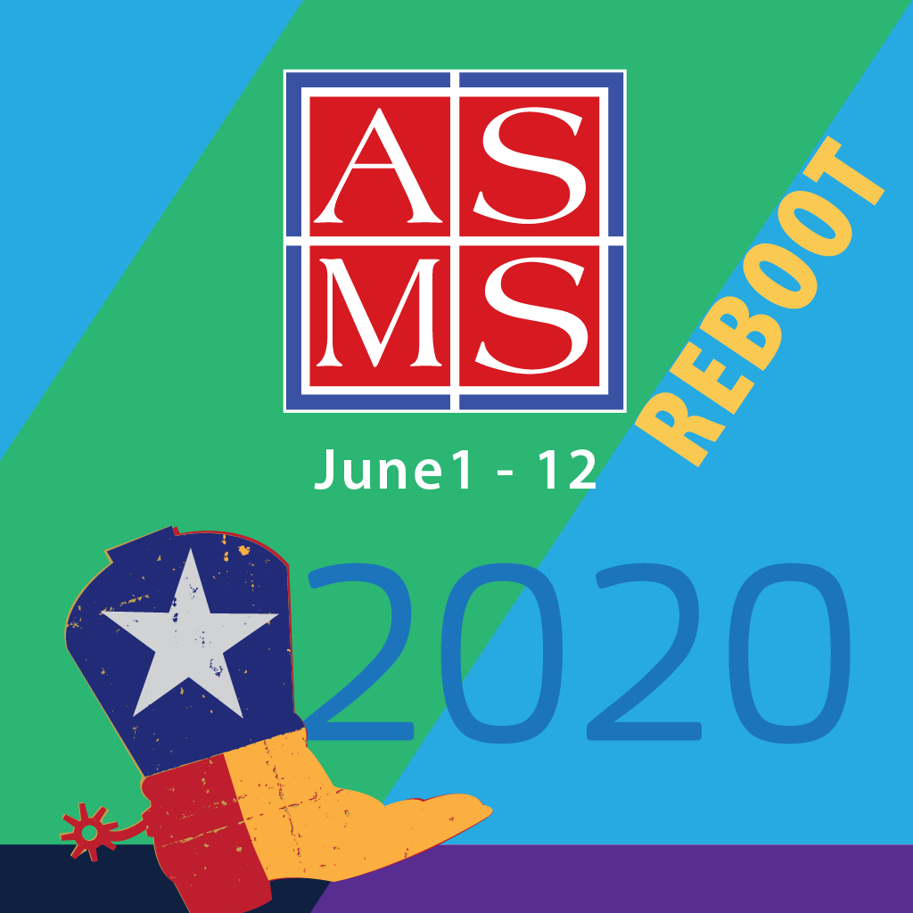
```
]
]


---

<style type="text/css">

p.caption {
  font-size: 0.6em;
}

.large { font-size: 200% }

.medium-large { font-size: 130% }

.small{ font-size: 80% }

.tiny{ font-size: 40% }

.center-left {
  position:          relative;
  top:               50%;
  transform:         translateY(50%);
}
.center-right {
  position:          relative;
  top:               50%;
  transform:         translateY(10%);
}

.remark-slide-content {
  background-color: #FFFFFF;
  border-top: 80px solid #8f1414;
  font-size: 28px;
  font-weight: 300;
  line-height: 1.5;
  padding: 1em 2em 1em 2em
}

.inverse {
  background-color: #8f1414;
  text-shadow: none;
}

.right-column {
	color: #000000;
	width: 30%;
	height: 92%;
	float: right;
}

.left-column {
  width: 68%;
  float: left;
}

</style>
# Fiehn et al.

.center[
```{r,echo=FALSE,out.width="1000px"}
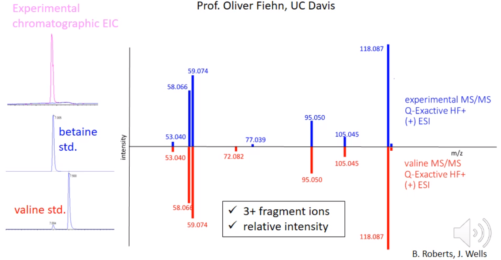
```
]

---
# Fiehn et al.
## Combining biological and chemical information in compound annotation for untargeted metabolomics

- Typically we identify a compound using 3 or more fragment ions (m/z
  and relative intensities)
- Even with ms/ms and accurate mass, misidentifications can happen
- The Fiehn group developed MoNA (Mass Bank of North America) to address this is the past, which
  adds information like expected retention time
- Developed the SPLASH code, which is like InChis for Spectra
- However, many of these databases contain a huge number of
  metabolites that can lead to false positives
- Using biological context helps narrow down the search

.center[
```{r,echo=FALSE,out.width="400px"}
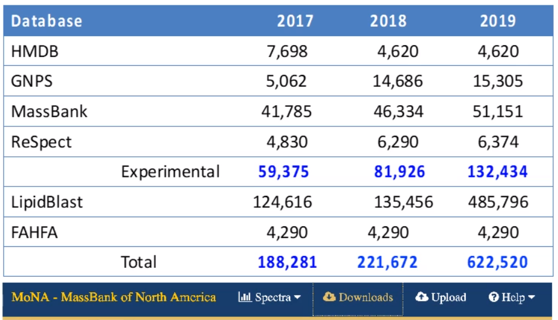
```
]

---

# Fiehn et al.

.center[
```{r,echo=FALSE,out.width="700px"}
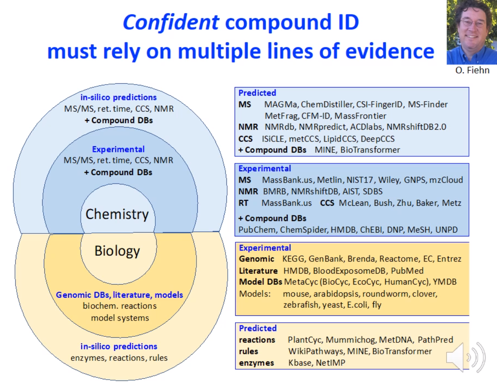
```
]

---
# Fiehn et al.
## Combining biological and chemical information in compound annotation for untargeted metabolomics
- They created the [blood exposome
  database](http://bloodexposome.org), which used text mining to
  identify 40,000 compounds you can reasonably expect to find in human
  blood
  
.center[
```{r,echo=FALSE,out.width="300px"}
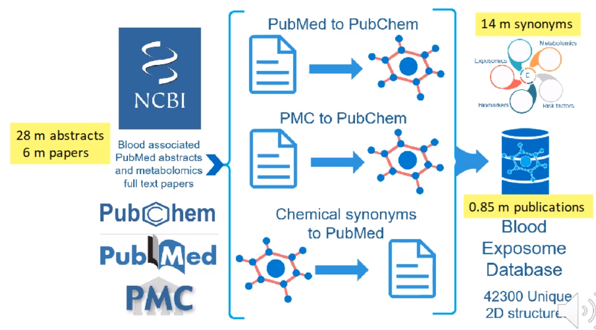
```
]
--

- The confidence of an identification is still not very granular - can
  we integrate biological/chemical information into the confidence
  metrics of identification software? Ideally would incorporate:
  - Similarity to experimental and predicted spectra
  - Likelihood given known biology (context & experimental)

---
# Fiehn et al.
## Reducing False Positive Identifications
- *Retip:* machine learning software for retention time prediction to exclude likely false positives 
  - 5 machine learning models predict retention time from known values - great for detecting false positives caused by isomer detection
--

- MS-DIAL has a new release this year that includes predicted retention time calculations
  - MS-DIAL is also now compatible with AWS for large computations
  - Interfaces with Metabolome Atlas to reduce search space by organ
--

- Using random forests to remove technical noise from MS data (SERDA, Fan et al Analytical Chemistry)
  - Assumes technical noise has a Gaussian distribution and successfully removes most of it
--

- Combining Hydrogen/Deuterium exchange with MS/MS spectra to identify new compounds
--

- Expanded LipidBLAST libraries by developing CoA-BLAST for acyl-CoA intermediates
--

- Poster: Which MS/MS similarity to use?
  - The traditional dot product distance metric didn't even make the top 10 in an ROC analysis!
--

- Using quantum chemistry to predict spectra aids in identification but it currently computationally prohibitive for the number of metabolites you can find in a typical study


---

# Koelmel et al.
## A Comparison of Intelligent Data-Acquisition Methods for Exposomics and Lipidomics Applications
.pull-left[
.small[
- High resolution tandem MS provides a generalized snapshot of all the metabolites in a sample
- Current ion acquisition techniques often ignore low-abundance ions
- In 2017 this group developed the iterative exclusion method (left)
- Can double or more the number of identified lipids you get in an experiment compared to DDA
]
]

.pull-right[
```{r,echo=FALSE,out.width="450px"}
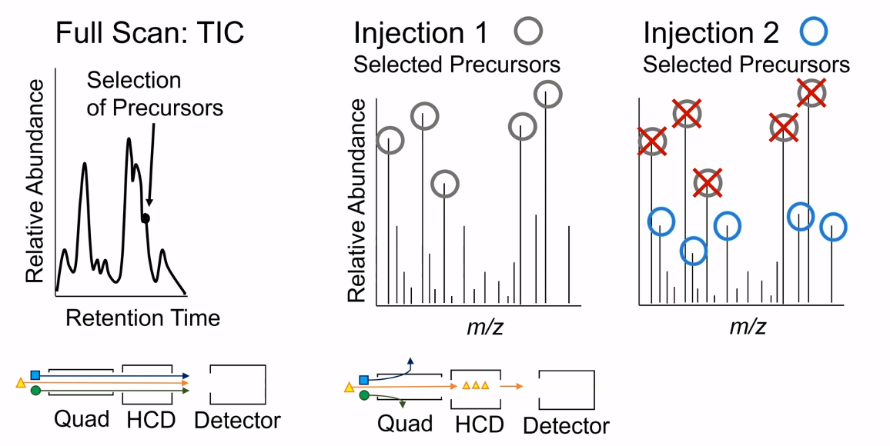
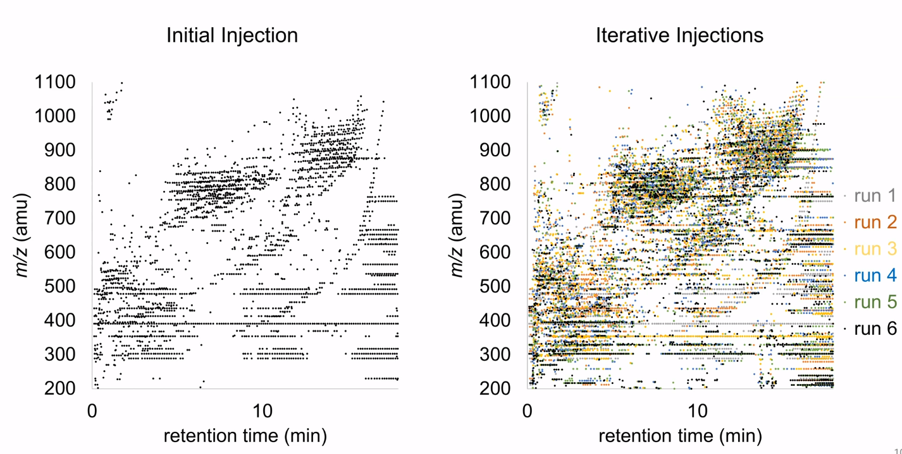
```
]

---

# Koelmel et al.
## A Comparison of Intelligent Data-Acquisition Methods for Exposomics and Lipidomics Applications

.small[
- DDA is not the only way to pick ions; you can fragment all ions in a sample for example
- Total ion fragmentation is a deconvolution nightmare so it actually ends up worse than DDA 
- Iterative exclusion is best, however the workflow is incredibly tedious!
- One improvement is to do a bunch of MS1 runs to identify ions to exclude, then do one big MS2 run
- Iterative inclusion is another option:
  - Use XCMS to identify nice MS1 peaks
  - Perform blank filtration
  - Perform MS1 annotation of those peaks (this prevents you from
fragmenting any ions you wouldn't be able to annotate anyways) 
  - Pick your fragmentation ions based off this
  - Optionally perform iterations 
]

---

# Koelmel et al.
## A Comparison of Intelligent Data-Acquisition Methods for Exposomics and Lipidomics Applications

.center[
```{r,echo=FALSE,out.width="900px"}
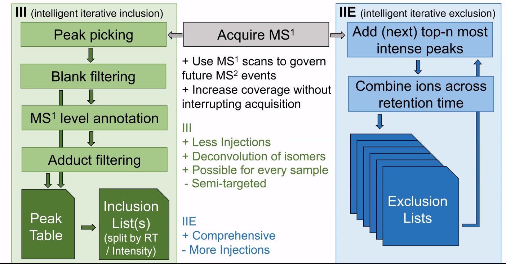
```
]

---

# Odenkirk et al.
## Structural-based Connectivity and Omic Phenotype Evaluations (SCOPE) Workflow for Lipid Data Interpretation

.pull-left[
.small[
- Focused on improving interpretation of lipidomics data (what a concept!)
- Lipids are commonly grouped into generic structures in pathway databases
- Want to incorporate chemical structure and biological context into their interpretation models
- Structural connectivity:
  - Agglomerative clustering of similarity by structural features (custom algorithm that weights head group differences highly)
  - Based on SMILES strings in Lipid MAPS
]
]

.pull-right[
```{r,echo=FALSE,out.width="900px"}
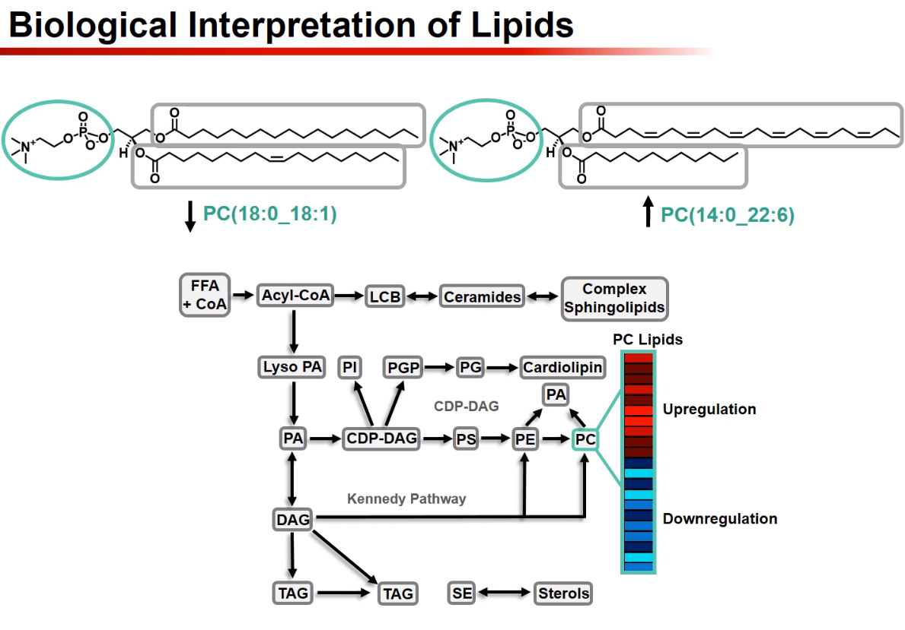
```
]

---

# Odenkirk et al.
## Result of clustering 288 lipids

.center[
```{r,echo=FALSE,out.width="700px"}
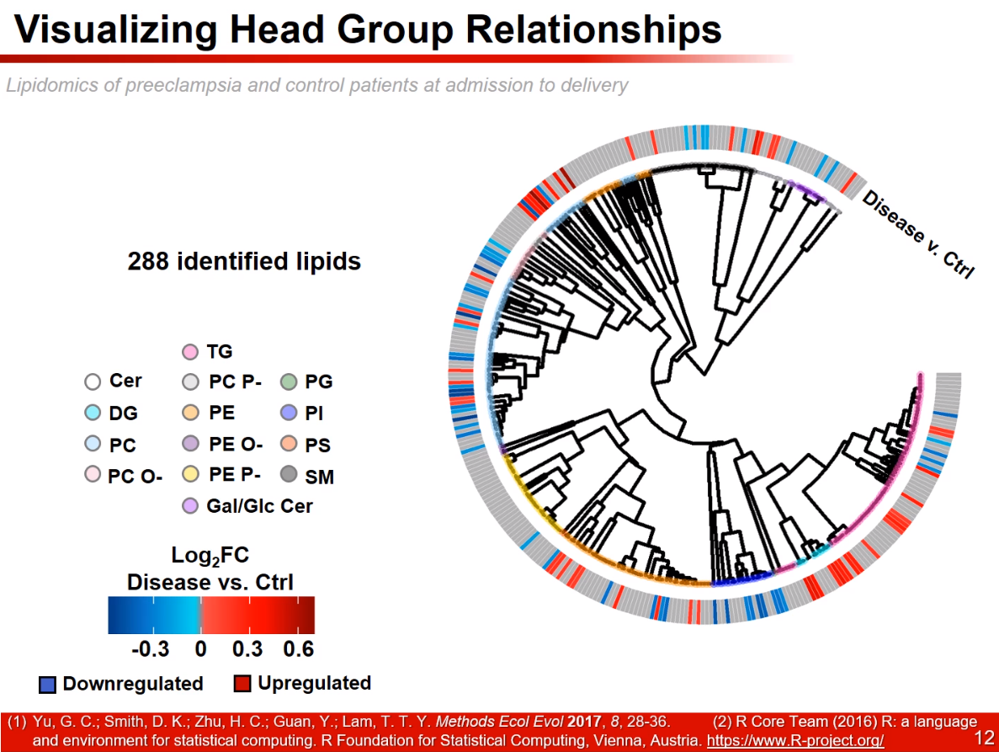
```
]

---

# Odenkirk et al.
## Incorporating Clinical Metadata

.pull-left[
.small[
- Uses both sample and metabolite metadata
- Uses ToxPie software to generate pie chart visualizations
- Sample metadata:
  - Slices represent lipid abundance
  - Cluster profiles and observe enrichment in clinical data
]
]

.pull-right[
```{r,echo=FALSE,out.width="900px"}
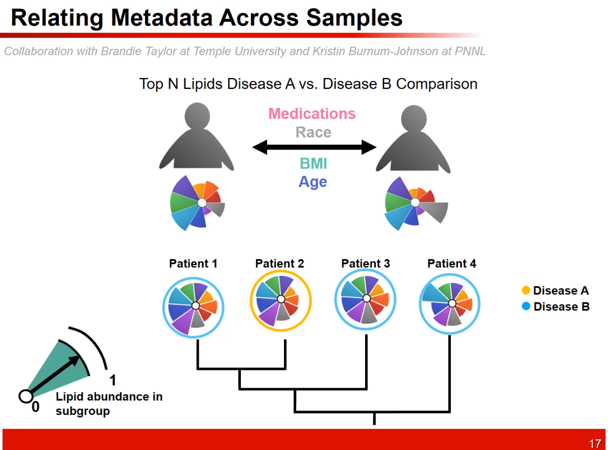
```
]

---
# GWAS of human lipidome and links to CVD risk
.pull-left[
.small[
## Methods
- Lipidomic profiling on plasma of 4,492 genotyped individuals (LC-MS/MS)
- Targeted panel of 596 lipid species (33 classes) to look for associations
- Linear mixed effect models correcting for age, sex, age:sex, 10 genomic PCs and an empirical genetic relatedness matrix
- Assessed lipid associations with CVD using logistic regression adjusted for age and sex
- Used an FDR adjusted pval cutoff of 5e-8
]
]

.pull-right[
```{r,echo=FALSE,out.width="1000px"}
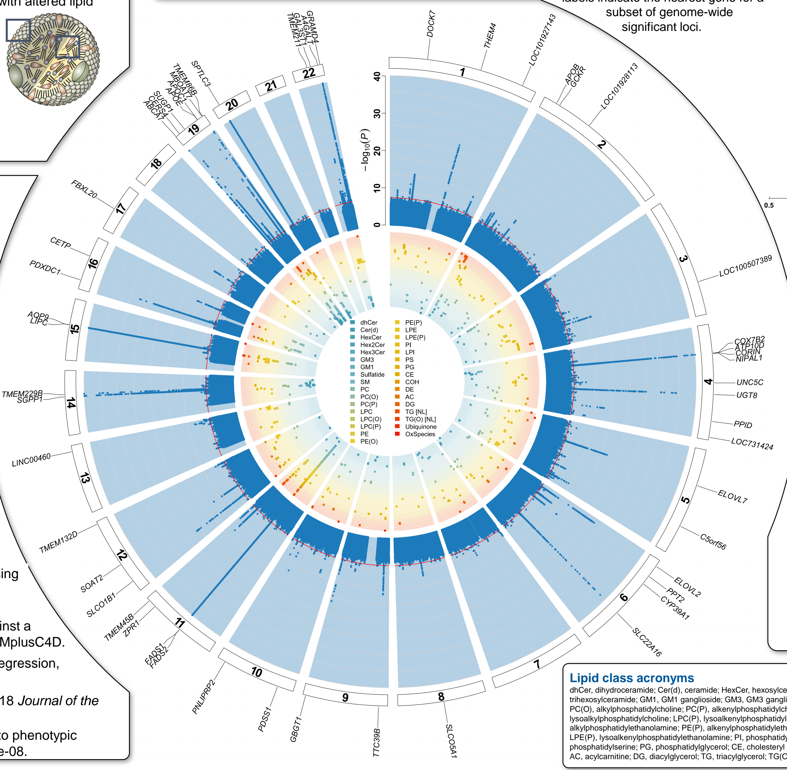
```
]

---

# GWAS of human lipidome and links to CVD risk 
.pull-left[
.small[
## Results
- Identified 70,000 genome-wide significant associations, including at
least one SNP for 451 lipids (76% of panel) 
- Identified 300 lipid-associated loci
- Some important loci regulate a large number of lipid species
- Identified lipids associated wih polygenic risk known to be associated with CVD
] ]

.pull-right[
```{r,echo=FALSE,out.width="1000px"}
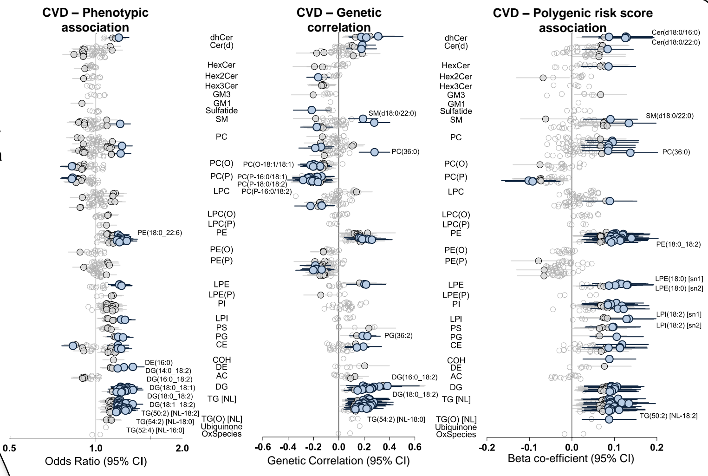
```
]

---

# scMetabolomics Studies of  drug-resistant Cells
.pull-left[
## Methods
- Working with colorectal cancer cell lines
- Irinotecan is an effective chemotherapy drug but fails when cells acquire resistance by growing more "stem-like"
- Metformin selectively kills CSCs, so the authors wanted to assess the efficacy of combination treatment
- Used single-probe MS on irinotecan resistant CRC cells
]

.pull-right[
```{r,echo=FALSE,out.width="1000px"}
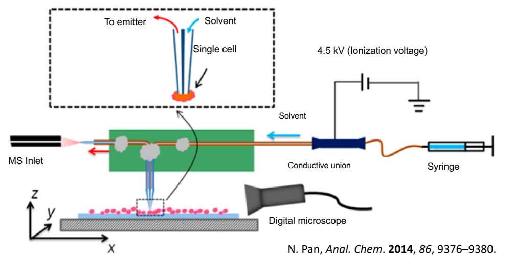
```
]

---

# scMetabolomics Studies of drug-resistant Cells
.pull-left[
## Results
- Levels of fatty acids, HexCers and other lipids were lowered in
  metformin and combination treated cells
- FASN activity assays confirmed this observation
- Viability studies demonstrated synergistic effect of treatment in
drug-resistant cells 
]

.pull-right[
```{r,echo=FALSE,out.width="1000px"}
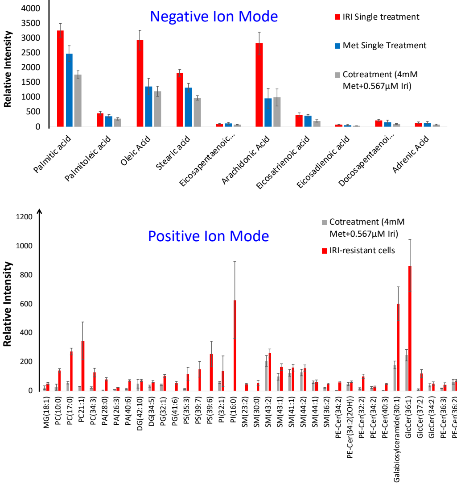
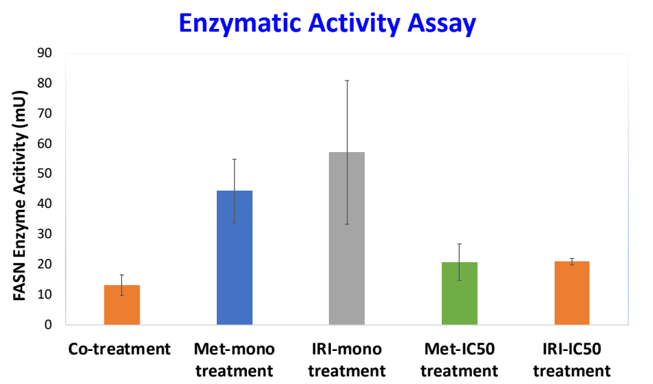
```
]

---

# scMetabolomics Studies of drug-resistant Cells
## Schematic
.center[
```{r,echo=FALSE,out.width="650px"}
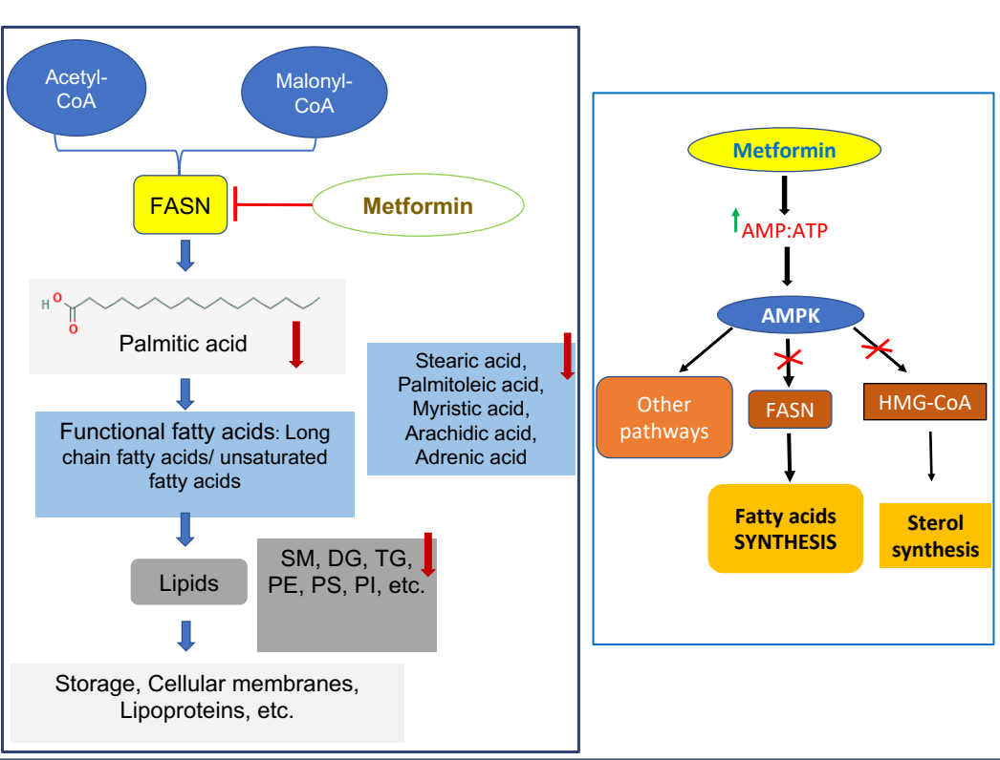
```
]


