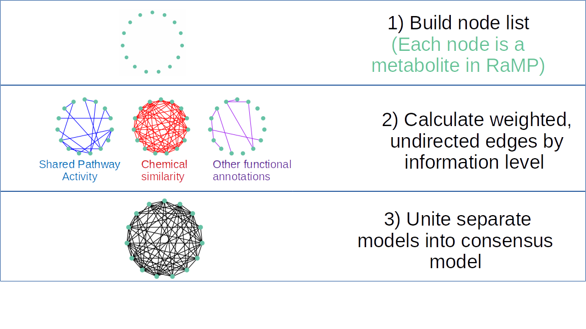
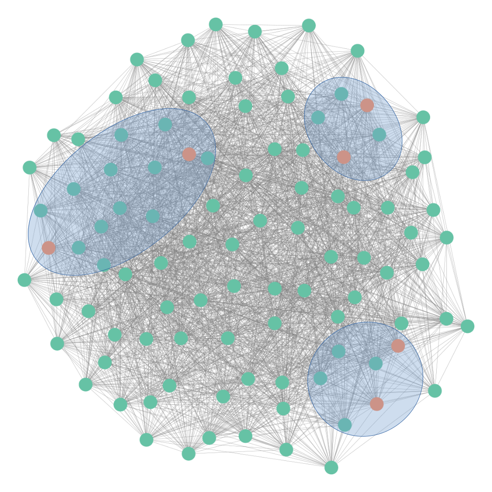

---
output:
  xaringan::moon_reader:
    css: [default, metropolis, metropolis-fonts]
    lib_dir: libs
    includes:
      after_body: insert-logo.html
    nature:
      highlightStyle: github
      countIncrementalSlides: false
      seal: false
      ratio: '16:9'
---
class: primary

```{r,echo=FALSE,message=FALSE}
MDM2HivsLoLMME<-readRDS("img/Lipid_volcano_plot.Rds")
fc_thresh=0.75
p_thresh <- 0.05
lipidomic_key<-readRDS("img/lipidomic_key.Rds")
resMDM2HiLoLMME<-readRDS("img/metabolite_volcano_plot.Rds")
myPalette<-c("#e6194b","#8B008B","#808080","#f58231","gray80","#008080","#46f0f0","#3cb44b","#e6194b")
names(myPalette)<-c("Amino Acid","Cofactors and Vitamins","Nucleotide","Lipid","Not Significant","Peptide","Hexosylated Ceramide")

library(ggplot2)
library(ggrepel)
library(gplots)
library(RColorBrewer)
```

<style type="text/css">

p.caption {
  font-size: 0.6em;
}

.large { font-size: 200% }

.medium-large { font-size: 130% }

.small{ font-size: 70% }

.tiny{ font-size: 60% }

code.r{
  font-size: 20px;
}

.center-left {
  position:          relative;
  top:               50%;
  transform:         translateY(50%);
}
.center-right {
  position:          relative;
  top:               50%;
  transform:         translateY(10%);
}

.remark-slide-content {
  background-color: #FFFFFF;
  border-top: 80px solid #2b0a5e;
  font-size: 28px;
  font-weight: 300;
  line-height: 1.5;
  padding: .5em 1em .5em 1em
}

.inverse {
  background-color: #2b0a5e;
  text-shadow: none;
}

.right-column {
	color: #000000;
	width: 30%;
	height: 92%;
	float: right;
}

.left-column {
  width: 68%;
  float: left;
}

.remark-slide-number {
	display: none;
}

.remark-slide-content:after {
    content: "";
    position: absolute;
    bottom: 0px;
	left: 20px;
    height: 60px;
    width: 400px;
	font-size: 12px;
    background-repeat: no-repeat;
    background-size: contain;
	background-image: url("img/The-Ohio-State-University-Wexner-Medical-Center.png")
}

.aligncenter {
  text-align: center;
}

</style> 

.pull-left[
<h2 style=font-size:35px> Improving pathway analysis of
lipidomic and metabolomic data through comprehensive functional
annotation and network approaches </style>

<h6 style=font-size:20px>
Andrew Patt, Doctoral Candidate
<br>
<br>
National Center for Advancing Translational Science/The Ohio State University
</style>
]

.pull-right[
.center[
```{r,echo=FALSE,out.width="475px"}
knitr::include_graphics("img/covid_network_example.png")
```
]
]


---

# Agenda

### 1. Thesis Overview

--

### 2. Status update on MetaboSPAN
- Addressing pathway overlap
- Improving computational efficiency
- Package prototype
- Optimizing run time

--

### 3. Remaining work
- Constructing RaMP 2.0 knowledge graph
- Validation Experiments

---

# Timeline

.small[
| Date   | Milestone(s)                                        |
|---------------|--------------------------------------------------|
| August 2016   | Started program                                  |
| Fall 2017 | RaMP publication (2nd author), T32 award              |
| Fall 2018  | Candidacy exam                                   |
| Spring 2019  | RaMP textbook chapter (1st author)               |
| Summer 2019     | Proteogenomic integration review (Co-1st author) |
| Spring 2020    | Multiomic integration review  (2nd author), F31 finalist  |
| Summer 2020      | Liposarcoma metabolomics (Co-1st author), COVID data portal (middle author)         |
| Winter 2020 | LipidMatch Flow (6th author)                     |
| Spring 2021    | MetaboSPAN (1st author), Thesis Defense              |
]

---

# Thesis Chapters

**Part I: Metabolomics and Lipidomics: Applications in biomedical sciences (Introduction)**

**Part II: Metabolomics and lipidomics of liposarcoma**

**Part III: RaMP and Multi-Omic integration** 

**Part IV: Computational approaches for functional analysis and integration of metabolomic and lipidomic data**

**Part IV: Conclusions (Broadly state my contributions to the field of metabolomics)**


---
# I. Introduction

- 1.1 Definition of metabolomics and lipidomics
- 1.2 Role of metabolism in cancer
- <span style="color: red;">1.3 Metabolomics computational workflow</span>
  - <span style="color: red;">File formats, peak picking, chromatogram alignment, normalization</span>
- 1.4 Pathway and functional analysis of metabolomics data
  - 1.4.1 Methods for metabolomic functional enrichment analysis
  - 1.4.2 Resources for metabolomic functional analysis
  - 1.4.3 Tools for metabolomic functional analysis
  - 1.4.4 Tools for lipidomic analysis
  - <span style="color: red;">1.4.5 Validating/Comparing functional analysis methods</span>
- <span style="color: red;">1.5 Conclusions: Gaps to be filled </span>
---
# II. Liposarcoma Metabolomics
.small[
- 2.1 Dedifferentiated liposarcoma background
- 2.2 Materials and methods
  - 2.2.1 Metabolomic data preprocessing
  - 2.2.2 Lipidomic data preprocessing
  - 2.2.3 Statistical analysis
  - 2.2.4 Preliminary network enrichment analysis method
- 2.3 Results
  - 2.3.1 Metabolomic changes associated with MDM2 amplification levels
  - 2.3.2 Raising the MDM2 Levels in DDLPS Lower Cell Lines Results in Induction of Key Metabolites Resembling Those of MDM2 Higher Cells
  - 2.3.3 Independent Lipidomic Profiling Confirms Lipids Found to Be Altered by MDM2 Amplification from Metabolomic Analysis and Identifies Additional Relevant MDM2-Dependent Lipids
  - 2.3.4 Induction of the Sphingolipid Pathway in DDLPS Models Using Atorvastatin Resulted in Chemoresistance
  - 2.3.5 Glycosylated Ceramides Are Consistently Elevated in MDM2 Higher Cells
- 2.4 Discussion
- 2.5 Conclusions 
]

---
# III. Metabolomics and Multi-Omic Pathway Analysis
.small[
- <span style="color: red;">3.1 Metabolomics and Multi-Omics Integration</span>
- 3.2 Issues in standard metabolomic workflows
  - 3.2.1 Lack of pathway annotations
  - 3.2.2 Pathway redundancy
  - 3.2.3 Difficulty harmonizing identifiers
  - 3.2.4 Mapping metabolite names to database identifiers
  - <span style="color: red;">3.2.4 Challenges in Multi-Omic integration</span>
- <span style="color: blue;">3.3 RaMP: A Comprehensive Relational Database of Metabolomics Pathways</span>
  - <span style="color: blue;">3.3.1 RaMP contents</span>
  - <span style="color: blue;">3.3.2 RaMP user interface</span>
  - <span style="color: blue;">3.3.2 Pathway redundancy clustering</span>
  - <span style="color: green;">3.3.2 Fisher testing with custom background</span>
  - <span style="color: green;">3.3.3 Westfall-Young p value adjustment</span>
  - <span style="color: green;">3.3.4 RaMP 2.0</span>   
- 3.4 Conclusions
]

---

# IV. MetaboSPAN

.small[
- 4.1 Introduction
- 4.2 Methods
  - 4.2.1 Constructing the RaMP knowledge graph
  - 4.2.2 Selecting metabolites of interest from the knowledge graph
  - 4.2.3 Calculating significant annotations
- 4.3 Vignette: core package functions and code
  - 4.3.1 `create_RaMP_knowledge_graph.R`
  - 4.3.2 `find_crosstalkers()`
  - 4.3.3 `visualize_crosstalkers_network()`
  - 4.3.4 `Westfall_young_pathway_enrichment()` and `plot_pathway_results()`
- 4.4 Results
  - 4.4.1 Liposarcoma results
  - 4.4.2 Translating results across breast cancer cohorts
  - 4.4.3 Robustness to simulated noise
- 4.5 Discussion
- 4.6 Conclusions
]

---
class: inverse, center, middle
# Ongoing research/remaining work

---

# Challenges in metabolite/lipid pathway analysis
.pull-left[
.small[
- Lack of pathway annotations
	- Incorporating biological and chemical annotations offer better coverage

- Conventional pathway overrepresentation analysis does not account for redundancy of pathway annotations	
	- Pathway annotations are not independent, which is an assumption of the Fisher's/Hypergeometric tests

]]

.pull-right[
```{r,echo=FALSE,out.width="800px"}
knitr::include_graphics("img/pathway_coverage_2.png")
```
]

---
# Ongoing RaMP expansions

.pull-left[
- **Metabolic pathways:**
  - HumanCyc (255+ pathways)
  - Pathbank (78,488 pathways)
]

--

.pull-right[
- **Chemical Structures:**
  - InChIKeys
  - LyChIKeys
]

--
.tiny[
</br>
]

| DB          | # lipids | Chemical class | Subcellular location | Structure | Reactions | Function |
|-------------|----------|----------------|----------------------|-----------|-----------|----------|
| LION/Web    | > 50,000 | No             | Yes                  | No        | No        | Yes         |
| SwissLipids | 777,657  | Yes            | Yes                  | Yes       | Yes       | No         |
| Lipid Maps  | 43,636   | Yes            | No                   | Yes       | No        | No         |
| LipidPedia  | 4,487    | No             | Yes                  | No        | Yes       |  Yes        |


---

# Metabolite Similarity Networks

.pull-left[
- Through RaMP, we are collecting data that describes relationships between metabolites:
  - Shared pathway activity
  - Mutual participation in reactions
  - Chemical structural similarity
  - Associations with disease, etc...

- Using this information, we can build knowledge networks describing the information landscape of the database
] 

.pull-right[

```{r,echo=FALSE,out.width="600px"}
knitr::include_graphics("img/small_network_example.png")
```
]

---

# Metabolite Structure, Pathway and Annotation Networks
.center[
```{r,echo=FALSE,out.width="900px"}
knitr::include_graphics("img/network_schematic1.png")
```
]
---

# Metabolite Structure, Pathway and Annotation Networks
.center[
```{r,echo=FALSE,out.width="900px"}
knitr::include_graphics("img/network_schematic2.png")
```
]
---

# Metabolite Structure, Pathway and Annotation Networks
.center[
```{r,echo=FALSE,out.width="900px"}

```
]
---

# Metabolite Structure, Pathway and Annotation Networks
.center[
```{r,echo=FALSE,out.width="900px"}

```
]
---

# Topological analysis/Enrichment analysis

.pull-left[
.small[
1. Run random walks with restarts algorithm using metabolites of interest as seed node set

2. Run random walks with restarts using random node set many times

3. Calculate percentile of true score  in random score distribution by node

4. Filter network down to highly similar nodes to seed set

5. Identify clusters of related metabolites in final model and perform
   enrichment analysis
]
]

.pull-right[
```{r,echo=FALSE,out.width="900px"}

```

]

---

# MetaboSPAN road map
```{r, echo=FALSE,out.width=1400}
library(DiagrammeR)
DiagrammeR::grViz("digraph nicegraph {
compound=true;
graph [nodesep = 1, ranksep = .5,
         color = black,rankdir=LR]

# define the global styles of the nodes. We can override these in box if we wish
node [fontname = Helvetica, fontcolor = darkslategray, style=filled,
        shape = rectangle, fixedsize=true, width=2,height=1,
        color = darkslategray,fontsize=14]

1 [label = 'Basic workflow\n implemented \n(Liposarcoma\n paper)', fillcolor = green]
2 [label = 'Write core \npackage \nfunctions', fillcolor = green]
3 [label =  'Address \npathway \n dependency', fillcolor = green]
4 [label = 'Improve \nrun time', fillcolor = yellow]
5 [label = 'Construct \nRaMP 2.0 \nknowledge \ngraph', fillcolor = yellow]
6 [label = 'Perform \nvalidation \nexperiments', fillcolor = red]
7 [label = 'Write \nthesis part IV/\nMetaboSPAN \npaper', fillcolor = red]
b1 [color = 'white', label='']

# edge definitions with the node IDs
subgraph cluster1 {
    label = 'Completed';
    style=dashed;
		color= '#625a5a';
fontname = 'helvetica-bold';
edge [style='invisible',dir='none']
1->2->3
}

subgraph cluster2 {
    label = 'In Progress';
    style=dashed;
		color= '#625a5a';
fontname = 'helvetica-bold';
4->5 
5->6 6->5 [color = 'red'] 6->7}

3->b1 [color='white',style='invisible',dir='none']
7->b1 [color='white',style='invisible',dir='none']
2->6 [ltail=cluster1,lhead=cluster2];
}")


```

---

# Core MetaboSPAN functions
.tiny[
| Function          | Description | Input | Output |
|-------------|----------|----------------|----------------------|
| `find_crosstalkers()`    | Run random walks with restarts algorithm on RaMP knowledge graph with seed set of interest. Scores are currently compared with an empirical distribution made from random seed sets. |   Metabolites of interest (DB identifiers or common names), Number of iterations for empirical distribution (to be removed), Percentile random walk score cutoff for significance, Iterations for random walk (to be implemented)            |  Expanded list of metabolites of interest, Diagnostic histogram (to be removed)                 |
| `visualize_crosstalkers_network()` | View network visual of metabolites of interest, color coded by module  | Metabolites of interest   | Network visual displaying clusters of related metabolites  |
| `cluster_metabolites()` | Returns the cluster membership of metabolites in the above network   | Metabolites of interest     | Metabolites similarity cluster membership                   |
| `WY_pathway_adjustment()`  | Fisher's p value adjustment strategy for accounting for interdependence of pathways (see next slide)    | Metabolites of interest, metabolite panel background, number of iterations             | Adjusted p vals for pathways associated with metabolites of interest  |
]
---

# Example Network Visual

```{r,echo=FALSE,out.width="550px",fig.align="center"}
knitr::include_graphics("img/covid_network_example.png")
```


---

# Westfall-Young Fisher's p val adjustment

- Westfall and Young (1993) developed a method for p value
  permutation-based adjustment strategy that modeled interdependence
  in gene expression
```{r,eval=FALSE}
## Calculate true p values & sort
p_val_matrix[,1]<-sort(fishers_with_custom_background(metabs_of_interest,metab_panel))

## Calculate fake p values by sampling from background
for(i in 1:iterations){
    fake_metabs_of_interest<-sample(metab_panel,size=length(metabs_of_interest))
    fake_p_vals<-fishers_with_custom_background(fake_metabs_of_interest,metab_panel)
    pval_matrix<-cbind(pval_matrix,sort(fake_p_vals))
}

## Find percentile of true value among rank family
adjusted_p_vals<-apply(p_val_matrix,by_row,get_percentile(true_column,fake_columns))
```

---

# Optimizing run time

- Original run-time: ~35 minutes
- **Finding nodes of interest**
  - Run random walks (RW) once
  - ~~Build empirical RW score distribution to assess significance~~
  - Penalize based on some measure of node centrality
---

# Topological analysis/Enrichment analysis

.pull-left[
.small[
1. Run random walks with restarts algorithm using metabolites of interest as seed node set

2. ~~Run random walks with restarts using random node set many times~~

3. ~~Calculate percentile of true score  in random score distribution by node~~

4. Filter network down to highly similar nodes to seed set, **penalizing those with high centrality**

5. Identify clusters of related metabolites in final model and perform
   enrichment analysis
]
]

.pull-right[
```{r,echo=FALSE,out.width="900px"}

```

]

---

# Optimizing run time

- Original run-time: ~35 minutes
- **Finding nodes of interest**
  - Run random walks once
  - Penalize based on some measure of node centrality
	- ~~Predict 95th percentile cutoff of random distribution~~
	- Extract nodes with high percentile true score, filter out those
      with exceptionally high centrality (degree)
- W-Y pathway enrichment
  - Minimize number of calls to database
- Current run-time: ~6 minutes

---

# Building RaMP 2.0 knowledge graph

- As RaMP expands, the number of relationships that are computed grows
  exponentially
- These relationships (except chemical similarity) are sparse,
  allowing them to be stored as sparse matrices
  - NCATS collaborators have code for computing tanimoto similarity
    and storing sparsely (using a cutoff)
- Individual graphs are precomputed on supercomputer (takes ~ 14 hours)
- Remaining questions:
  - How to fuse networks?
  - Include reactions?
  - Remove pathways?
  - Various combinations will be assessed in the validation framework
- Eventually we will build a lipidomics knowledge graph (potentially post-thesis)

---

# Validation experiments

- Compare Fisher's, K-S, topological approaches with various MetaboSPAN candidate workflows
- Biological
  - Updated Liposarcoma analysis
  - Showing consistently perturbed pathways across independent experiments with similar setup (breast cancer, COVID 19)
	- Show that reproducible pathways are biologically coherent
- Simulated
  - Starting with true list of interest, perturb randomly. Show that
    MetaboSPAN recovers true results at higher noise levels than other
    methods
  - Simulated lists of interest. Show MetaboSPAN is robust to noise in
    both promiscuous and non-promiscuous pathways

---

# Questions?
<div class="aligncenter">
<iframe src="https://gifer.com/embed/3bm4" width=800 height=500.000 frameBorder="0" allowFullScreen>
</div>
