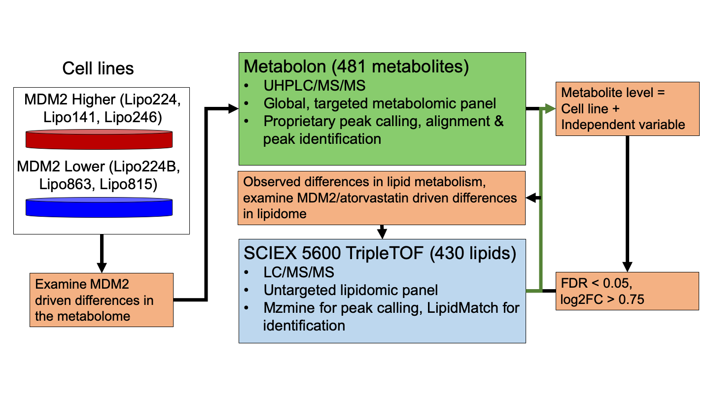
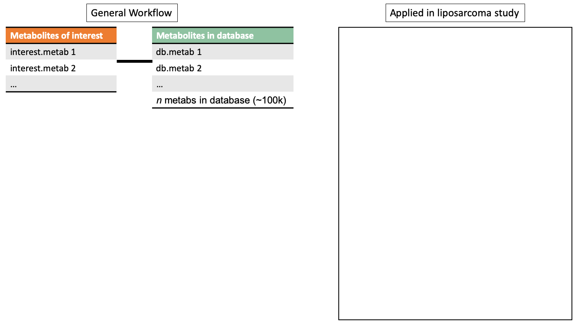
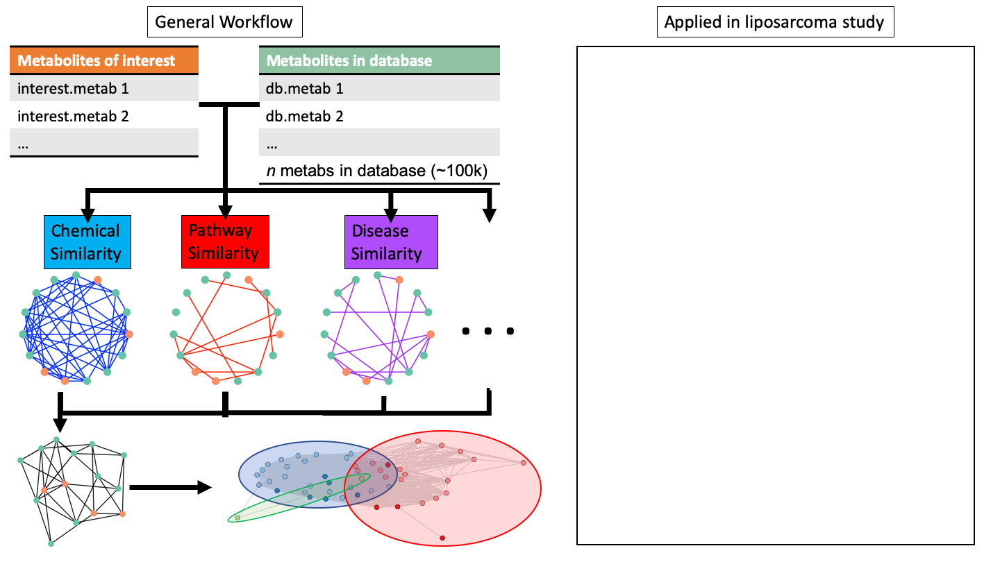
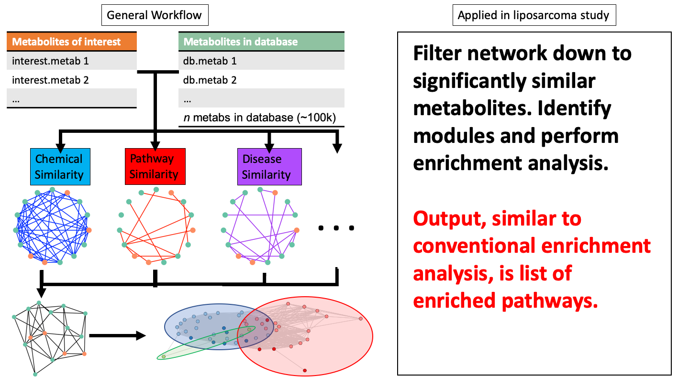

---
output:
  xaringan::moon_reader:
    css: [default, metropolis, metropolis-fonts]
    lib_dir: libs
    nature:
      highlightStyle: github
      countIncrementalSlides: false
      seal: false
      ratio: '16:9'
---

class: inverse, middle
background-image: url(title_background.svg)
background-size: cover

<font color = "white">
## Andrew Patt Committee Meeting
.pull-left[
### May 11th, 2020
]

.pull-right[
.center[
```{r,echo=FALSE,out.width="300px"}
knitr::include_graphics("img/Ohio_State_University_seal.svg.png")
```
]
]


---

<style type="text/css">

p.caption {
  font-size: 0.6em;
}

.large { font-size: 200% }

.medium-large { font-size: 130% }

.small{ font-size: 80% }

.tiny{ font-size: 55% }

.center-left {
  position:          relative;
  top:               50%;
  transform:         translateY(50%);
}
.center-right {
  position:          relative;
  top:               50%;
  transform:         translateY(10%);
}

.remark-slide-content {
  background-color: #FFFFFF;
  border-top: 80px solid #8f1414;
  font-size: 28px;
  font-weight: 300;
  line-height: 1.5;
  padding: 1em 2em 1em 2em
}

.inverse {
  background-color: #8f1414;
  text-shadow: none;
}

.right-column {
	color: #000000;
	width: 30%;
	height: 92%;
	float: right;
}

.left-column {
  width: 68%;
  float: left;
}

</style>

# Agenda

--
- Review of progress

--
- Plans for future work

--
- Thesis plan

--
- Timeline

---

# Dedifferentiated Liposarcoma 

.pull-left[
- 20% of all soft tissue sarcoma diagnoses
- Some drugs (Dactinomycin, Doxorubicin) are used to treat
  liposarcoma, but they have unpredictable efficacy and toxicity.
- Prognosis depends on copy number of the MDM2 oncogene
]

.pull-right[
```{r,echo=FALSE,out.width="400px"}
knitr::include_graphics("img/DDLPS_prognosis.png")
```

.tiny[
Bill KLJ, Seligson ND, Hays JL, et al. Degree of Amplification Affects Clinical Outcomes in Dedifferentiated Liposarcoma. Oncologist. 2019;24(7):989-996.
]
]

---

# Objectives

--

### 1. Understand resistance of MDM2 high cells to atorvastatin treatment

--

### 2. Identify altered metabolites/lipids between MDM2 high and low to identify potential biomarkers/therapeutic targets 

--

### 3. Find higher level biological differences (e.g. pathways) between MDM2 high and low tumors that explain poorer prognosis of MDM2 high patients

---

# Targeting the p53-cholesterol synthesis axis

.right-column[
.small[
- Statins (mevalonate pathway inhibitors) have been associated with
  reduced mortality in multiple cancers

- p53 downregulates transcriptional regulator of mevalonate pathway

- p53-null cell lines have been shown to withstand sterol deprived
  conditions better than WT
  
	  ]
  ]

.left-column[

```{r,echo=FALSE,out.width="800px"}
knitr::include_graphics("img/Atorvastatin_response.png")
```

]
  
---
# Methods

```{r,echo=FALSE,out.width="1000px"}
knitr::include_graphics("img/metabolite_methods.png")
```

---

# Methods

```{r,echo=FALSE,out.width="1000px"}

```


---

# Atorvastatin greatly impacted MDM2 low lipidome 

.left-column[
```{r,fig.width=10,fig.height=7, echo=FALSE}

volcano_plotter <- function(df,title){
    T_test_results<-df
    
    ## Make insignificant points smaller and more transparent
    T_test_results$significant = abs(T_test_results$log2fc) > fc_thresh &
        -log10(T_test_results$mypadj) > -log10(p_thresh)
    T_test_results$size <- ifelse(T_test_results$significant,4,2)
    
    ## Color code by lipid class
    T_test_results$class<-lipidomic_key$LM.Main.Class[match(T_test_results$name,lipidomic_key$name)]
    palette_names<-as.vector(sort(unique(T_test_results$class)))
    T_test_results$class<-sapply(1:nrow(T_test_results),function(x){
        ifelse(T_test_results$significant[x],
                    return(as.vector(T_test_results$class)[x]),return("Not Significant"))
    })
      
	 legend_labels<-sort(unique(sapply(T_test_results$class, function(x){
             if(!is.na(x)){
		 return(paste0(x," (n=",length(which(T_test_results$class==x)),")"))
             }else{
		 return(x)
             }
	 })))
      
	 ##legend_labels<-legend_labels[-which(is.na(legend_labels))]
      
	 palette<-c(brewer.pal(9,"Set1"),"sienna","springgreen4","seagreen","#40E0D0","violet","grey80")
	 names(palette)<-c(palette_names,"Not Significant")
	 palette<-palette[unique(T_test_results$class)]
                                           #palette<-palette[-which(is.na(palette))]
      
        g = ggplot(data=T_test_results, aes(x=log2fc, y=-log10(mypadj), colour=class)) +
            geom_point(##alpha=0.7,
                       aes(size=size)) +
            scale_color_manual(values = palette,
                                        #na.value="grey80",
                               labels=legend_labels,
                               name="LipidMaps Main Class") +
            theme_bw(base_size=20) +
                                        #scale_color_brewer(palette="Paired",na.value="grey80") +
            ggtitle(title) +
            theme(plot.title = element_text(hjust = 0.5)) +
            theme(panel.grid.major = element_blank(), panel.grid.minor = element_blank()) +
            ylab("-log10 p-value") +
            geom_hline(yintercept = -log10(p_thresh),lty = 2) +
            geom_vline(xintercept = fc_thresh, lty = 2) +
            geom_vline(xintercept = -fc_thresh, lty = 2) +
            scale_size(range=c(2,4)) +
            guides(size=FALSE,
                   colour = guide_legend(override.aes = list(size=10)))
    
    T_test_results_sig<-T_test_results[T_test_results$significant,]
    text_size<-round(min(20,350/nrow(T_test_results_sig)),digits=0)
    
    return(g)
}

p_thresh=0.05
fc_thresh=0.75
TreVsUntreLMME_lo<-readRDS("img/Lipid_Lo_Tre_volcano_plot.Rds")

volcano_plotter(TreVsUntreLMME_lo,"Treated vs Untreated, MDM2 Low")
```
]

.right-column[
- MDM2 low tumors have better prognosis

- The growth of MDM2 low cell lines was slowed by atorvastatin treatment

- Over a quarter of the panel was significantly altered by atorvastatin treatment ]

---

# Atorvastatin changed sphingolipids in MDM2 low cells

.left-column[
```{r,fig.width=10,fig.height=7, echo=FALSE}

T_test_results<-TreVsUntreLMME_lo
    
## Make insignificant points smaller and more transparent
T_test_results$significant = abs(T_test_results$log2fc) > fc_thresh &
    -log10(T_test_results$mypadj) > -log10(p_thresh)
T_test_results$size <- ifelse(T_test_results$significant,4,2)

## Color code by lipid class
T_test_results$class<-lipidomic_key$LM.Main.Class[match(T_test_results$name,lipidomic_key$name)]
palette_names<-as.vector(sort(unique(T_test_results$class)))
T_test_results$class<-sapply(1:nrow(T_test_results),function(x){
    ifelse(T_test_results$significant[x],
           return(as.vector(T_test_results$class)[x]),return("Not Significant"))
})

T_test_results = T_test_results %>%
    mutate(class =
               apply(T_test_results, 1, function(x){
                   if(x["class"]!="Not Significant"){
                       if(grepl("HexCer",x["name"])){
                           "Hexosylated Ceramide"
                       }else if(grepl("Cer",x["name"])){
                           "Ceramide"
                       }else{
                           "Not Significant"
                       }
                   }else{
                       "Not Significant"
                   }
               }) %>%
           as.factor())

palette<-c("red","blue","grey80")
names(palette)<-c("Ceramide","Hexosylated Ceramide","Not Significant")

g = ggplot(data=T_test_results, aes(x=log2fc, y=-log10(mypadj), colour=class)) +
    geom_point(##alpha=0.7,
        aes(size=size)) +
    scale_color_manual(values = palette,
                       ##na.value="grey80",
                       ##labels=legend_labels,
                       name="LipidMaps Main Class") +
    theme_bw(base_size=20) +
    ##scale_color_brewer(palette="Paired",na.value="grey80") +
    ggtitle("Treated vs Untreated, MDM2 Low") +
    theme(plot.title = element_text(hjust = 0.5)) +
    theme(panel.grid.major = element_blank(), panel.grid.minor = element_blank()) +
    ylab("-log10 p-value") +
    geom_hline(yintercept = -log10(p_thresh),lty = 2) +
    geom_vline(xintercept = fc_thresh, lty = 2) +
    geom_vline(xintercept = -fc_thresh, lty = 2) +
    scale_size(range=c(2,4)) +
    guides(size=FALSE,
           colour = guide_legend(override.aes = list(size=10))) ## +
    ## geom_label_repel(data = T_test_results %>% filter(grepl("Cer",name) &
    ##                                                   class!="Not Significant"),
    ##                  aes(label=name),
    ##                  show.legend = FALSE,
    ##                  force=10,
    ##                  xlim=c(NA,1),
    ##                  arrow = arrow(length = unit(0.03,"npc"),type = "closed"),
    ##                  size=6)
g

```
]

.right-column[

- 11 ceramides and 3 hexosylated ceramides were upregulated by atorvastatin treatment in MDM2 low cells

- This could indicate activation of an apoptotic response

]
---

# Sphingolipid metabolism as a therapeutic target

```{r,echo=FALSE,out.width="1100px"}
knitr::include_graphics("img/sphingolipid_therapy.png")
```

---

# HexCers are upregulated by MDM2 in both panels
.pull-left[
```{r,echo=FALSE,fig.height=10,fig.width=10}

##ggplotly(p)

library(ggplot2)
library(ggrepel)
resMDM2HiLoLMME<-readRDS("img/metabolite_volcano_plot.Rds")
myPalette<-c("#e6194b","#8B008B","#808080","#f58231","gray80","#008080","#46f0f0","#3cb44b","#e6194b")
names(myPalette)<-c("Amino Acid","Cofactors and Vitamins","Nucleotide","Lipid","Not Significant","Peptide","Hexosylated Ceramide")


myPalette2<-c("gray80","red")
names(myPalette2)<-c("Not Significant","Hexosylated Ceramide")

p <- resMDM2HiLoLMME %>%
    mutate(class=ifelse(name == "glycosyl-N-palmitoyl-sphingosine"  |
                        name == "glycosyl-N-stearoyl-sphingosine"
                       ,
                        "Hexosylated Ceramide",
                        "Not Significant")) %>%
    ggplot(aes(x=log2fc, y=-log10(LMMEadj), colour=class)) +
    geom_hline(yintercept = -log10(0.05),lty = 2) +
    geom_vline(xintercept = 0.75, lty = 2) +
    geom_vline(xintercept = -0.75, lty = 2) +
    geom_point(aes(size=size)) +
    geom_label_repel(data =
                         resMDM2HiLoLMME %>%
                         mutate(class=ifelse(name == "glycosyl-N-palmitoyl-sphingosine"  |
                                             name == "glycosyl-N-stearoyl-sphingosine",
                                             "Hexosylated Ceramide",
                                             "Not Significant")) %>%
                         mutate(name=sapply(name, function(x) if(x == "glycosyl-N-palmitoyl-sphingosine"){
                                         "HexCer-NS(d18:1/16:0)"
                                     }else if(x == "glycosyl-N-stearoyl-sphingosine"){
                                         "HexCer-NS(d18:1/18:0)"
                                     }else{
                                         x})) %>%
                         ## mutate(name=ifelse(name == "glycosyl-N-stearoyl-sphingosine",
                         ##                    "HexCer-NS(d18:1/18:0)",
                         ##                    name)) %>%
                         filter(class=="Hexosylated Ceramide")
                    ,
                     aes(label=name),
                     show.legend = FALSE,
                     force=10,
                     xlim=c(NA,0),
                     ylim=c(NA,2.25),
                     arrow = arrow(length = unit(0.03,"npc"),type = "closed"),
                     size=10) +
    theme_bw(base_size=24) +
    scale_color_manual(values = myPalette2) +
    ggtitle("Metabolomic Panel") +
    theme(plot.title = element_text(hjust = 0.5)) +
    theme(panel.grid.major = element_blank(), panel.grid.minor = element_blank()) +
    ylab("-log10 p-value") +
    xlab("log2(MDM2Hi)-log2(MDM2Lo)") +
    scale_alpha(range=c(0.2,0.7)) +
    scale_size(range=c(4,6)) +
    guides(size=FALSE,alpha=FALSE,label=FALSE,
           ##colour = guide_legend(override.aes = list(size=10))) +
           colour = FALSE) +
    xlim(-4,5) +
    ylim(0,3)
##ggplotly(p)
p

```
]

.pull-right[
```{r,echo=FALSE,fig.width=10,fig.height=10}
MDM2HivsLoLMME<-readRDS("img/Lipid_volcano_plot.Rds")
fc_thresh=0.75
p_thresh <- 0.05
lipidomic_key<-readRDS("img/lipidomic_key.Rds")

library(gplots)

library(RColorBrewer)

T_test_results<-MDM2HivsLoLMME
    
## Make insignificant points smaller and more transparent
T_test_results$significant = abs(T_test_results$log2fc) > fc_thresh &
    -log10(T_test_results$mypadj) > -log10(p_thresh)
T_test_results$size <- ifelse(T_test_results$significant,4,2)

## Color code by lipid class
T_test_results$class<-lipidomic_key$LM.Main.Class[match(T_test_results$name,lipidomic_key$name)]
palette_names<-as.vector(sort(unique(T_test_results$class)))
T_test_results$class<-sapply(1:nrow(T_test_results),function(x){
    ifelse(T_test_results$significant[x],
                    return(as.vector(T_test_results$class)[x]),return("Not Significant"))
})

legend_labels<-sort(unique(sapply(T_test_results$class, function(x){
    if(!is.na(x)){
        return(paste0(x," (n=",length(which(T_test_results$class==x)),")"))
    }else{
        return(x)
    }
})))

##legend_labels<-legend_labels[-which(is.na(legend_labels))]

palette<-c("gray80","red")

names(palette)<-c("Not Significant","Hexosylated Ceramide")

g =
    T_test_results %>%
    mutate(class = ifelse(grepl("HexCer",name),
                          "Hexosylated Ceramide",
                          "Not Significant")) %>%
    ggplot(aes(x=log2fc, y=-log10(mypadj), colour=class)) +
    geom_point(##alpha=0.7,
        aes(size=size)) +
    scale_color_manual(values = palette,
                                        #na.value="grey80",
                       ##labels=legend_labels,
                       ##name="class"
                       ) +
    theme_bw(base_size=24) +
                                        #scale_color_brewer(palette="Paired",na.value="grey80") +
    ggtitle("Lipidomic Panel") +
    theme(plot.title = element_text(hjust = 0.5)) +
    theme(panel.grid.major = element_blank(), panel.grid.minor = element_blank()) +
    ylab("-log10 p-value") +
    xlab("log2(MDM2Hi)-log2(MDM2Lo)") +
    geom_hline(yintercept = -log10(p_thresh),lty = 2) +
    geom_vline(xintercept = fc_thresh, lty = 2) +
    geom_vline(xintercept = -fc_thresh, lty = 2) +
    scale_size(range=c(4,6)) +
    guides(size=FALSE,
           ## colour = guide_legend(override.aes = list(size=10))) +
           colour = FALSE) +
    geom_label_repel(data = T_test_results %>%
                         mutate(class = ifelse(grepl("HexCer",name),
                                               "Hexosylated Ceramide",
                                               "Not Significant")) %>% filter(grepl("HexCer",name)),
                     aes(label=name),
                     nudge_y=0.5,
                     show.legend = FALSE,
                     force=10,
                     xlim=c(NA,1),
                     arrow = arrow(length = unit(0.03,"npc"),type = "closed"),
                     size=8) +
    xlim(-4,5) +
    ylim(0,3)
g


```
]

---


# Ceramide glycosylation levels predict MDM2 status
.left-column[
```{r,echo=FALSE,fig.height=6.5,fig.width=10}
##

load("img/heatmap.Rda")

mycol = colorRampPalette(c("blue", "white","red"))(100)

heatmap.2(y, Colv=as.dendrogram(hc), col=mycol, scale="row", density.info="none",
          trace="none",dendrogram = "col",
          ##lhei=c(1.5,5,1),
          ##lwid=c(1.5, 3),
          ColSideColors = col_colors,
          tracecol = "black",
          labCol=as.vector(t(mycell)),
          margins=c(5,14.2),
          cexRow = 1.5,
          cexCol = 1.5
          )

```
]

.right-column[
.small[
- Cell lines cluster by their expression of glycosylated ceramides in
  an unsupervised manner in the lipidomic dataset

- MDM2 high is the red bar and MDM2 low is the blue bar ]
]

---

# Conclusions

--

### 1. MDM2 was associated with resistance to apoptosis, shifts in energy metabolism, and driving a pro-inflammatory phenotype

--

### 2. Atorvastatin worked through changes in the sphingolipid pathway which were counteracted by MDM2 activity

---

# Background
--

- Pathway annotations are not available for most metabolites identified in an experiment
--

- There's variability in the number and types of metabolites that can be identified in similar experimental conditions
--

- Lipid annotations are sparse and difficult to consolidate
--

  - Pathway coverage is poor
--

  - Alternate schemes are not harmonized
--

- ORA statistics falsely assume that pathways are independent of each other

---

# Aim 1 

### Expand and improve usability of lipid annotations within RaMP from multiple sources
--

.small[
**Subaim 1a:  Consolidate lipid annotations in RaMP from lipid databases**
]
--

.small[
- LION/Web, SwissLipids, Lipid Maps, LipidPedia, InChIKey
]
--

.small[
**Subaim 1b: Improve usability of known lipid annotations by implementing conventional ORA software
for expanded lipidomic knowledge base.**
]
--

.small[
- Structure, Chemical class, Disease, MeSH term, Biological Function,
Reaction(?), Subcellular location, Biochemical/physical properties 
]
--

.small[
**Subaim1c: Develop methodology for the visualization of coverage of pathways in user-supplied data.**
]
--

.small[
- Generate a network visual for demonstrating high level functional clusters in user analytes
]

---
# Aim 2 

### Develop a novel network-based pathway and annotation enrichment method that integrates multiple sources of metabolite/lipid annotations
--

.small[
**Subaim 2a:  Build a consensus similarity network model from multiple annotation types using sim-
ilarity network fusion algorithms**
]
--

.tiny[
- Need to determine how to quantify and weight similarities between analytes on many ontological levels
- Alternative approaches include simpler (sum edge weights, union of edges) or more complex (Grassmann manifold) strategies
]
--

.small[
**Subaim 2b: Develop methodology for detecting enriched pathways and annotations in the consen-
sus similarity network**
]
--

.tiny[
- Currently using random walks with restarts to identify crosstalkers with seed set (list of DE analytes)
- This is used to build a new subnetwork that can be tested for enrichment of annotations
- Heat diffusion is a potential alternative
]
--

.small[
**Subaim2c: Develop MetaboSPAN: R package/Shiny app for Metabolite Structure, Pathway, and Anno-
tation Network enrichment analysis**
]


---
# MetaboSPAN

```{r,echo=FALSE,out.width="1000px"}
knitr::include_graphics("img/network_schematic1.png")
```

---

# MetaboSPAN

```{r,echo=FALSE,out.width="1000px"}
knitr::include_graphics("img/network_schematic2.png")
```

---

# MetaboSPAN

```{r,echo=FALSE,out.width="1000px"}

```

---

# MetaboSPAN

```{r,echo=FALSE,out.width="1000px"}

```

---

# MetaboSPAN

```{r,echo=FALSE,out.width="1000px"}
knitr::include_graphics("img/network_schematic5.png")
```

---

# MetaboSPAN

```{r,echo=FALSE,out.width="1000px"}
knitr::include_graphics("img/network_schematic6.png")
```

---

# MetaboSPAN

```{r,echo=FALSE,out.width="1000px"}
knitr::include_graphics("img/network_schematic7.png")
```

---

# MetaboSPAN

```{r,echo=FALSE,out.width="1000px"}
knitr::include_graphics("img/network_schematic8.png")
```

---

# MetaboSPAN

```{r,echo=FALSE,out.width="1000px"}
knitr::include_graphics("img/network_schematic9.png")
```

---

# MetaboSPAN

```{r,echo=FALSE,out.width="1000px"}

```

---

# MetaboSPAN

```{r,echo=FALSE,out.width="1000px"}

```

---

# MDM2 high vs low comparison

```{r,echo=FALSE,out.width="1000px"}
knitr::include_graphics("img/Network_figure_2.png")
```

---

# Impact of MDM2 Inhibition

```{r,echo=FALSE,out.width="1000px"}

```

---

# MetaboSPAN moving forward

--

## What to test:
.small[
1. How much information to include
2. How to encode that information
3. How to combine network models
4. How to evaluate network topology
5. How to evaluate annotation enrichment
]

--

## How to test:

.small[
- Requires both biological and statistical validation (computational efficiency is a concern as well)
- **Statistical**
  - Simulation studies showing improved detection of pathways in same list of analytes
  - Consistent results across similar experimental setups
- **Biological**
  - Consistent results across similar experimental setups
  - Results reflect known biology
  - Test generated hypotheses in *in vitro* liposarcoma experimentation
]

---
# Thesis Chapters

.tiny[
**Part I: Metabolomics and Lipidomics: Applications in biomedical sciences (Introduction)**

**Part II: Metabolomics of liposarcoma**
   
   1) Liposarcoma review
   
   2) Liposarcoma treatment response and Ceramides
   
   3) Conclusions

**Part III: Computational approaches for functional analysis and integration of metabolomic and lipidomic data**

   1) Introduction
   - Overview of standard metabolomic workflows (Issues include missing annotations, identifications, and lack of standard annotations)
	  
   - Pathway analysis (Databases, methods, tools & challenges)
	  
   - Integration (Methods, tools & challenges)
	  
2) RaMP chapter (addressing issues in multiomic data analysis) and
      improved lipid pathway annotations
	  
3) MetaboSPAN
   
4) Potential COVID work integrating drug target/metabolite data
   
5) Conclusions

**Part IV: Conclusions (Broadly state my contributions to the field of metabolomics)**
]
---

# Timeline

.tiny[
| Relative time | Actual time | Milestone |
|-------------------|-----------------|--------------|
| Year 0 | August 2016 | Started program  |
| Year 1.5 | December 2017 | RaMP publication (2nd author)  |
| Year 2.5 | October 2018 | Candidacy exam |
| Year 2.5 | January 2019 | RaMP textbook chapter (1st author)  |
| Year 3 | June 2019 | Proteogenomic integration review (Co-1st author)  |
| Year 3.5    | April 2020    | Multiomic integration review  (2nd author) |
| Year 3.5  | May 2020    | **Liposarcoma metabolomics (Co-1st author)**   |
| Year 4 | July 2020  | **MetaboSPAN (1st author)**  |
| Year 4.5  | December 2020 | Defend and submit thesis |
| Year 4.5   | Spring 2021  | **Renovated RaMP (1st author)**  |
| ???    | ???    | Identifying potential COVID therapies |
| ???    | ???    | LipidMatch Flow (6th author) |
]
