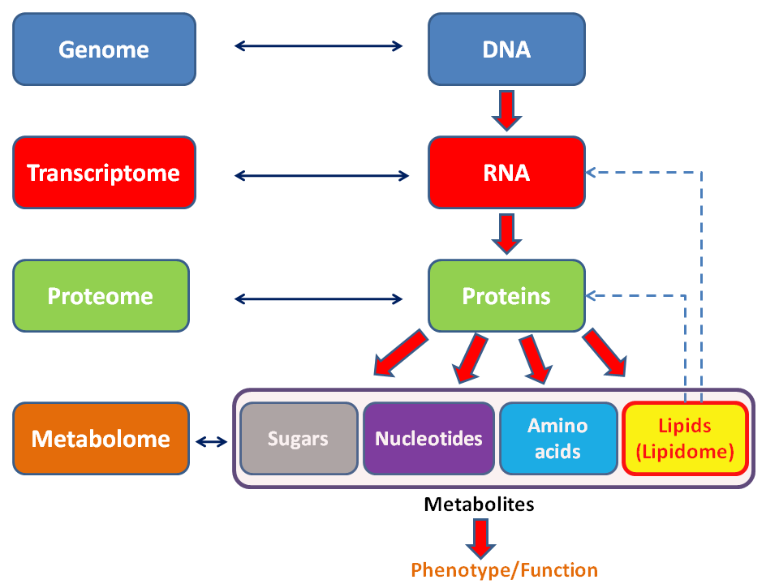
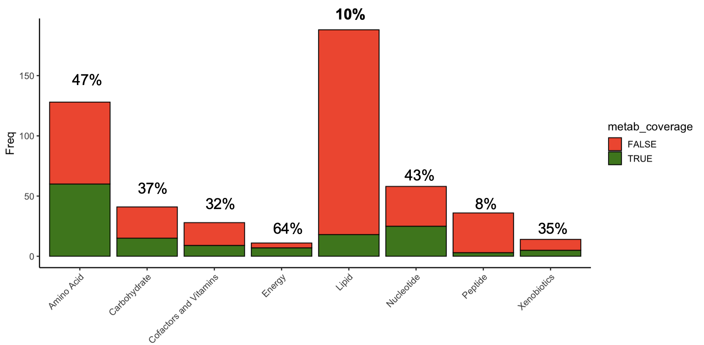

---
output:
  xaringan::moon_reader:
    css: [default, metropolis, metropolis-fonts]
    lib_dir: libs
    nature:
      highlightStyle: github
      countIncrementalSlides: false
      seal: false
      ratio: '16:9'
---

class: inverse, middle
background-image: url(title_background.svg)
background-size: cover
<font color = "white">
# Innovative approaches for analysis and integration of metabolomic data
### Andrew Patt
### Ohio State University
Department of Biomedical Informatics/Biomedical Sciences Graduate Program

`r format(Sys.time(), '%B %d, %Y')`

---

<style>
p.caption {
  font-size: 0.6em;
}

.large { font-size: 200% }

.medium-large { font-size: 130% }

.center-left {
  position:          relative;
  top:               50%;
  transform:         translateY(50%);
}
.center-right {
  position:          relative;
  top:               50%;
  transform:         translateY(10%);
}

.remark-slide-content {
  background-color: #FFFFFF;
  border-top: 80px solid #171d6f;
  font-size: 20px;
  font-weight: 300;
  line-height: 1.5;
  padding: 1em 2em 1em 2em
}

.inverse {
  background-color: #171d6f;
  text-shadow: none;
}

</style>

# Metabolomics for biomedical research
--

- Study of small biomolecules using mass spectrometry or NMR

--

- Structurally and functionally diverse

--

- Impacted by diet, lifestyle, toxins, pharmaceutics, microbiome, etc.

--

- Downstream stage in flow of biological information

--

.center[
```{r,echo=FALSE,out.width="500px"}

```
]

---
class: inverse, bottom

# Project 1: Metabolomics of Liposarcoma

---

# Metabolomics of Liposarcoma

--

- Liposarcoma is a rare, deadly soft tissue sarcoma

--

- Prognosis depends on copy number of the MDM2 oncogene

--

- Experiments in cell lines with atorvastatin and MDM2 inhibitor were
  ineffective

--

- Examine the metabolic differences between MDM2 high and MDM2 low
  cell lines

--

.center[
```{r,echo=FALSE,out.width="750px"}

```
]

---

# Metabolomics of Liposarcoma

- Liposarcoma is a rare, deadly soft tissue sarcoma

- Prognosis depends on copy number of the MDM2 oncogene

- Experiments in cell lines with atorvastatin and MDM2 inhibitor were
  ineffective
  
- Examine the metabolic differences between MDM2 high and MDM2 low
  cell lines
  
.center[
```{r,echo=FALSE,out.width="750px"}

```
]

---

# MDM2 high tumor cells resist apoptosis

```{r,echo=FALSE,out.width="1000px"}
library(plotly)
library(ggplot2)
plot<-readRDS("img/metabolite_volcano_plot.Rds")
ggplotly(plot)
```


---

# MDM2 high tumor cells resist apoptosis

```{r,echo=FALSE,out.width="1000px"}
knitr::include_graphics("img/Metabolon_pathways.png")
```


---

# MDM2 high tumor cells resist apoptosis


```{r,echo=FALSE,out.width="1000px"}
plot<-readRDS("img/Lipid_volcano_plot.Rds")
ggplotly(plot + theme_classic(base_size=12))
```

---

# MDM2 high tumor cells resist apoptosis

```{r,echo=FALSE,fig.height=8,fig.width=15}
##knitr::include_graphics("img/Glycosylated_ceramides.png")

load("img/heatmap.Rda")
heatmap.2(y, Colv=as.dendrogram(hc), col=mycol, scale="row", density.info="none",
          trace="none",dendrogram = "col", lhei=c(1.5,5,1),
          lwid=c(1.5, 3),
          ColSideColors = col_colors,
          tracecol = "black",
          labCol=as.vector(t(mycell)),
          cexRow = 1.1,
          margins=c(5,16))

```


---

# Challenges in lipid analysis

.center[
```{r,echo=FALSE,out.width="1000px"}

```
]

---
class: inverse, bottom

# Project 2: Expand lipid annotations in RaMP

---

# RaMP: Relational Database of Metabolic Pathways
.pull-left[
- Metabolic pathway database integrating pathways from other databases
- MySQL database with associated R package and RShiny app
- [Website](https://ramp-db.bmi.osumc.edu/)
- Pathways include enzymes/transcripts that catalyze reactions on metabolites
- Other info includes reactions and ontology (biofluid/disease associations)
- Query pathway participation info on metabolites/genes, or perform
pathway enrichment analysis on a set of analytes 
- Functional clustering of pathways
]

.pull-right[
```{r,echo=FALSE,out.width="1000px"}
knitr::include_graphics("img/map00600.png")
```
]

---

# Proposed RaMP Renovation

.pull-left[
- 6 different types of information: Chemical structure, Chemical
  class, Context (subcellular or tissue location), Chemical/physical
  properties, Biological function, Disease association
- Drawn from following open-source resources:
  - LION/Web: >250,000 annotations for >50,000 lipids, including lipid class, subcellular location, biolog- ical function, and biochemical/physical properties.
  - SwissLipids: Location, reaction, structure and chemical class annotations for 777,657 lipids (real and theoretical)
  - Lipid Maps: Structure and chemical class annotations for 43,636 lipids
  - LipidPedia: Disease, MeSH term, function, reactions for 4,487 lipids.
- Implement enrichment analysis software for lipids
]

.pull-right[
```{r,echo=FALSE,out.width="250px"}
knitr::include_graphics("img/LipidMaps.png")

knitr::include_graphics("img/LIONWeb.png")

```
]

---
class: inverse, bottom

# Project 3: Develop novel functional enrichment method for lipids and metabolites

---
# Build similarity network model of lipid species

.medium-large[
- Quantify species similarity in each annotation type
- Similarities will be used as edges in networks where nodes are
lipids
- Fuse individual models into consensus model:
  - Similarity network fusion algorithms
  - Simple methods (union of edges, sum of edges)
  - Multiplex page rank
  - Affinity aggregation for spectral clustering]

---

# Identify groups of similar lipids altered by phenotype

.medium-large[
- Take a list of metabolites or lipids of interest as input
- Construct similarity networks for each level of ontology and fuse
into consensus similarity network of lipids 
- Identify metabolites/lipids that are significantly similar to the
  list of analytes of interest using network topology
- Output will be groups of highly similar metabolites that were
  altered with respect to phenotype
- Validate by comparing results of this method to conventional ORA in
  liposarcoma, as well as simulated and public data]

---

# Preliminary Result

```{r,echo=FALSE,out.width="1000px"}

```
---

# Current work

## - Completion of liposarcoma paper
## - Review paper of multi-omic integration strategies for metabolomic data


