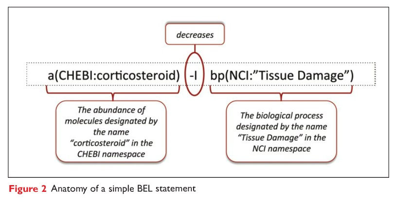
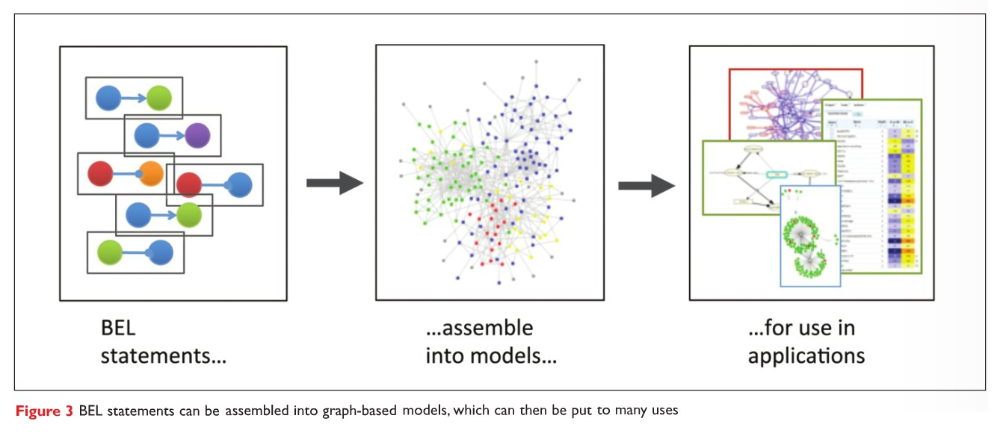
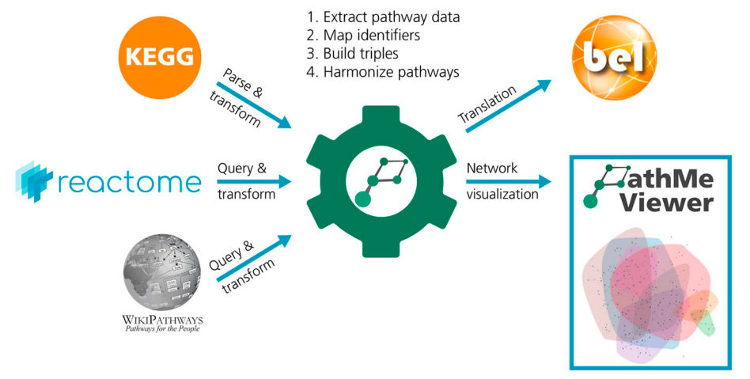
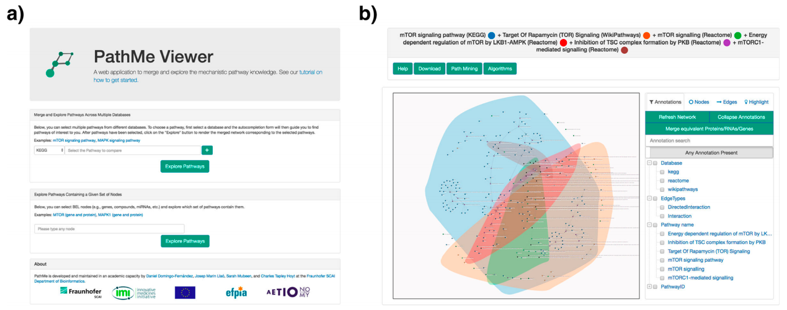
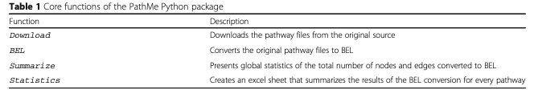
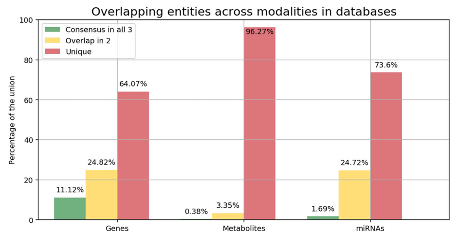
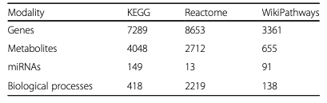
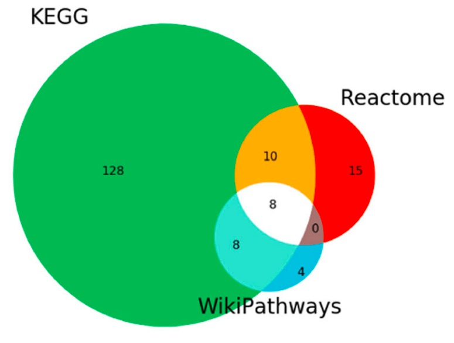
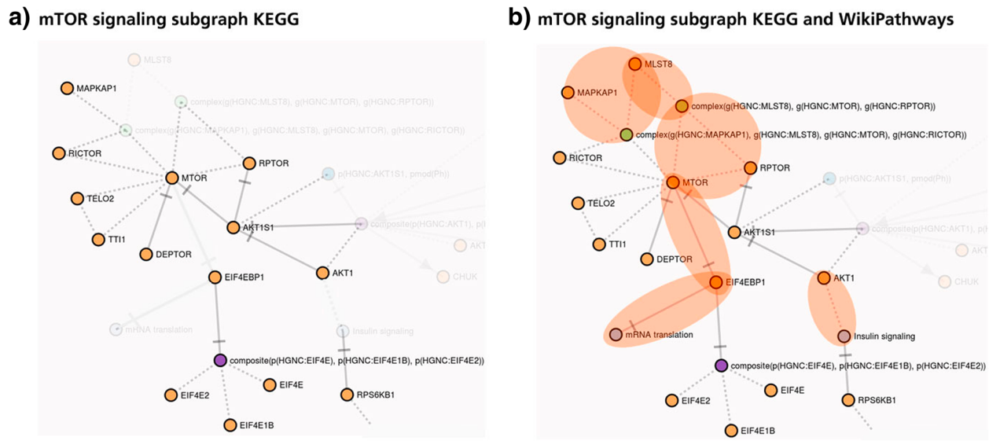

<style>
p.caption {
  font-size: 0.6em;
}

.center-left {
  position:          relative;
  top:               50%;
  transform:         translateY(50%);
}
.center-right {
  position:          relative;
  top:               50%;
  transform:         translateY(10%);
}
</style>

# Introduction

- Pathway databases ease pathway-centric analyses of omic data
- Most of these resources are generated in silo and lack interoperability
- Harmonizing these databases improves the coverage they provide for pathway analysis
- Leads to development of metadatabases
  - PathwayCommons
  - ConsensusPathDB
  - *RaMP*
- Harmonizing is a major challenge and requires a unified framework. Challenges include:
  - Differences in scale
  - Nomenclature (standard vs internal)
- Formats for harmonizing 
  - Systems Biology Markup Language
  - Systems Biology Graphical Notation
  - Biological Pathway Exchange
  - Biological Expression Language
- Study of the redundancy of these different databases is necessary

---

# Biological Expression Language

.pull-left[
```{r,echo=FALSE,out.width="1000px"}


```
]

.pull-right[
.center-right[
- Simple language for describing relationships between biological
entities in a machine-readable format 
- Typically consists of triplet describing a causal, directional relationship
- Can be used to represent complex network of relationships
- Widely used (developed 10 years ago)
]
]

---

# Overview

.pull-left[
.center-left[
```{r,echo=FALSE,out.width="1000px"}

```
]
]

.pull-right[
- Integrating 3 databases of transcript/metabolite/miRNA pathways:
  - Wikipathways
  - Reactome
  - KEGG
- Hierarchical common nomenclature prioritization depending on data
type (e.g. CheBI for metabolites, HGNC for genes) 
- Parsers were written in Python thanks to preexisting PyBEL framework
- Includes a viewer for researchers to explore the crosstalk between pathways
- Overlap between pathways is calculated as $S(X,Y) = \frac{|X \cap Y|}{min(|X|,|Y|)}$

]

---

# Viewer and package functions

.pull-left[
```{r,echo=FALSE,out.width="1000px"}

```
</br>
</br>
</br>
</br>
</br>
</br>
```{r,echo=FALSE,out.width="1000px"}

```
]

.pull-right[

### Viewer:
- Query pathways in the database and get network visual of analyte constituents
- Query multiple pathways simultaneously and visualize their overlap
- Filter nodes/edges, calculate paths
- Calculate centrality of nodes
- Quantify similarity of pathways

### Package:
- Download raw pathway files
- Generate BEL files
- Summarize transformed content
- Calculate detailed network statistics

]

---

# Overlap between databases

.pull-left[
```{r,echo=FALSE,out.width="1000px"}

```
</br>
</br>
</br>
</br>
```{r,echo=FALSE,out.width="800px"}

```
]

.pull-right[
- Used a "highly cited and peer reviewed "collection of 510 pathways from WikiPathways as comparison
- Overlap was generally low
  - Metabolites in particular had very low overlap since sizes of databases were so variable
  - Pathway definitions are so subjective that only 21 pathways were found in all 3 databases
	- In many cases, even these common, well annotated pathways had relatively low overlap between databases
  - "Structural resolution" issues apply to genes and proteins too
- The hassle of putting this together points to the need for stricter adherence to standard nomenclatures in biological databases
]

---

# Case study: mTOR signaling pathway 

.pull-left[
```{r,echo=FALSE,out.width="400px"}

```
</br>

```{r,echo=FALSE,out.width="800px"}

```
]

.pull-right[
- Venn diagram (top) shows overlap in all modalities (metabolites, genes, miRNAs and processes) across all 3 databases
- While there is clearly overlap, each database contains unique information
- mTOR signaling is well known to interact with other biological processes downstream, including mRNA translation and insulin signaling
- By superimposing the KEGG and Wikipathways versions of the pathway, they were able to get a more complete view of the pathway than either database provided on its own
- The PathMe viewer allows researchers to interactively compare pathways to test hypotheses like this 
]

---

# Conclusions

- Translation of biological relationships to BEL improved the amount of information that could be included in the database
- Study illustrated the major obstacles in the way of harmonizing biological databases
- Automatically updates periodically using cron
- Flexible framework that can accommodate the inclusion of further databases
