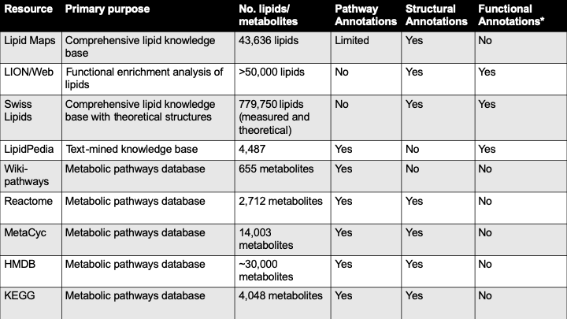
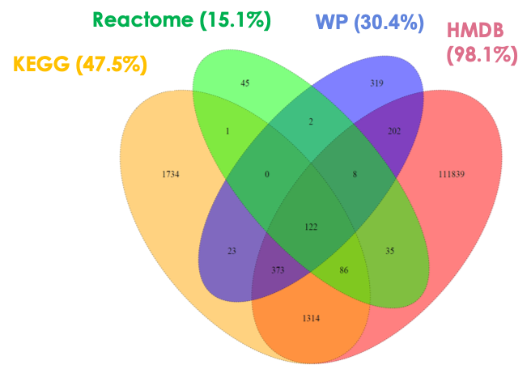

---
output:
  xaringan::moon_reader:
    css: [default, metropolis, metropolis-fonts]
    lib_dir: libs
    nature:
      highlightStyle: github
      countIncrementalSlides: false
      seal: false
      ratio: '16:9'
---

class: inverse, middle
background-image: url(title_background.svg)
background-size: cover
<font color = "white">
# PathMe: merging and exploring mechanistic pathway knowledge
### Andrew Patt
### Ohio State University
Department of Biomedical Informatics/Biomedical Sciences Graduate Program

`r format(Sys.time(), '%B %d, %Y')`

---
<style>
p.caption {
  font-size: 0.6em;
}

.large { font-size: 200% }

.medium-large { font-size: 130% }

.center-left {
  position:          relative;
  top:               50%;
  transform:         translateY(50%);
}
.center-right {
  position:          relative;
  top:               50%;
  transform:         translateY(10%);
}
</style>

# Introduction

- Pathway databases ease pathway-centric analyses of omic data
- Most of these resources are generated in silo and lack interoperability
- Harmonizing these databases improves the coverage they provide for pathway analysis
- Leads to development of metadatabases
  - PathwayCommons
  - ConsensusPathDB
  - **RaMP**
- Harmonizing is a major challenge and requires a unified framework. Challenges include:
  - Differences in scale
  - Nomenclature (standard vs internal)
- Formats for harmonizing 
  - Systems Biology Markup Language
  - Systems Biology Graphical Notation
  - Biological Pathway Exchange
  - Biological Expression Language
- Study of the redundancy of these different databases is necessary

---

# Biological Expression Language

.pull-left[
```{r,echo=FALSE,out.width="1000px"}
knitr::include_graphics("BEL_2.jpg")
knitr::include_graphics("BEL_3.jpg")
```
]

.pull-right[
.center-right[
.medium-large[
- Simple language for describing relationships between biological
entities in a machine-readable format 
- Typically consists of triplet describing a causal, directional relationship
- Can be used to represent complex network of relationships
- Widely used (developed 10 years ago)
]
]
]

---

# Overview

.pull-left[
.center-left[
```{r,echo=FALSE,out.width="1000px"}
knitr::include_graphics("fig1.png")
```
]
]

.pull-right[
- Integrating 3 databases of transcript/metabolite/miRNA pathways:
  - Wikipathways
  - Reactome
  - KEGG
- Hierarchical common nomenclature prioritization depending on data
type (e.g. CheBI for metabolites, HGNC for genes) 
- Parsers were written in Python thanks to preexisting PyBEL framework
- Includes a viewer for researchers to explore the crosstalk between pathways
- Overlap between pathways is calculated as $S(X,Y) = \frac{|X \cap Y|}{min(|X|,|Y|)}$

]

---

# Viewer and package functions

.pull-left[
```{r,echo=FALSE,out.width="1000px"}
knitr::include_graphics("fig2.png")
```
</br>
</br>
</br>
</br>
</br>
</br>
```{r,echo=FALSE,out.width="1000px"}
knitr::include_graphics("table1.png")
```
]

.pull-right[

### Viewer:
- Query pathways in the database and get network visual of analyte constituents
- Query multiple pathways simultaneously and visualize their overlap
- Filter nodes/edges, calculate paths
- Calculate centrality of nodes
- Quantify similarity of pathways

### Package:
- Download raw pathway files
- Generate BEL files
- Summarize transformed content
- Calculate detailed network statistics

]

---

# Overlap between databases

.pull-left[
```{r,echo=FALSE,out.width="1000px"}
knitr::include_graphics("fig3.png")
```
</br>
</br>
</br>
</br>
```{r,echo=FALSE,out.width="800px"}
knitr::include_graphics("table2.png")
```
]

.pull-right[
- Used a "highly cited and peer reviewed "collection of 510 pathways from WikiPathways as comparison
- Overlap was generally low
  - Metabolites in particular had very low overlap since sizes of databases were so variable
  - Pathway definitions are so subjective that only 21 pathways were found in all 3 databases
	- In many cases, even these common, well annotated pathways had relatively low overlap between databases
  - "Structural resolution" issues apply to genes and proteins too
- The hassle of putting this together points to the need for stricter adherence to standard nomenclatures in biological databases
]

---

# Case study: mTOR signaling pathway 

.pull-left[
```{r,echo=FALSE,out.width="300px"}
knitr::include_graphics("fig4.png")
```
</br>

```{r,echo=FALSE,out.width="800px"}
knitr::include_graphics("fig5.png")
```
]

.pull-right[
- Venn diagram (top) shows overlap in all modalities (metabolites, genes, miRNAs and processes) across all 3 databases
- While there is clearly overlap, each database contains unique information
- mTOR signaling is well known to interact with other biological processes downstream, including mRNA translation and insulin signaling
- By superimposing the KEGG and Wikipathways versions of the pathway, they were able to get a more complete view of the pathway than either database provided on its own
- The PathMe viewer allows researchers to interactively compare pathways to test hypotheses like this 
]

---

# Conclusions
.large[
- Translation of biological relationships to BEL improved the amount of information that could be included in the database
- Study illustrated the major obstacles in the way of harmonizing biological databases
- Automatically updates periodically using cron
- Flexible framework that can accommodate the inclusion of further databases
]
---

class: inverse, middle
background-image: url(title_background.svg)
background-size: cover
<font color = "white">

# Improving interpretation of lipidomic and metabolomic data through comprehensive functional annotation and network approaches

---

# Significance
.medium-large[
- Metabolomics and lipidomics are fields of increasing interest that
  lack standard analysis methodology
- Differences in structural resolution makes pathway mapping of
  lipidomics difficult
- Pathway-level analysis of the lipidome/ metabolome is a reproducible
  method for inferring biological processes associated with disease
- Tools for network visualization and analysis of lipid/metabolite data are needed
- Network methods can be used to model interdependencies between lipids and other metabolites
]
---

# Innovation
.pull-left[
.medium-large[
- Development of comprehensive, multi-source lipid annotation database
- Integrating multiple annotation types into a single enrichment strategy
- Modeling interdependency of pathways
- Network visuals of pathway and analyte similarity
]
]

.pull-right[
.center-right[
```{r,out.width = "90%",out.height="90%",echo=FALSE}

```
]
]

---
class: inverse, middle
background-image: url(title_background.svg)
background-size: cover
<font color = "white">

# Aim 1:
## Expand lipid annotations within RaMP to increase coverage of lipid annotations and improve usability of open source lipidomic software

---

# Preliminary findings (aim 1)

.pull-left[
```{r,out.width = "100%",out.height="100%",echo=FALSE}

```
]

.pull-right[
```{r,out.width = "100%",out.height="100%",echo=FALSE}
knitr::include_graphics("Network_fig2.pdf")
```
]

---
# Subaim 1a: 
## Consolidate lipid annotations in RaMP from LipidMaps, SwissLipids, LipidPedia, and LION/Web

Seven different types of information: 

1. Chemical structure in the form of INChiKeys 
2. Chemical classes (e.g. ceramides, phosphocholines) 
3. Context, (e.g. subcellular or tissue location) 
4. Chemical/physical properties (e.g. headgroup charge, bilayer thickness) 
5. Biological function (e.g. signaling, storage) 
6. Disease 
7. Biochemical reactions

- LION/Web: >250,000 annotations for >50,000 lipids, including lipid class, subcellular location, biolog- ical function, and biochemical/physical properties.
- SwissLipids: Location, reaction, structure and chemical class annotations for 777,657 lipids (real and theoretical)
- Lipid Maps: Structure and chemical class annotations for 43,636 lipids
- LipidPedia: Disease, MeSH term, function, reactions for 4,487 lipids.

---

# Subaim 1b: 
## Implement conventional ORA software for expanded lipidomic knowledgebase

.medium-large[
- Implement enrichment testing software for all annotations gathered in 1a
- **Input:** User supplied list of significantly different analytes (or FC list for KS)
- **Output:** P values for enrichment of annotations associated with user list
- Types:
  - Fisher's
  - Hypergeometric
  - KS (MSEA style analysis)
]

---

# Subaim 1c: 
## Develop methodology for the visualization of coverage of pathways in user-supplied data

- Allow users to visualize annotation coverage and redundancy associated with their data
- **Input:** User-supplied list of differentially expressed analytes
- User chooses:
  - Pathway sources
  - Alternative annotation scheme
  - Context constraints
  - Edge weight filtration
- Edge weights are determined by Fisher's overlap
- Modules detected by Louvain clustering algorithm
- Functional terms are tested for enrichment in modules (e.g. BRITE terms in KEGG graph)
- **Output:** Network visual of pathway redundancy, where nodes are pathways and weighted edges describe metabolite overlap

---

class: inverse, middle
background-image: url(title_background.svg)
background-size: cover
<font color = "white">

# Aim 2:
## Integrate metabolite/lipid annotations into a consensus similarity network to identify shifts in pathways and chemical classes associated with phenotype

---

# Subaim 2a: 
## Develop methodology for merging similarity network models built in individual annotation schema into a consensus similarity network model.
.medium-large[
- Merging pathway, chemical structure, annotation, and potentially reaction networks
- Potential methods:
  - Grassmann Manifold
  - Similarity Network Fusion
  - Multiplex Page Rank
  - Affinity Aggregation for Spectral Clustering
  - Sum Edge Weights
  - Union of Edges
]

---

# Subaim 2b: 
## Develop methodology for detecting enriched modules in the consensus similarity network
- **Input:** List of statistically significant (T-test, Wilcox, PLS-DA) lipids
- Method: 
  - Construct similarity networks for each level of ontology and fuse
    into consensus similarity network of lipids
  - Random walk from significant seed lipids to identify associated lipids
  - Empirical p value distribution to assign significance
- **Output:** Modules of similar lipids associated with the condition of interest with statistical significance associated with them
- Validate in simulated data as well as liposarcoma

---

# Subaim 2c: 
## Develop LipidSPAN and MetaboSPAN: R package/Shiny app for Lipid/Metabolite Structure, Pathway, and Annotation Network enrichment analysis
- Associated R package for work described in proposal
- Separated because many of the annotations I'm gathering in the
  proposal are exclusive to lipids and I liked the name "LipidSPAN"
- Functionality:
  - Uploading of data
  - log2 transformation
  - MSTUS normalization
  - Differential abundance testing
  - Associated volcano plots and heatmaps
  - Conventional enrichment analysis (1b)
  - Network coverage visual (1c)
  - Network-based enrichment (2a & 2b)
