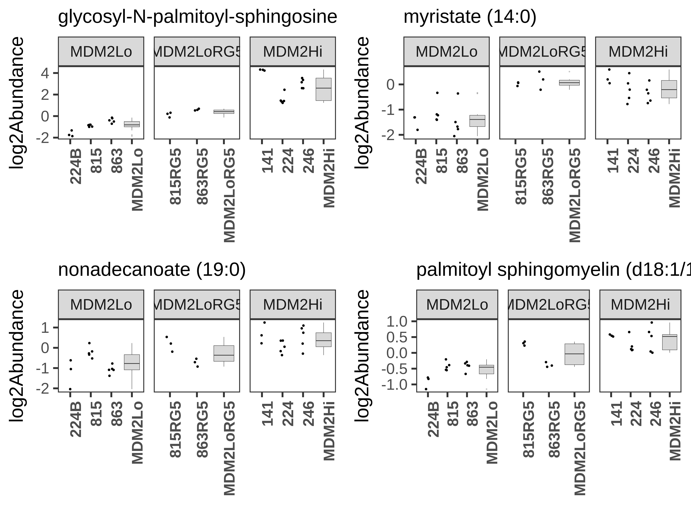
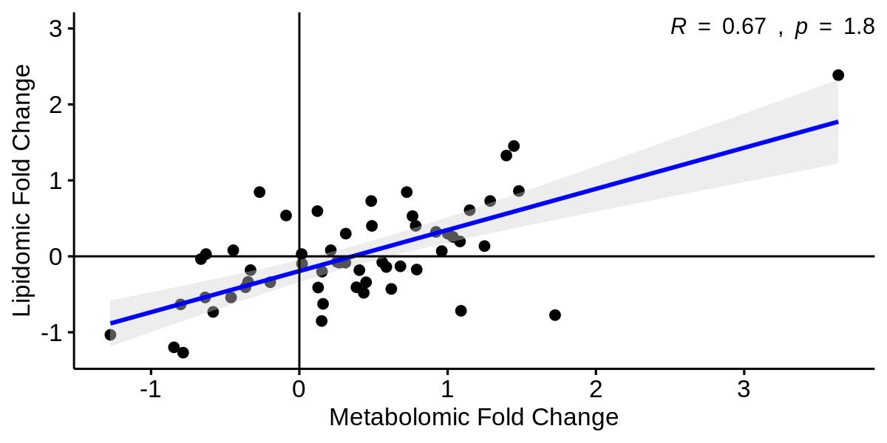

---
output:
  xaringan::moon_reader:
    css: [default, metropolis, metropolis-fonts]
    lib_dir: libs
    nature:
      highlightStyle: github
      countIncrementalSlides: false
      seal: false
      ratio: '16:9'
---

class: inverse, middle
background-image: url(title_background.svg)
background-size: cover

<font color = "white">
## An integrative systems genetic analysis of mammalian lipid metabolism
.pull-left[
### Andrew Patt
### Ohio State University
Department of Biomedical Informatics/Biomedical Sciences Graduate Program

]

.pull-right[
.center[
```{r,echo=FALSE,out.width="200px"}
knitr::include_graphics("img/Ohio_State_University_seal.svg.png")
```
]
]


---

<style type="text/css">

p.caption {
  font-size: 0.6em;
}

.large { font-size: 200% }

.medium-large { font-size: 130% }

.small{ font-size: 80% }

.center-left {
  position:          relative;
  top:               50%;
  transform:         translateY(50%);
}
.center-right {
  position:          relative;
  top:               50%;
  transform:         translateY(10%);
}

.remark-slide-content {
  background-color: #FFFFFF;
  border-top: 80px solid #8f1414;
  font-size: 28px;
  font-weight: 300;
  line-height: 1.5;
  padding: 1em 2em 1em 2em
}

.inverse {
  background-color: #8f1414;
  text-shadow: none;
}

.left-column {
	color: #000000;
	width: 40%;
	height: 92%;
	float: left;
}

.right-column {
  width: 58%;
  float: right;
  padding-top: 1em;
}

</style>


# Introduction

.pull-left[
- Hepatosteatosis (fatty liver disease) affects 30% of people in Western countries
- Often asymptomatic but can lead to fibrosis and liver cancer
- Causes are widely varied
- Genetic reference panels are like GWASs but are performed on model organisms (mice, drosophila) 
- Allows for identification of genetic, proteomic and lipidomic associations with phenotype
]

.pull-right[
```{r,echo=FALSE,out.width="450px"}

```
]

---

# Plasma lipids correlate with some liver lipids

.left-column[
- Lipids that were significantly correlated between plasma and liver:
  - AlkylPCs
  - HexCers (MHC)
  - PEs
- These lipids have been previously reported to influence hepatic lipotoxicity
- Not all relationships were in the same lipid species or positive correlations
]

.right-column[
```{r,echo=FALSE,out.width="1000px"}
knitr::include_graphics("img/Fig1c.png")
```
]

---

# Predicting liver lipids from plasma lipids

- Objective was to predict total class abundance in liver lipids using
  pairwise ratios of individual plasma species
- Top 10% of extreme correlation coefficients were used for the model 
- Used clustering-based representative feature selection to further
  reduce number of features down to about 50 per class
- LASSO regression with five fold CV repeated 10 times for a total of 50 trials
- Predictability ranked by proportion of trials that produced a
  significant linear model (1D)

---

# Liver lipid predictions by class

.left-column[
- Points are predicted vs actual values in individual mice (n=268, top) or humans (n=58, bottom)
- Boxes are plasma lipid ratios with highest individual correlation with lipid class in liver
]

.right-column[
```{r,echo=FALSE,out.width="550px"}
knitr::include_graphics("img/Fig1e.png")

```
]

---

# Integrating lipidome and peroxisomal proteome

- Used correlations to identify proteins associated with levels of peroxisomal "baits"
- Enrichment analysis confirmed peroxisomal proteins were recovered by this strategy
- Identified correlations between known peroxisomal proteins and liver lipid classes as well as novel associations
- ACAD11 was associated with almost every lipid class queried
- Validated it's activity in lipid metabolism in the peroxisome through:
  - Enrichment analysis of associated proteins
  - Confocal microscopy/Western blotting showing colocalization with peroxisome
  - Affinity-purification MS, which identified associations with more
    peroxisomal proteins as well as validated some correlations

---

# ACAD11 as a novel regulator of peroxisomal lipidome

.center[
```{r,echo=FALSE,out.width="1000px"}

```
]

---

# Genomic integration with proteome and lipidome

.pull-left[
- Identified 1,984 SNPs that were associated with a protein and a
lipid in the liver
-  Identified 3,342 SNPs in 27 loci that co-mapped to both a hepatic protein
and a plasma lipid, in which the protein and plasma lipid also correlated 
-  Implies causality in the identified protein/lipid relationship]

.pull-right[
```{r,echo=FALSE,out.width="1000px"}

```
Left is liver, right is plasma (top row)
]

---

# Investigating PSMD9 as a lipid metabolism regulator

- Previously known to be a component of proteasomes, associated with obesity and CVD
- Found global correlations with large number of liver and plasma lipids
- Performed gain and loss of function of PSMD9 experiments in 2 mouse
  strains being fed a Western diet (lipotoxic conditions)
- Many proteins involved in FA metabolism and synthesis were decreased following LoF
- Some effects were strain-specific
- Validated with histological analysis
---

# PSMD9 promotes lipid synthesis in the liver

.center[
```{r,echo=FALSE,out.width="900px"}

```
]

---

# Conclusions

--

.pull-left[
Conclusions drawn from multiomic correlation analysis
<br>
<br>
.center[
```{r,echo=FALSE,out.width="250px"}

```
]
]

--

.pull-right[
Conclusions drawn from multiomic correlation analysis **with experimental validation**

```{r,echo=FALSE,out.width="500px"}

```
]

---

# Conclusions
.small[
- Identified lipid pairs that can be assayed in serum to predict liver
  lipid levels that are associated with hepatosteatosis (validated in humans)
- Designed a network-based approach to identifying important novel
  protein regulators of lipids in hepatosteatosis, including ACAD11 in
  the peroxisome as an example (prior knowledge/supervised approach)
- Integrated whole genome data to infer causality
- Demonstrated the importance of interplay between genome, proteome and lipidome
- Identified PSMD9 as a potential therapeutic target for reducing
  lipid accumulation in the liver
- Extensive biological validation of findings:
  - Coherent patterns across 'omes
  - Consistencies with prior knowledge (KEGG pathways/GO/Protein interactions)
  - Human data
  - Fluorescence microscopy
  - Western blotting
  - Transcriptomics
  - AP-MS
  - Histology
  ]

---

class: inverse, bottom

# My research

---

# Novel network enrichment method

.center[
```{r,echo=FALSE,out.width="1000px"}
knitr::include_graphics("img/Network_project_schematic.png")
```
]
---

# Improved enrichment method for metabolomics

```{r,echo=FALSE,out.width="1200px"}
knitr::include_graphics("img/Network_figure_2.png")
```

---

# MDM2 amplification drives aberrant lipid metabolism

### Sphingolipid metabolism
- Cross-platform shifts in HexCers, sphingomyelins
- 2 pathways from enrichment analysis
- Increase in UGCG in MDM2 high cells
- UGCG results in worse prognosis in TCGA SARC
--
### Fatty acid/pro-inflammatory lipid metabolism
- Saturated fatty acids higher in MDM2 high
- MGDG and Ac-Ser-Asp-Lys-Pro-OH depleted in MDM2 high
- Alterations in Prostaglandin/Thromboxane synthesis and Eicosanoid pathways
--
### Cholesterol metabolism
- Differential response to atorvastatin treatment
- Shifts in bile acid pathways

---

# MDM2 inhibitor actually increases MDM2 expression

```{r,echo=FALSE,out.width="1200px"}

```

---

# Lipidomic data validates metabolomic data 

```{r,echo=FALSE,out.width="1200px"}

```

---

# Future work

- Search for more transcriptomic links with MDM2 (Sphingomyelin Synthase, Fatty Acid Synthase)
- Finish writing paper
- Refine and validate network enrichment results:
  - How best to merge networks?
  - How to analyze network topology?
