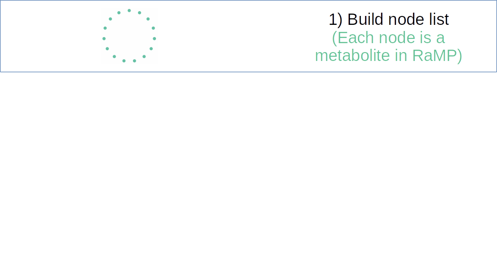

---
output:
  xaringan::moon_reader:
    css: [default, metropolis, metropolis-fonts]
    lib_dir: libs
    includes:
      after_body: insert-logo.html
    nature:
      highlightStyle: github
      countIncrementalSlides: false
      seal: false
      ratio: '16:9'
---
class: primary

<style type="text/css">

p.caption {
  font-size: 0.6em;
}

.large { font-size: 200% }

.medium-large { font-size: 130% }

.small{ font-size: 70% }

.tiny{ font-size: 60% }

code.r{
  font-size: 20px;
}

.center-left {
  position:          relative;
  top:               50%;
  transform:         translateY(50%);
}
.center-right {
  position:          relative;
  top:               50%;
  transform:         translateY(10%);
}

.remark-slide-content {
  background-color: #FFFFFF;
  border-top: 80px solid #2b0a5e;
  font-size: 28px;
  font-weight: 300;
  line-height: 1.5;
  padding: .5em 1em .5em 1em
}

.inverse {
  background-color: #2b0a5e;
  text-shadow: none;
}

.right-column {
	color: #000000;
	width: 30%;
	height: 92%;
	float: right;
}

.left-column {
  width: 68%;
  float: left;
}

.remark-slide-number {
	display: none;
}

.remark-slide-content:after {
    content: "";
    position: absolute;
    bottom: 0px;
	left: 20px;
    height: 60px;
    width: 400px;
	font-size: 12px;
    background-repeat: no-repeat;
    background-size: contain;
	background-image: url("img/The-Ohio-State-University-Wexner-Medical-Center.png")
}

.aligncenter {
  text-align: center;
}

</style> 

.pull-left[
<h2 style=font-size:35px> Novel personalized pathway-basedmetabolomics models reveal key metabolicpathways for breast cancer diagnosis </style>

<h6 style=font-size:20px>
Andrew Patt, Doctoral Candidate
<br>
<br>
National Center for Advancing Translational Science/The Ohio State University
</style>
]

.pull-right[
.center[
```{r,echo=FALSE,out.width="475px"}

```
]
]


---

# Introduction

- Highly accurate diagnostic test for breast cancer is lacking

- Need a high-sensitivity, noninvasive, cheap test

- Previous studies have identified metabolite biomarkers for breast cancer

- Metabolite biomarkers can be difficult to replicate

- This study tests the hypothesis that personalized high-level signatures (pathways) are more reproducible
---

# Study Design

.pull-left[
.small[
- GC-TOFMS and LC-TOFMS profiling of blood samples from breast cancer
  patients and healthy controls
  
- Two metabolomic datasets:
  - 132 breast cancer & 76 control plasma samples
  - 103 breast cancer & 31 control serum samples
  
- Validated in TCGA RNA-seq Breast cancer data (1082 tumor, 98 tumor
  adjacent controls)  
  
- Plasma is segregated into 80/20 cases/control split for all-stage
diagnosis model 

] ]

.pull-right[

```{r,echo=FALSE,out.width="600px"}

```
]

---

# Pathifier

- Generates a pathway dysregulation score for each sample in each
  pathway using metabolite abundances
  
- Measures perturbation based on a principle curve constructed from
  normal samples

- Principle curves are a one-dimensional non-parametric summary of a
  multi-dimensional dataset

- Pathifier accomodates custom pathway definitions

- In this study, pathways from HMDB, SMPDB, KEGG, IPA, FLink, Recon 2 and
  PubChem were analyzed
  
---
  
# Analytical workflow
  
```{r,echo=FALSE,out.width="1200px"}

```

---

# All-stage diagnosis model

.pull-left[
- Logistic regression using features selected by correlation feature
  selection (WEKA) in the plasma training set
  
- Excellent testing metrics across the board, even in different
  datasets
  
- Separate experiment found that age was not a large confounding
  variable for these models
]

.pull-right[
.center[
```{r,echo=FALSE,out.width="250px"}

```
]]

---

# Early-stage diagnosis model

.pull-left[
- Stages I and II only

- Slightly reduced but still excellent performance

- Similarly altered pathways besides Alanine, aspartate and glutamate
metabolism 
]

.pull-right[
.center[
```{r,echo=FALSE,out.width="250px"}

```
]]

---

# Comparing Pathway- and Metabolite-based models

.center[
```{r,echo=FALSE,out.width="750px"}

```
]

---

# Conclusions

- Pathway findings were transferable to other data sets, moreso than
  individual metabolites
  
- Significant contributors reflected previously described biology

- Describes biology on an individual sample level

- This approach can be used to compare results across -omes

---

# Addressing deficits in metabolite pathway analysis

- Metabolic pathway-level findings are more reproducible than
  individual metabolite perturbations
  
- Untargeted metabolomics provides inconsistent pathway-level coverage
  of the metabolome
  
- I hypothesize that identifying clusters of metabolites related by
  pathway participation and chemical function in data will improve
  recall of these high-level signatures
  
- To accomplish this, I integrate metabolite-level findings into a
  knowledge graph describing pathways and chemical similarity in RaMP
  
- The objective is to identify pathway clusters enriched in a list of
  perturbed metabolites

---

# Constructing the RaMP Knowledge Graph
.center[
```{r,echo=FALSE,out.width="900px"}

```
]
---

# Constructing the RaMP Knowledge Graph
.center[
```{r,echo=FALSE,out.width="900px"}

```
]
---

# Constructing the RaMP Knowledge Graph
.center[
```{r,echo=FALSE,out.width="900px"}
knitr::include_graphics("img/network_schematic3.png")
```
]
---

# Constructing the RaMP Knowledge Graph
.center[
```{r,echo=FALSE,out.width="900px"}
knitr::include_graphics("img/network_schematic4.png")
```
]
---


# Core MetaboSPAN functions
.tiny[
| Function          | Description | Input | Output |
|-------------|----------|----------------|----------------------|
| `extract_RaMP_metabolites()`    | Run random walks with restarts algorithm on RaMP knowledge graph with seed set of interest. Scores are currently compared with an empirical distribution made from random seed sets. |   Metabolites of interest (DB identifiers or common names), Number of iterations for empirical distribution (to be removed), Percentile random walk score cutoff for significance, Iterations for random walk (to be implemented)            |  Expanded list of metabolites of interest, Diagnostic histogram (to be removed)                 |
| `visualize_crosstalkers_network()` | View network visual of metabolites of interest, color coded by module  | Metabolites of interest   | Network visual displaying clusters of related metabolites  |
| `cluster_metabolites()` | Returns the cluster membership of metabolites in the above network   | Metabolites of interest     | Metabolites similarity cluster membership                   |
| `WY_pathway_adjustment()`  | Fisher's p value adjustment strategy for accounting for interdependence of pathways (see next slide)    | Metabolites of interest, metabolite panel background, number of iterations             | Adjusted p vals for pathways associated with metabolites of interest  |
]
---

# Example Network Visual

```{r,echo=FALSE,out.width="550px",fig.align="center"}

```


---

# Westfall-Young Fisher's p val adjustment

- Westfall and Young (1993) developed a method for p value
  permutation-based adjustment strategy that modeled interdependence
  in gene expression
```{r,eval=FALSE}
## Calculate true p values & sort
p_val_matrix[,1]<-sort(fishers_with_custom_background(metabs_of_interest,metab_panel))

## Calculate fake p values by sampling from background
for(i in 1:iterations){
    fake_metabs_of_interest<-sample(metab_panel,size=length(metabs_of_interest))
    fake_p_vals<-fishers_with_custom_background(fake_metabs_of_interest,metab_panel)
    pval_matrix<-cbind(pval_matrix,sort(fake_p_vals))
}

## Find percentile of true value among rank family
adjusted_p_vals<-apply(p_val_matrix,by_row,get_percentile(true_column,fake_columns))
```


---


# MetaboSPAN road map
```{r, echo=FALSE,out.width=1400}
library(DiagrammeR)
DiagrammeR::grViz("digraph nicegraph {
compound=true;
graph [nodesep = 1, ranksep = .5,
         color = black,rankdir=LR,fontsize=54]

# define the global styles of the nodes. We can override these in box if we wish
node [fontname = Helvetica, fontcolor = darkslategray, style=filled,
        shape = rectangle, fixedsize=true, width=8,height=4,
        color = darkslategray,fontsize=48]

edge [penwidth=7]

1 [label = 'Basic workflow\n implemented \n(Liposarcoma\n paper)', fillcolor = green]
2 [label = 'Write core \npackage \nfunctions', fillcolor = green]
3 [label =  'Address \npathway \n dependency', fillcolor = green]
5 [label = 'Improve \nrun time', fillcolor = yellow]
4 [label = 'Construct \nRaMP 2.0 \nknowledge \ngraph', fillcolor = green]
6 [label = 'Perform \nvalidation \nexperiments', fillcolor = yellow]
7 [label = 'Write \nthesis part IV/\nMetaboSPAN \npaper', fillcolor = red]
b1 [color = 'white', label='']

# edge definitions with the node IDs
subgraph cluster1 {
    label = 'Completed';
    style=dashed;
		color= '#625a5a';
fontname = 'helvetica-bold';
edge [style='invisible',dir='none']
1->2->3->4
}

subgraph cluster2 {
    label = 'In Progress';
    style=dashed;
		color= '#625a5a';
fontname = 'helvetica-bold';
5->7 6->7}

3->b1 [color='white',style='invisible',dir='none']
7->b1 [color='white',style='invisible',dir='none']
2->6 [ltail=cluster1,lhead=cluster2];
}")


```

---

# Validations in breast cancer: data
.small[
### Ambs Data
**Description:** Characterized the metabolomic profile of human breast
tumors and uncovered intrinsic metabolite signatures in these tumors
using an untargeted discovery approach and validation of key
metabolites

**Samples:** 67 Breast tumors and 65 adjacent normal tissue

**Chromatography/Spectrometry:** LC-MS/MS

### Garmire Data
**Description:** Use GC/MS and LC/MS technique to profile breast
cancer samples and normal control samples

**Sample types:** 132 Human breast cancer and 76 normal control plasma, 103 breast cancer and 31 control serum metabolomics profiling

**Chromatography/Spectrometry:** GC/MS and RPLC/MS, Positive mode only

**Clinical info** Healthy vs. disease, disease stage
]

---

# Breast cancer validation plan
.tiny[
1. Identify all pathways that are covered by metabolites in individual
   breast cancer datasets pre and post expansion. This will establish
   viable overlapping pathway results.
2. Select random sets of interest from dataset backgrounds. Perform
   MetaboSPAN analysis and demonstrate low overlap in results between
   data sets. This will establish that MetaboSPAN is not enriching for
   the same, promiscuous pathways in every analysis.
3. Perform MetaboSPAN on training/testing splits in the same data as
   well as different datasets and show overlap between significant
   results is higher than when using other methods. Methods to be
   benchmarked:
   1. MetaboSPAN + W-Y
   2. MetaboSPAN + Holm
   3. MetaboSPAN + FDR
   4. Fisher's (all Metaboanalyst databases individually as well as RaMP) + W-Y
   5. Fisher's + Holm
   6. Fisher's + FDR
   7. K-S + W-Y
   8. K-S + Holm
   9. K-S + FDR
   10. Topological + W-Y
   11. Topological + Holm
   12. Topological + FDR
4. Demonstrate that shared pathways between datasets are coherent
   given what's know about breast cancer in the literature
]

---

# COVID Data
.small[
#### PMC7197563
**Description:** Assayed lipidome and metabolome in a time-series
analysis, and performed statistical analysis to identify biomarkers of
disease severity.

**Samples:** Blood samples taken from 9 fatal outcome COVID-19 patients, survivors recovered from 11 severe COVID-19
cases & 14 mild COVID-19 cases, and 10 healthy controls
- TImepoint 1 in mild and severe is collected during "disease peak"
- Timepoint 2 in mild and severe is last collection before 

**Chromatography/Spectrometry:** LC-MS/MS

#### PMC7254001
**Description:** Measured metabolomic and proteomic profiles of
COVID-19 vs healthy controls and severe vs non-severe COVID-19
patients, and built a machine learning model to predict disease
severity.

**Samples** 46 COVID-19 patients, 53 control patients

**Chromatography/Spectrometry:** LC-MS/MS

]

---

# COVID Data continued

.small[
#### PMC7311890 
**Description:** Examined plasma and exosome of COVID-19 patients

**Samples:** 26 healthy controls, 18 mild cases, 19 moderate cases, 13 severe cases

**Chromatography/Spectrometry:** LC-MS
]

---

# Simulation: Robustness to noise
.small[
1. Starting data is a real data set (background & list of interest)

2. Perform MetaboSPAN analysis, treating significant pathways as "true
   positives" for remaining steps
   
3. Iteratively randomly replace metabolites in list of interest with
   metabolites from background. Perform metaboSPAN analysis and record
   the false positive rate as noise increases.
	   1. Metabolites selected from background may not be totally
          random. They may be selected based on properties such as
          belonging to promicscous or non-promiscuous pathways, or
          larger or smaller pathways. These experiments would be
          segregated accordingly so we don't compare panels of random
          metabolites that shouldn't be compared.
		  
4. Benchmark robustness to noise against methods and p value
   adjustments described in prior slides
   
5. This will establish that MetaboSPAN is less sensitive to random
   noise in the list of interest than other methods
]
---

# Simulation: Robustness to pathway properties
.small[
1. Starting data is a real metabolite panel (no list of interest)

2. Lists of interest are composed with true positives in mind
   1. Lists entirely composed of metabolites in large pathways
   2. Lists entirely composed of metabolites in small pathways
   3. Lists entirely composed of metabolites in promiscuous pathways
   4. Lists entirely composed of metabolites in non-promiscous pathways
   5. Small lists of interest (<10)
   6. Large lists of interest (>50)
   
3. Benchmark against other approaches described above

4. This will demonstrate that MetaboSPAN detects true positives at a
   similar or better rates as other methods in the various different
   plausible pathway analysis scenarios users are likely to encounter
]
