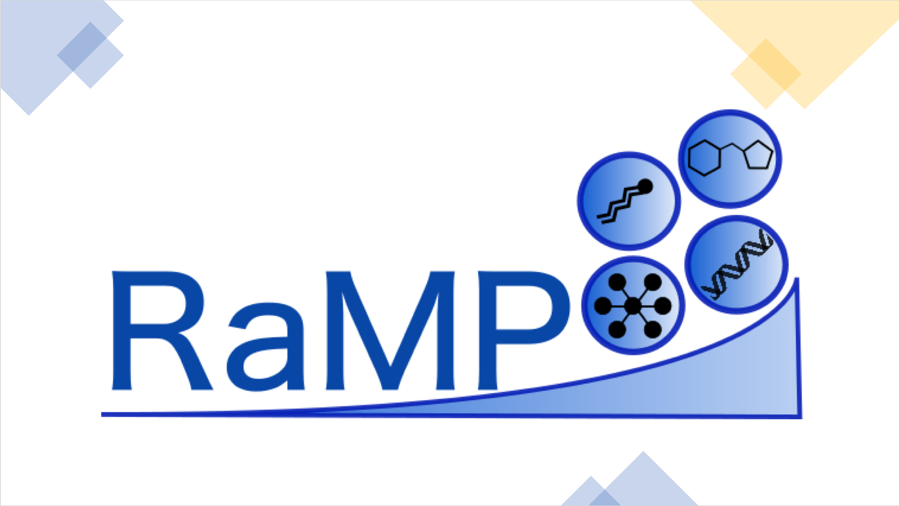
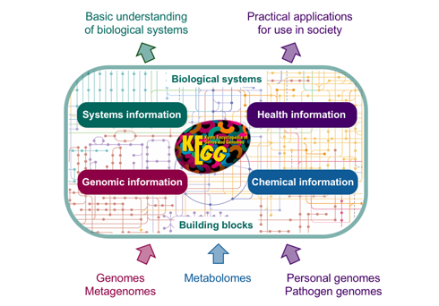
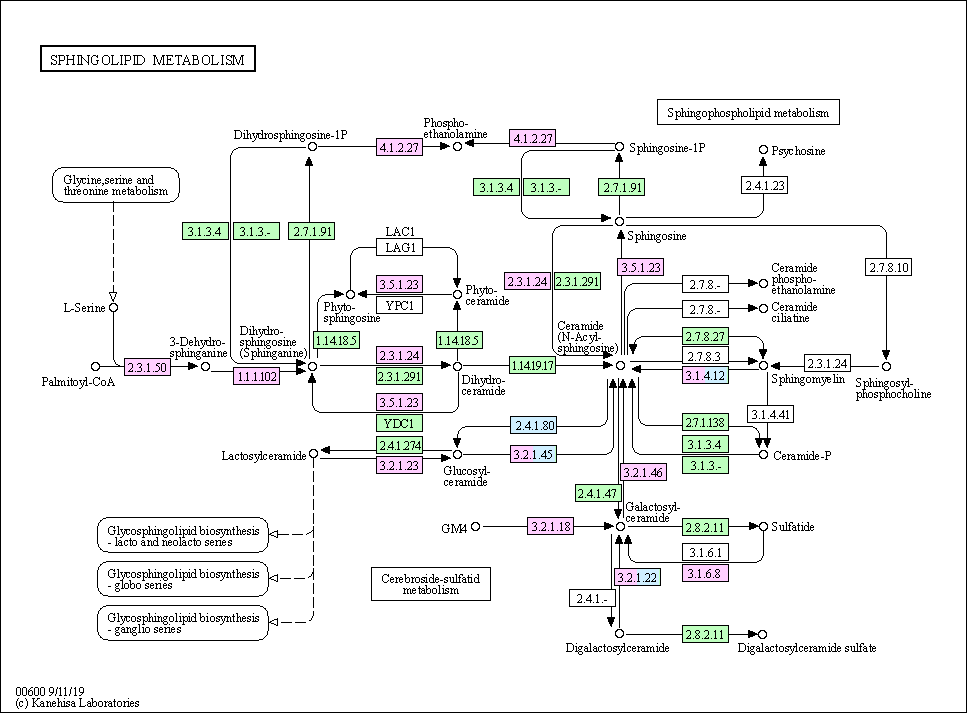
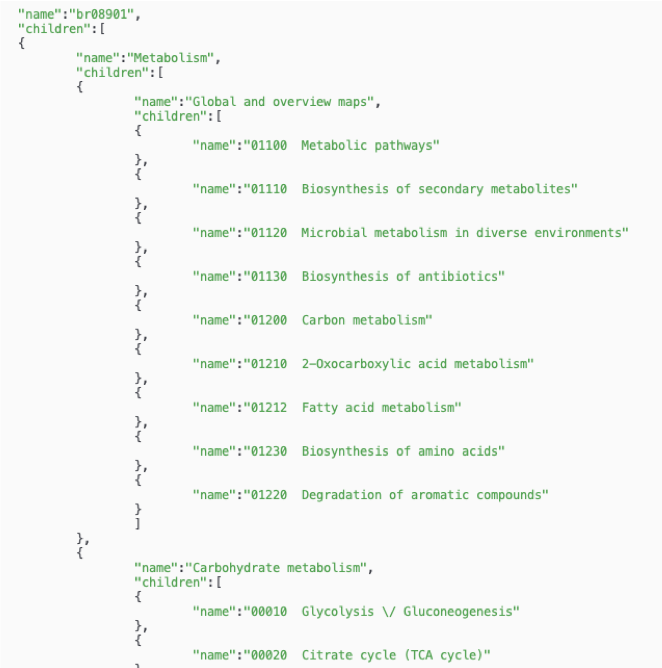
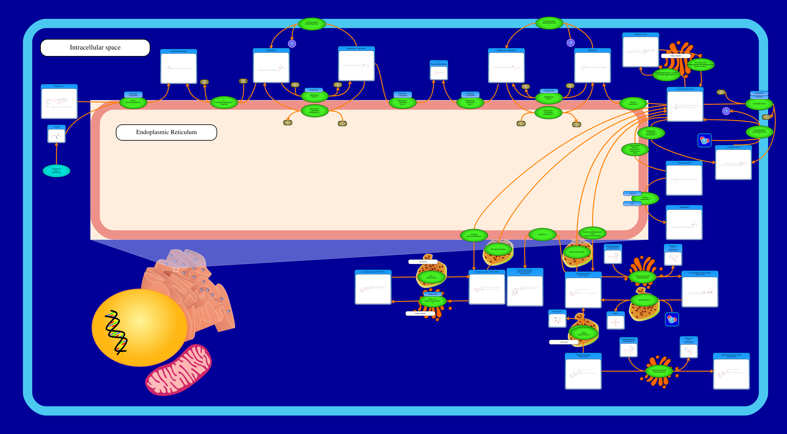
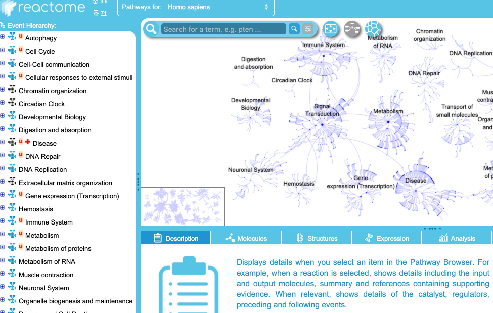
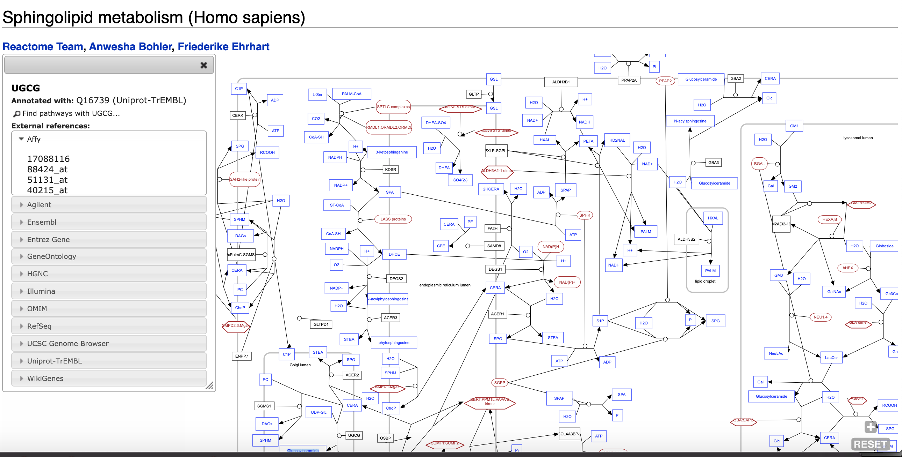
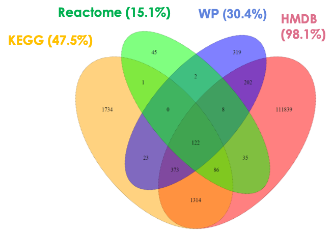

---
output:
  xaringan::moon_reader:
    css: [default, metropolis, metropolis-fonts]
    lib_dir: libs
    nature:
      highlightStyle: github
      countIncrementalSlides: false
      seal: false
      ratio: '16:9'
---

class: inverse, middle
background-image: url(title_background.svg)
background-size: cover

<font color = "white">
## Overview of Major Metabolic Pathway Databases
.pull-left[
### Andrew Patt
### National Center for Advancing Translational Science/Ohio State University
Biomedical Sciences Graduate Program

]

.pull-right[
.center[
```{r,echo=FALSE,out.width="500px"}
library(knitr)

knitr::opts_chunk$set(echo=FALSE)
```
]
]


---

<style type="text/css">

p.caption {
  font-size: 0.6em;
}

.large { font-size: 200% }

.medium-large { font-size: 130% }

.small{ font-size: 80% }

.tiny{ font-size: 40% }

.center-left {
  position:          relative;
  top:               50%;
  transform:         translateY(50%);
}
.center-right {
  position:          relative;
  top:               50%;
  transform:         translateY(10%);
}

.remark-slide-content {
  background-color: #FFFFFF;
  border-top: 80px solid #14148f;
  font-size: 28px;
  font-weight: 300;
  line-height: 1.5;
  padding: 1em 2em 1em 2em
}

.inverse {
  background-color: #14148f;
  text-shadow: none;
}

.left-column {
	color: #000000;
	width: 30%;
	height: 92%;
	float: left;
}

.right-column {
  width: 68%;
  float: right;
}

</style>


# Helpful links

- Presentation: https://andyptt21.github.io/Li_presentation_3_6_20/

- RaMP shiny app: https://ramp-db.bmi.osumc.edu/

- RaMP R package git: https://github.com/Mathelab/RaMP-DB

- RaMP construction git: https://github.com/Mathelab/RaMP-BackEnd

- RaMP publication: https://www.mdpi.com/2218-1989/8/1/16

- RaMP protocol textbook chapter: https://link.springer.com/protocol/10.1007%2F978-1-4939-9027-6_23

---

# Kyoto Encyclopedia of Genes and Genomes: Overview
.pull-left[
- 18,682 unique human metabolites, 7,335 human genes/enzymes
  - 538 pathway maps
  - 202 functional hierarchies  
- 11,200 drugs
  - 2,265 drug groups  
- 11,381 reactions
  - 3,165 reaction classes  
- API access or downloads
]
.pull-right[
```{r,out.width="1000px"}

```
]

---

# KEGG pathway annotations
.left-column[
.small[
- Human Disease/Drug map of the [Sphingolipid Metabolism pathway](https://www.genome.jp/kegg-bin/show_pathway?org_name=hsadd&mapno=00600&mapscale=&show_description=hide)

- Green is gene product (usually enzyme)

- Pink means gene with known disease associations 

- Blue means it is a drug target

- White means there is no human ortholog

- [Edge interpretation guide](https://www.genome.jp/kegg/document/help_pathway.html)

]
]
.right-column[
```{r,out.width="650px"}

```
]

---

# KEGG pathway hierarchy
.pull-left[
- Pathway maps are the most specific tier of a 3 tiered organization system called the BRITE hierarchy

- Manually curated

- Provides further opportunity for enrichment analysis

- Hierarchical classification system also exists for drugs in database
]

.pull-right[
```{r}

```
]

---

# Human Metabolome Database
.left-column[
- 114,192 human metabolites

- 5,702 proteins

- SMPDB contains pathway diagrams for ~25,000 metabolic and disease pathways

- [Browser](http://smpdb.ca/view/SMP0000034)

]

.right-column[
```{r}

```
]

---

# Drugbank

- 11,360 drugs

- 3,093 drug-metabolite interactions

- 1,302 drug-protein interactions

- 127,383 drug-transcript interactions

- "Each interaction identifies whether the drug increases or decreases
  the expression of the metabolite, protein or gene and each entry is
  linked to one or more literature references"

- Classyfire classification of drugs for cheminformatics
---

# Reactome
.left-column[
- 2,325 human pathways
- 12,770 reactions
- 10,870 proteins
- 1,863 metabolites
- 225 drugs (seem to be treated as metabolite entities)
- Reactions-centric
- Pathway hierarchy
- [Browser](https://reactome.org/PathwayBrowser/#/R-HSA-428157&SEL=R-HSA-428221)
]

.right-column[
```{r,out.width="600px"}

```
]

---

# WikiPathways
.left-column[
- 11,532 human protein-coding genes, 3133 human metabolites
- 1,129 human pathways
- Community annotated pathways
- No pathway hierarchy
- No drug information
- Some disease pathways
]

.right-column[
```{r,out.width="600px"}

```
]

---

# RaMP
.pull-left[
.small[
- Integrates pathway info from KEGG, Wikipathways, Reactome and HMDB

- RShiny app for querying pathway info, analytes in a pathway,
  HMDB reaction partners, ontology (disease/biofluid) info
  
- Fisher's ORA with pathway redundancy clustering

- Underlying mySQL relational database

- **No drug related information**
]
]

.pull-right[
```{r}

```
]

---

# Installing RaMP

1) Install mySQL

2) Download and unzip dump file found [here](https://github.com/Mathelab/RaMP-DB/tree/master/inst/extdata)

3) Create empty database in mySQl 

```{bash,eval=FALSE,engine="sh", echo=TRUE}
> create database ramp;
> exit;
```

4) Populate with sql file

```{bash,eval=FALSE,engine="sh",echo=TRUE}
> mysql -u "username" -p ramp < ~/Downloads/ramp180302.sql
```

---

# RaMP Organization

## 8 tables in database:
.small[
1. **analyte** lists all internal RaMP IDs and their compound/gene status

2. **analytehasontology** lists HMDB ontologies associated with RaMP IDs

3. **analytehaspathway** lists pathways associated with RaMP IDs and their database of origin

4. **analytesynonym** lists common name identifiers associated with RaMP IDs and database of origin

5. **catalyzed** lists metabolites and genes that catalyze reactions upon them

6. **ontology** translates the RaMP ontology IDs from analytehasontology to common names

7. **pathway** translates the RaMP pathway IDs from analytehaspathway to common names and assigns categories (Cellular process, Metabolism, Disease, etc.)

8. **source** translates RaMP analyte IDs to common names and external DB identifiers
]
---

# Other notable pathway databases

- PathBank

- Pathway Commons

- PharmGKB

- Super Natural II


---

# Helpful links

- Presentation: https://andyptt21.github.io/Li_presentation_3_6_20/

- RaMP shiny app: https://ramp-db.bmi.osumc.edu/

- RaMP R package git: https://github.com/Mathelab/RaMP-DB

- RaMP construction git: https://github.com/Mathelab/RaMP-BackEnd

- RaMP publication: https://www.mdpi.com/2218-1989/8/1/16

- RaMP protocol textbook chapter: https://link.springer.com/protocol/10.1007%2F978-1-4939-9027-6_23
