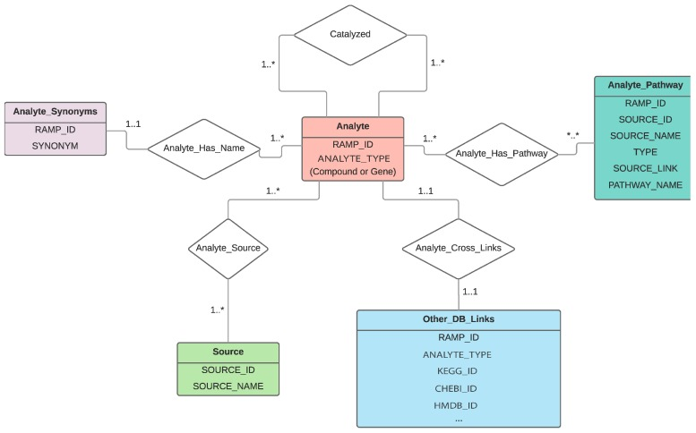
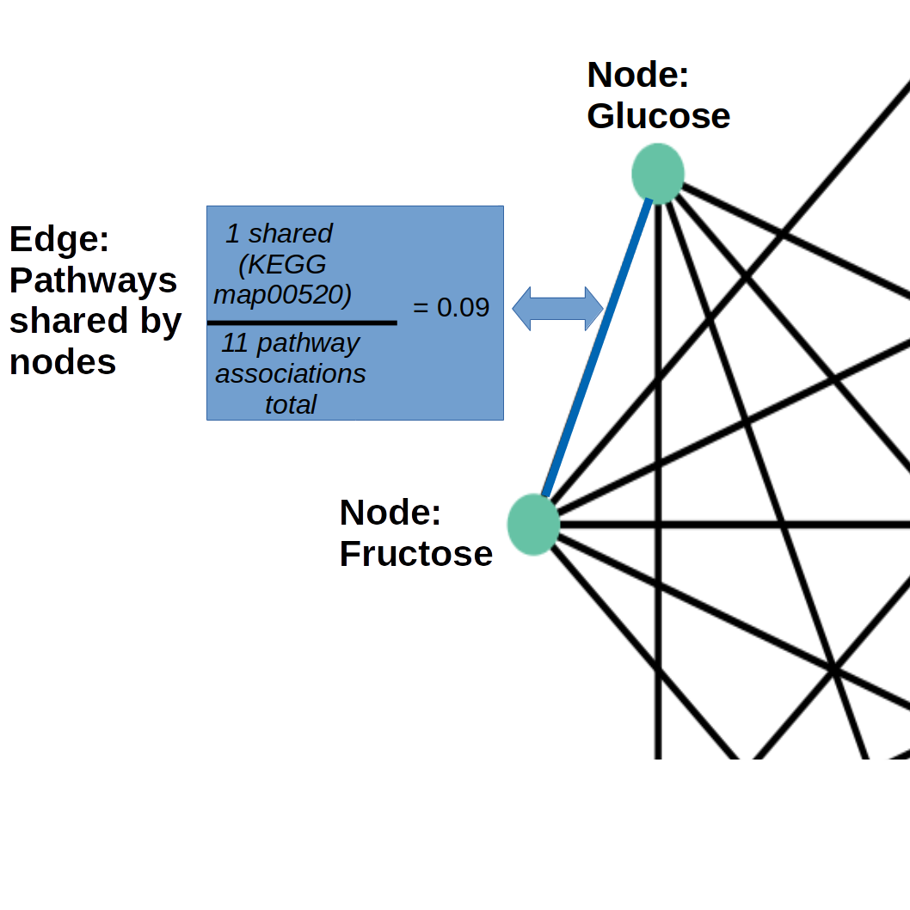
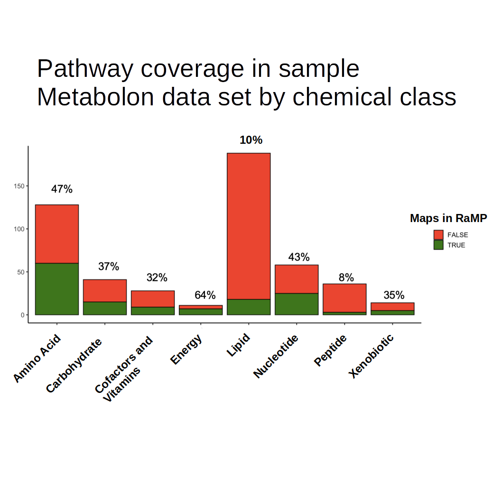
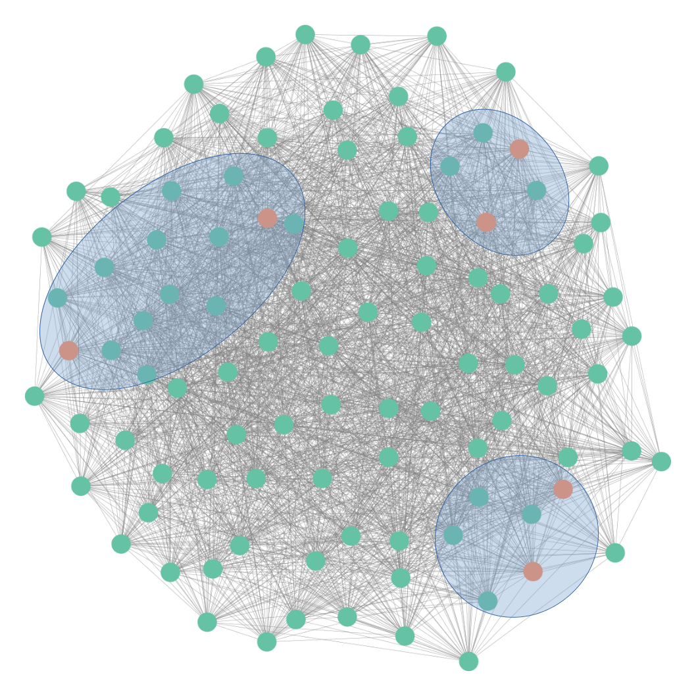

---
output:
  xaringan::moon_reader:
    css: [default, metropolis, metropolis-fonts]
    lib_dir: libs
    includes:
      after_body: insert-logo.html
    nature:
      highlightStyle: github
      countIncrementalSlides: false
      seal: false
      ratio: '16:9'
---
class: primary

```{r,echo=FALSE}
MDM2HivsLoLMME<-readRDS("img/Lipid_volcano_plot.Rds")
fc_thresh=0.75
p_thresh <- 0.05
lipidomic_key<-readRDS("img/lipidomic_key.Rds")
resMDM2HiLoLMME<-readRDS("img/metabolite_volcano_plot.Rds")
myPalette<-c("#e6194b","#8B008B","#808080","#f58231","gray80","#008080","#46f0f0","#3cb44b","#e6194b")
names(myPalette)<-c("Amino Acid","Cofactors and Vitamins","Nucleotide","Lipid","Not Significant","Peptide","Hexosylated Ceramide")

library(ggplot2)
library(ggrepel)
library(gplots)
library(RColorBrewer)
```

<style type="text/css">

p.caption {
  font-size: 0.6em;
}

.large { font-size: 200% }

.medium-large { font-size: 130% }

.small{ font-size: 80% }

.tiny{ font-size: 40% }

.center-left {
  position:          relative;
  top:               50%;
  transform:         translateY(50%);
}
.center-right {
  position:          relative;
  top:               50%;
  transform:         translateY(10%);
}

.remark-slide-content {
  background-color: #FFFFFF;
  border-top: 80px solid #2b0a5e;
  font-size: 28px;
  font-weight: 300;
  line-height: 1.5;
  padding: .5em 1em .5em 1em
}

.inverse {
  background-color: #2b0a5e;
  text-shadow: none;
}

.right-column {
	color: #000000;
	width: 30%;
	height: 92%;
	float: right;
}

.left-column {
  width: 68%;
  float: left;
}

.remark-slide-number {
	display: none;
}

.remark-slide-content:after {
    content: "";
    position: absolute;
    bottom: 0px;
	left: 20px;
    height: 60px;
    width: 400px;
	font-size: 12px;
    background-repeat: no-repeat;
    background-size: contain;
	background-image: url("img/The-Ohio-State-University-Wexner-Medical-Center.png")
}

</style> 

<h2 style=font-size:45px> Improving pathway analysis of
lipidomic and metabolomic data through comprehensive functional
annotation and network approaches </style>

.pull-left[
<h6 style=font-size:20px>
<br>
Andrew Patt, Doctoral Candidate
<br>
<br>
National Center for Advancing Translational Science/The Ohio State University
</style>
]

.pull-right[
.center[
```{r,echo=FALSE,out.width="250px"}
knitr::include_graphics("img/network_example.png")
```
]
]


---

# Relational database of Metabolic Pathways (RaMP)
.pull-left[
.small[
- RaMP is our group's multiomic pathway mySQL database integrating
information from KEGG, HMDB, WikiPathways and Reactome 

- Currently contains pathway information for > 13,000 metabolites and >14,000 
  transcripts, totalling 51,526 pathways and 536,245 associations

- Associated R package allows for querying of pathway, reaction, and
ontology level knowledge, as well as Fisher's pathway analysis of
metabolite and transcript data individually or concurrently 
</br>
</br>
]

.tiny[
[Zhang B, Hu S, Baskin E, Patt A, Siddiqui JK, Mathé EA. RaMP: A Comprehensive Relational Database of Metabolomics Pathways for Pathway Enrichment Analysis of Genes and Metabolites. Metabolites. 2018;8(1):16. Published 2018 Feb 22. doi:10.3390/metabo8010016](https://pubmed.ncbi.nlm.nih.gov/29470400/)
]]

.pull-right[
</br>
```{r,echo=FALSE,out.width="500px"}

```

.tiny[
</br>
</br>
[Patt A, Siddiqui J, Zhang B, Mathé E. Integration of Metabolomics and Transcriptomics to Identify Gene-Metabolite Relationships Specific to Phenotype. Methods Mol Biol. 2019;1928:441-468. doi:10.1007/978-1-4939-9027-6_23](https://pubmed.ncbi.nlm.nih.gov/30725469/)
]]

---

# Planned RaMP expansions

.pull-left[
- **Metabolic pathways:**
  - HumanCyc (255+ pathways)
  - Pathbank (78,488 pathways)
]

--

.pull-right[
- **Chemical Structures:**
  - InChIKeys
  - LyChIKeys
]

--
.tiny[
</br>
]

| DB          | # lipids | Chemical class | Subcellular location | Structure | Reactions | Function |
|-------------|----------|----------------|----------------------|-----------|-----------|----------|
| LION/Web    | > 50,000 | No             | Yes                  | No        | No        | Yes         |
| SwissLipids | 777,657  | Yes            | Yes                  | Yes       | Yes       | No         |
| Lipid Maps  | 43,636   | Yes            | No                   | Yes       | No        | No         |
| LipidPedia  | 4,487    | No             | Yes                  | No        | Yes       |  Yes        |


---

# Metabolite Similarity Networks

.pull-left[
.small[
- Through RaMP, we are collecting data that describes relationships between metabolites:
  - Shared pathway activity
  - Mutual participation in reactions
  - Chemical structural similarity
  - Associations with disease, etc...
- Using this information, we can build knowledge networks describing the landscape of the database
- We can leverage these models to identify metabolites with high
centrality to our set of interest, using topological analysis ] ]

.pull-right[

```{r,echo=FALSE,out.width="600px"}

```
]

---

# Challenges in metabolite/lipid pathway analysis
.pull-left[
.small[
- Lack of pathway annotations

	- Incorporating biological and chemical annotations offer better coverage

- Conventional pathway overrepresentation analysis does not account for redundancy of pathway annotations
	
	- Pathway annotations are not independent, which is an assumption of the Fisher's/Hypergeometric tests

]
]

.pull-right[
```{r,echo=FALSE,out.width="800px"}

```
]

---

# Metabolite Structure, Pathway and Annotation Networks
.center[
```{r,echo=FALSE,out.width="900px"}
knitr::include_graphics("img/network_schematic1.png")
```
]
---

# Metabolite Structure, Pathway and Annotation Networks
.center[
```{r,echo=FALSE,out.width="900px"}
knitr::include_graphics("img/network_schematic2.png")
```
]
---

# Metabolite Structure, Pathway and Annotation Networks
.center[
```{r,echo=FALSE,out.width="900px"}
knitr::include_graphics("img/network_schematic3.png")
```
]
---

# Metabolite Structure, Pathway and Annotation Networks
.center[
```{r,echo=FALSE,out.width="900px"}
knitr::include_graphics("img/network_schematic4.png")
```
]
---

# Topological analysis/Enrichment analysis

.pull-left[
.small[
1. Run random walks with restarts algorithm using metabolites of interest as seed node set

2. Run random walks with restarts using random node set many times

3. Calculate percentile of true score  in random score distribution by node

4. Filter network down to highly similar nodes to seed set

5. Identify clusters of related metabolites in final model and perform
   enrichment analysis
]
]

.pull-right[
```{r,echo=FALSE,out.width="900px"}

```

]

---

# Example study: Metabolomics of liposarcoma

.pull-left[
.small[
- Three treatment-responsive (MDM2-low) liposarcoma cell lines were
  compared to three unresponsive (MDM2 high) cell lines using the
  Metabolon platform

- Statistical analysis identified 18 metabolites different between the
  groups, 10 of which mapped to pathways in the KEGG database

- Major differences were observed in lipids including ceramides and fatty acids

]

</br>

.tiny[
[Patt A, Demoret B, Stets C, et al. MDM2-Dependent Rewiring of Metabolomic and Lipidomic Profiles in Dedifferentiated Liposarcoma Models. Cancers (Basel). 2020;12(8):E2157. Published 2020 Aug 4. doi:10.3390/cancers12082157](https://www.ncbi.nlm.nih.gov/pmc/articles/PMC7463633/)
]
]

.pull-right[
```{r,echo=FALSE,fig.height=8,fig.width=10}

p<-ggplot(data=resMDM2HiLoLMME, aes(x=log2fc, y=-log10(LMMEadj), colour=class)) +
    geom_hline(yintercept = -log10(0.05),lty = 2) +
    geom_vline(xintercept = 0.75, lty = 2) +
    geom_vline(xintercept = -0.75, lty = 2) +
    geom_point(aes(size=size)) +
    theme_bw(base_size=22) +
    scale_color_manual(values = myPalette[c(1,2,4,5,3,6)]) +
    ggtitle("") +
    theme(plot.title = element_text(hjust = 0.5)) +
    theme(panel.grid.major = element_blank(), panel.grid.minor = element_blank()) +
    ylab("-log10 p-value") +
    xlab("log2(MDM2Hi)-log2(MDM2Lo)") +
    scale_alpha(range=c(0.2,0.7)) +
    scale_size(range=c(2,4)) +
    guides(size=FALSE,alpha=FALSE,label=FALSE,
           colour = guide_legend(override.aes = list(size=8)))

p

```
]

---

# Network Method Preliminary Results in Liposarcoma
.center[
```{r,echo=FALSE,out.width="900px"}
knitr::include_graphics("img/Network_figure_2.png")
```
]
---

# Current Software Tools for Pathway Analysis

.center[
```{r,echo=FALSE,out.width="900px"}
knitr::include_graphics("img/tools_table.png")
```
]

---

# Advantages/Disadvantages of Method

.pull-left[
**PROS** 
- Avoids issues arising from pathway interdependence by accounting
  for overlap in network modeling
  
- Improved coverage of annotations by incorporating sources other than pathways
]

.pull-right[
**CONS**
- Enriching by module may enrich spurious relationships

- More computationally intensive
]

---

# Future Extensions

- Optimizations:

	- Incorporate KS test for improved statistical validity

	- Identify best network topology analysis method

	- Identify best network fusion approach

- Demonstrate improved reproducibility

- Build networks using lipid annotations

---

# Acknowledgements

.pull-left[
.small[
**Mathé Lab**
- Dr. Ewy Mathé, OSU/NCATS
- Tara Eicher, OSU/NCATS
- Kevin Ying, OSU
- Dr. Garrett Kinnebrew, OSU
- Kyle Spencer, OSU/NCATS

**Collaborators/Advisors**
- Dr. James Chen, OSU
- Dr. Kevin Coombes, OSU
- Dr. Zachary Abrams, OSU
- Dr. Lang Li, OSU

]]

.pull-right[
.small[
**Collaborators/Advisors**
- Dr. Rachel Kopec, OSU
- Dr. Tim Garrett, Florida State University
- Dr. Jeremy Koelmel Florida State University
- John Braisted, NCATS
- NCATS informatics core

**Funding from**
- The OSU Clinical and Translational Research Informatics Training
Program (4T15LM011270-05)
- Systems and Integrative Biology training program (T32GM068412) ]]

---

# Questions?

.pull-left[
<iframe src='https://gfycat.com/ifr/LongLateAcouchi' frameborder='0' scrolling='no' allowfullscreen width='480' height='390'></iframe><p><a href="https://gfycat.com/discover/question-gifs">from Question GIFs</a> <a href="https://gfycat.com/longlateacouchi-question-mark-confused-what-huh">via Gfycat</a></p>
]

.pull-right[
- Slides link: https://andyptt21.github.io/MANA_2020

- RaMP link: https://rampdb.ncats.io/
]
