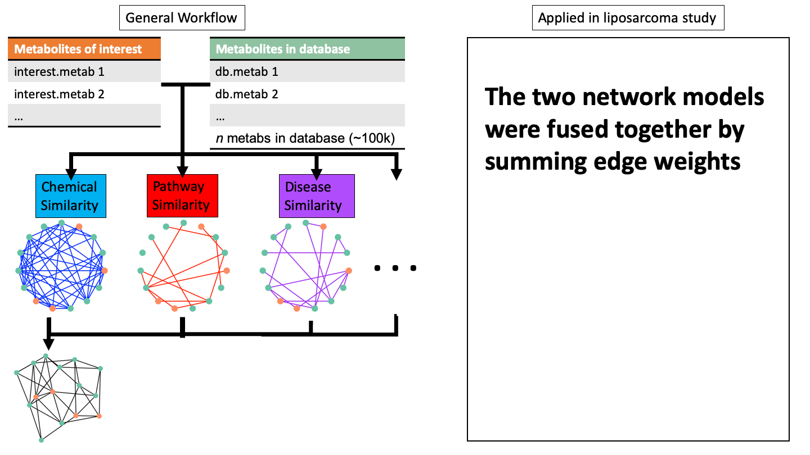
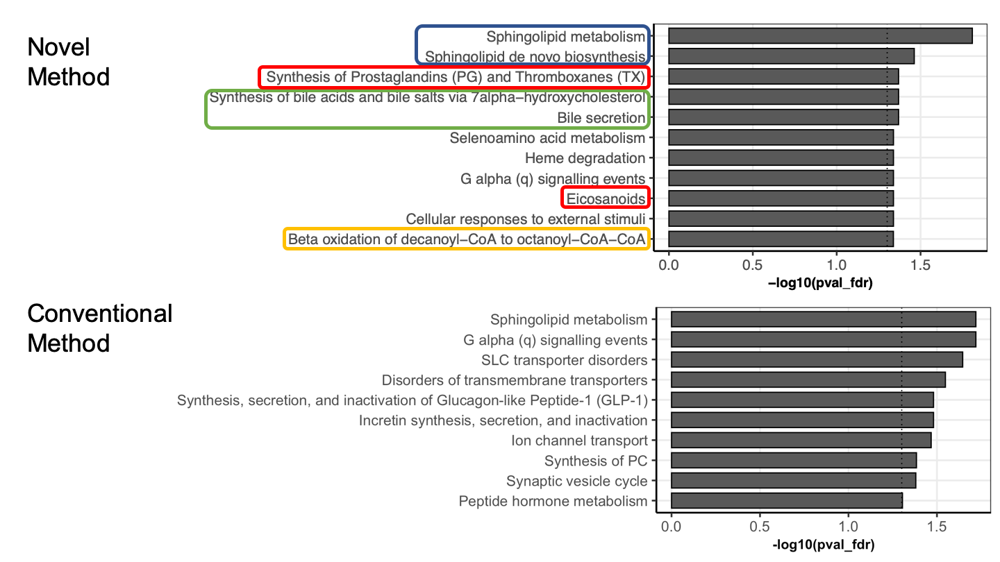

---
output:
  xaringan::moon_reader:
    css: [default, metropolis, metropolis-fonts]
    lib_dir: libs
    includes:
      after_body: insert-logo.html
    nature:
      highlightStyle: github
      countIncrementalSlides: false
      seal: false
      ratio: '16:9'
---

```{r,echo=FALSE}
MDM2HivsLoLMME<-readRDS("img/Lipid_volcano_plot.Rds")
fc_thresh=0.75
p_thresh <- 0.05
lipidomic_key<-readRDS("img/lipidomic_key.Rds")
resMDM2HiLoLMME<-readRDS("img/metabolite_volcano_plot.Rds")
myPalette<-c("#e6194b","#8B008B","#808080","#f58231","gray80","#008080","#46f0f0","#3cb44b","#e6194b")
names(myPalette)<-c("Amino Acid","Cofactors and Vitamins","Nucleotide","Lipid","Not Significant","Peptide","Hexosylated Ceramide")

library(ggplot2)
library(ggrepel)
library(gplots)
library(RColorBrewer)
```

class: inverse, middle

<font color = "white">
# Improving pathway analysis of lipidomic and metabolomic data through comprehensive functional annotation and network approaches
.pull-left[
## Andrew Patt
## National Center for Advancing Translational Science/The Ohio State University


]

.pull-right[
.center[
```{r,echo=FALSE,out.width="350px"}

```
]
]


---

<style type="text/css">

p.caption {
  font-size: 0.6em;
}

.large { font-size: 200% }

.medium-large { font-size: 130% }

.small{ font-size: 80% }

.tiny{ font-size: 40% }

.center-left {
  position:          relative;
  top:               50%;
  transform:         translateY(50%);
}
.center-right {
  position:          relative;
  top:               50%;
  transform:         translateY(10%);
}

.remark-slide-content {
  background-color: #FFFFFF;
  border-top: 80px solid #2b0a5e;
  font-size: 28px;
  font-weight: 300;
  line-height: 1.5;
  padding: .5em 1em .5em 1em
}

.inverse {
  background-color: #2b0a5e;
  text-shadow: none;
}

.right-column {
	color: #000000;
	width: 30%;
	height: 92%;
	float: right;
}

.left-column {
  width: 68%;
  float: left;
}

.remark-slide-number {
	display: none;
}

.remark-slide-content:after {
    content: "";
    position: absolute;
    bottom: 0px;
	left: 20px;
    height: 60px;
    width: 400px;
	font-size: 12px;
    background-repeat: no-repeat;
    background-size: contain;
	background-image: url("img/The-Ohio-State-University-Wexner-Medical-Center.png")
}

</style>

# Functional analysis of metabolomic/lipidomic data

.center[
```{r,echo=FALSE,out.width="900px"}

```
]
---

# Challenges in metabolite/lipid pathway analysis

1. Lack of pathway annotations

---

# Challenges in metabolite/lipid pathway analysis

1. Lack of pathway annotations

.center[
```{r,echo=FALSE,out.width="800px"}
knitr::include_graphics("img/pathway_coverage.png")
```
]

---

# Challenges in metabolite/lipid pathway analysis

1. Lack of pathway annotations

	- Incorporating biological and chemical annotations offer better coverage

--

2. Very difficult to achieve a comprehensive view of the metabolome/lipidome of a biospecimen

	- Leads to reproducibility issues

--

3. Conventional pathway overrepresentation analysis does not account for redundancy of pathway annotations
	
	- Pathway annotations are not independent, which is an assumption of the Fisher's/Hypergeometric tests
---

# Relational database of Metabolic Pathways (RaMP)

- RaMP is our group's multiomic pathway mySQL database integrating
information from KEGG, HMDB, WikiPathways and Reactome 

--

- Currently contains pathway information for > 13,000 metabolites and >14,000 transcripts

--

- Associated R package allows for querying of pathway, reaction, and
ontology level knowledge, as well as Fisher's pathway analysis of
metabolite and transcript data individually or concurrently 

--

- For more info see our publications [[RaMP](https://pubmed.ncbi.nlm.nih.gov/29470400/)] [[RaMP Vignette](https://pubmed.ncbi.nlm.nih.gov/30725469/)], and poster #47 by John Braisted
---

# Renovating RaMP to improve annotation coverage

- Expanding pathway coverage (especially in lipids) by incorporating HumanCyc, PathBank and inxight

--

- Adding InChIKeys for all metabolites

--

- Adding lipid functional/structural annotations drawn from following  resources:
--

  - LION/Web: >250,000 annotations for >50,000 lipids, including lipid class, subcellular location, biological function, and biochemical/physical properties.
--

  - SwissLipids: Location, reaction, structure and chemical class annotations for 777,657 lipids (real and theoretical)
--

  - Lipid Maps: Structure and chemical class annotations for 43,636 lipids
--
  
  - LipidPedia: Disease, MeSH term, function, reactions for 4,487 lipids.

---

# Case study: Metabolomics of liposarcoma

.center[
```{r,echo=FALSE,out.width="900px"}
knitr::include_graphics("img/lipid_methods.png")
```
.small[[Paper link](https://www.ncbi.nlm.nih.gov/pmc/articles/PMC7463633/)]
]
---

# MDM2 high tumor cells show markers of inflammation

.center[
```{r,echo=FALSE,fig.height=7,fig.width=11}

p<- resMDM2HiLoLMME %>%
    ##mutate(class=sapply(class, function(x) ifelse(x %in% c("Lipid","Peptide"),return(x),return("Not Significant")))) %>%
    mutate(class = ifelse(name == "Ac-Ser-Asp-Lys-Pro-OH" |
                         name == "stearate (18:0)" |
                         name == "myristate (14:0)" |
                         name == "nonadecanoate (19:0)",
                         class,
                         "Not Significant")) %>%
    ggplot(aes(x=log2fc, y=-log10(LMMEadj), colour=class)) +
    geom_hline(yintercept = -log10(0.05),lty = 2) +
    geom_vline(xintercept = 0.75, lty = 2) +
    geom_vline(xintercept = -0.75, lty = 2) +
    geom_point(aes(size=size)) +
    geom_label_repel(data = resMDM2HiLoLMME %>% filter(name == "Ac-Ser-Asp-Lys-Pro-OH" |
                                                       name == "stearate (18:0)" |
                                                       name == "myristate (14:0)" |
                                                       name == "nonadecanoate (19:0)"),
                     aes(label=name),
                     show.legend = FALSE,
                     force=100,
                     nudge_x = .25,
                     nudge_y=-.5,
                     ##xlim=c(NA,0),
                     ##ylim=c(NA,1.25),
                     arrow = arrow(length = unit(0.2,"inches"),type="closed"),
                     size=9) +
    theme_bw(base_size=24) +
    scale_color_manual(values = myPalette[c(1,2,4,5,3,6)]) +
    ggtitle("MDM2 High vs Low: Metabolomic Panel") +
    theme(plot.title = element_text(hjust = 0.5)) +
    theme(panel.grid.major = element_blank(), panel.grid.minor = element_blank()) +
    ylab("-log10 p-value") +
    xlab("log2(MDM2Hi)-log2(MDM2Lo)") +
    scale_alpha(range=c(0.2,0.7)) +
    scale_size(range=c(4,6)) +
    guides(size=FALSE,alpha=FALSE,label=FALSE,
           colour = guide_legend(override.aes = list(size=10)))

p

```
]

---

# HexCers are upregulated by MDM2 in both panels
.pull-left[
```{r,echo=FALSE,fig.height=9,fig.width=10}

##ggplotly(p)

myPalette2<-c("gray80","red")
names(myPalette2)<-c("Not Significant","Hexosylated Ceramide")

p <- resMDM2HiLoLMME %>%
    mutate(class=ifelse(name == "glycosyl-N-palmitoyl-sphingosine"  |
                        name == "glycosyl-N-stearoyl-sphingosine"
                       ,
                        "Hexosylated Ceramide",
                        "Not Significant")) %>%
    ggplot(aes(x=log2fc, y=-log10(LMMEadj), colour=class)) +
    geom_hline(yintercept = -log10(0.05),lty = 2) +
    geom_vline(xintercept = 0.75, lty = 2) +
    geom_vline(xintercept = -0.75, lty = 2) +
    geom_point(aes(size=size)) +
    geom_label_repel(data =
                         resMDM2HiLoLMME %>%
                         mutate(class=ifelse(name == "glycosyl-N-palmitoyl-sphingosine"  |
                                             name == "glycosyl-N-stearoyl-sphingosine",
                                             "Hexosylated Ceramide",
                                             "Not Significant")) %>%
                         mutate(name=sapply(name, function(x) if(x == "glycosyl-N-palmitoyl-sphingosine"){
                                         "HexCer-NS(d18:1/16:0)"
                                     }else if(x == "glycosyl-N-stearoyl-sphingosine"){
                                         "HexCer-NS(d18:1/18:0)"
                                     }else{
                                         x})) %>%
                         ## mutate(name=ifelse(name == "glycosyl-N-stearoyl-sphingosine",
                         ##                    "HexCer-NS(d18:1/18:0)",
                         ##                    name)) %>%
                         filter(class=="Hexosylated Ceramide")
                    ,
                     aes(label=name),
                     show.legend = FALSE,
                     force=10,
                     xlim=c(NA,0),
                     ylim=c(NA,2.25),
                     arrow = arrow(length = unit(0.03,"npc"),type = "closed"),
                     size=10) +
    theme_bw(base_size=24) +
    scale_color_manual(values = myPalette2) +
    ggtitle("Metabolomic Panel") +
    theme(plot.title = element_text(hjust = 0.5)) +
    theme(panel.grid.major = element_blank(), panel.grid.minor = element_blank()) +
    ylab("-log10 p-value") +
    xlab("log2(MDM2Hi)-log2(MDM2Lo)") +
    scale_alpha(range=c(0.2,0.7)) +
    scale_size(range=c(4,6)) +
    guides(size=FALSE,alpha=FALSE,label=FALSE,
           ##colour = guide_legend(override.aes = list(size=10))) +
           colour = FALSE) +
    xlim(-4,5) +
    ylim(0,3)
##ggplotly(p)
p

```
]

.pull-right[
```{r,echo=FALSE,fig.width=10,fig.height=9}
MDM2HivsLoLMME<-readRDS("img/Lipid_volcano_plot.Rds")
fc_thresh=0.75
p_thresh <- 0.05
lipidomic_key<-readRDS("img/lipidomic_key.Rds")

library(gplots)

library(RColorBrewer)

T_test_results<-MDM2HivsLoLMME
    
## Make insignificant points smaller and more transparent
T_test_results$significant = abs(T_test_results$log2fc) > fc_thresh &
    -log10(T_test_results$mypadj) > -log10(p_thresh)
T_test_results$size <- ifelse(T_test_results$significant,4,2)

## Color code by lipid class
T_test_results$class<-lipidomic_key$LM.Main.Class[match(T_test_results$name,lipidomic_key$name)]
palette_names<-as.vector(sort(unique(T_test_results$class)))
T_test_results$class<-sapply(1:nrow(T_test_results),function(x){
    ifelse(T_test_results$significant[x],
                    return(as.vector(T_test_results$class)[x]),return("Not Significant"))
})

legend_labels<-sort(unique(sapply(T_test_results$class, function(x){
    if(!is.na(x)){
        return(paste0(x," (n=",length(which(T_test_results$class==x)),")"))
    }else{
        return(x)
    }
})))

##legend_labels<-legend_labels[-which(is.na(legend_labels))]

palette<-c("gray80","red")

names(palette)<-c("Not Significant",
                  "Hexosylated Ceramide"
                  )

g =
    T_test_results %>%
    mutate(class = ifelse(grepl("HexCer",name),
                          "Hexosylated Ceramide",
                          "Not Significant")) %>%
    ggplot(aes(x=log2fc, y=-log10(mypadj), colour=class)) +
    geom_point(##alpha=0.7,
        aes(size=size)) +
    scale_color_manual(values = palette,
                                        #na.value="grey80",
                       ##labels=legend_labels,
                       name="class") +
    theme_bw(base_size=24) +
                                        #scale_color_brewer(palette="Paired",na.value="grey80") +
    ggtitle("Lipidomic Panel") +
    theme(plot.title = element_text(hjust = 0.5)) +
    theme(panel.grid.major = element_blank(), panel.grid.minor = element_blank()) +
    ylab("-log10 p-value") +
    xlab("log2(MDM2Hi)-log2(MDM2Lo)") +
    geom_hline(yintercept = -log10(p_thresh),lty = 2) +
    geom_vline(xintercept = fc_thresh, lty = 2) +
    geom_vline(xintercept = -fc_thresh, lty = 2) +
    scale_size(range=c(4,6)) +
    guides(size=FALSE,
           ## colour = guide_legend(override.aes = list(size=10))) +
           colour = FALSE) +
    geom_label_repel(data = T_test_results %>%
                         mutate(class = ifelse(grepl("HexCer",name),
                                               "Hexosylated Ceramide",
                                               "Not Significant")) %>% filter(grepl("HexCer",name)),
                     aes(label=name),
                     nudge_y=0.5,
                     show.legend = FALSE,
                     force=10,
                     xlim=c(NA,1),
                     arrow = arrow(length = unit(0.03,"npc"),type = "closed"),
                     size=8) +
    xlim(-4,5) +
    ylim(0,3)
g


```
]

---


# Metabolite Structure, Pathway and Annotation Networks
.center[
```{r,echo=FALSE,out.width="900px"}
knitr::include_graphics("img/network_schematic1.png")
```
]
---

# Metabolite Structure, Pathway and Annotation Networks
.center[
```{r,echo=FALSE,out.width="900px"}
knitr::include_graphics("img/network_schematic2.png")
```
]
---

# Metabolite Structure, Pathway and Annotation Networks
.center[
```{r,echo=FALSE,out.width="900px"}
knitr::include_graphics("img/network_schematic3.png")
```
]
---

# Metabolite Structure, Pathway and Annotation Networks
.center[
```{r,echo=FALSE,out.width="900px"}
knitr::include_graphics("img/network_schematic4.png")
```
]
---

# Metabolite Structure, Pathway and Annotation Networks
.center[
```{r,echo=FALSE,out.width="900px"}
knitr::include_graphics("img/network_schematic5.png")
```
]
---

# Metabolite Structure, Pathway and Annotation Networks
.center[
```{r,echo=FALSE,out.width="900px"}
knitr::include_graphics("img/network_schematic6.png")
```
]
---

# Metabolite Structure, Pathway and Annotation Networks
.center[
```{r,echo=FALSE,out.width="900px"}
knitr::include_graphics("img/network_schematic7.png")
```
]
---

# Metabolite Structure, Pathway and Annotation Networks
.center[
```{r,echo=FALSE,out.width="900px"}

```
]
---

# Metabolite Structure, Pathway and Annotation Networks
.center[
```{r,echo=FALSE,out.width="900px"}
knitr::include_graphics("img/network_schematic9.png")
```
]
---

# Metabolite Structure, Pathway and Annotation Networks
.center[
```{r,echo=FALSE,out.width="900px"}
knitr::include_graphics("img/network_schematic10.png")
```
]
---

# Metabolite Structure, Pathway and Annotation Networks
.center[
```{r,echo=FALSE,out.width="900px"}
knitr::include_graphics("img/network_schematic11.png")
```
]
---

# Network Method Preliminary Results in Liposarcoma
.center[
```{r,echo=FALSE,out.width="900px"}

```
]
---

# Advantages/Disadvantages of method

.pull-left[
**PROS**
- Incorporate metabolites not captured by experiment, thereby
  extending findings and improving reproducibility
  
- Avoids issues arising from pathway interdependence by accounting
  for overlap in network modeling
  
- Improved coverage of annotations by incorporating sources other than pathways
]

.pull-right[
**CONS**
- Enriching by module may enrich spurious relationships

- More computationally intensive
]

---

# Future Extensions
- Incorporate KS test for improved statistical validity

- Identify best network topology analysis method

- Identify best network fusion approach

- Build networks using lipid annotations

- Validate in more data sets as well as simulations

---

# Acknowledgements

.pull-left[
.small[
**Mathe Lab**
- Ewy Mathe
- Tara Eicher
- Kevin Ying
- Garrett Kinnebrew
- Kyle Spencer

**Collaborators/Advisors**
- Dr. James Chen
- Dr. Kevin Coombes
- Dr. Zachary Abrams
- Dr. Lang Li

]]

.pull-right[
.small[
**Collaborators/Advisors**
- Dr. Rachel Kopec
- Dr. Tim Garrett
- Dr. Jeremy Koelmel
- John Braisted

**Funding from**
- The OSU Clinical and Translational Research Informatics Training
Program (4T15LM011270-05)
- Systems and Integrative Biology training program (T32GM068412) ]]

---

# Questions?

.pull-left[
<iframe src='https://gfycat.com/ifr/LongLateAcouchi' frameborder='0' scrolling='no' allowfullscreen width='480' height='390'></iframe><p><a href="https://gfycat.com/discover/question-gifs">from Question GIFs</a> <a href="https://gfycat.com/longlateacouchi-question-mark-confused-what-huh">via Gfycat</a></p>
]

.pull-right[
- Slides link: https://andyptt21.github.io/MANA_2020

- RaMP link: https://ramp-db.bmi.osumc.edu/
]
