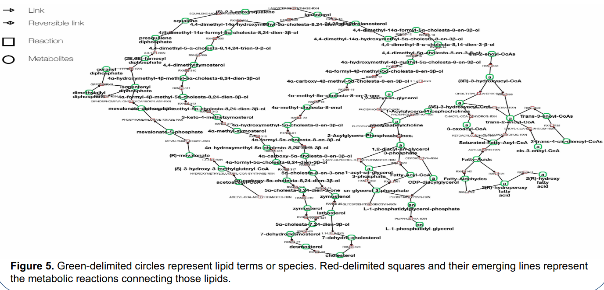
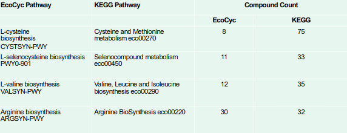
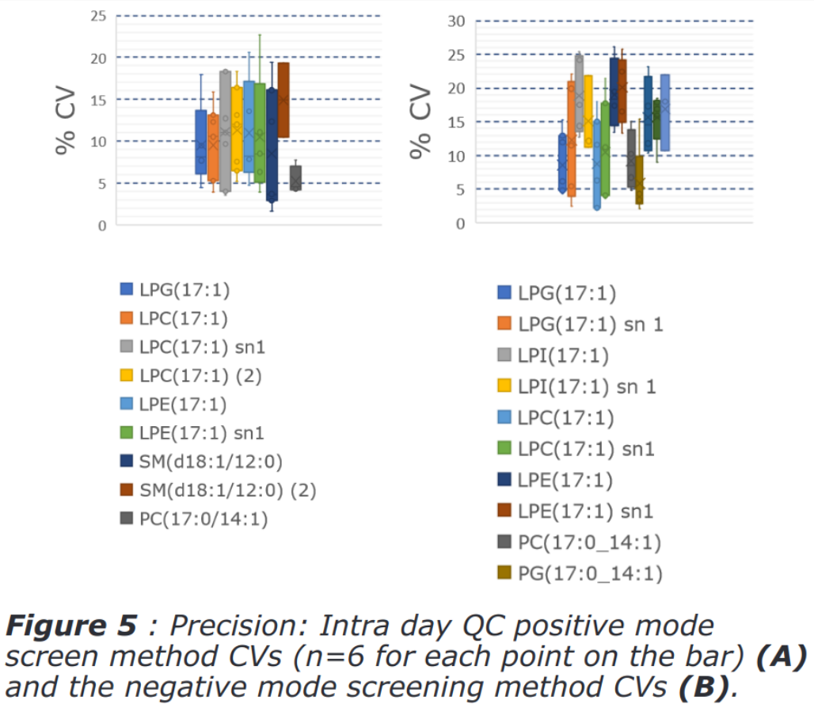
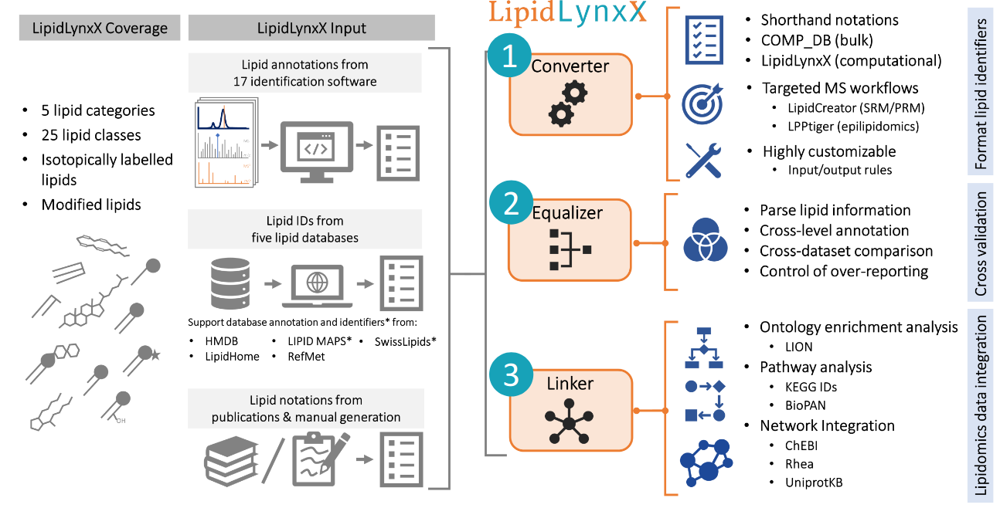

---
output:
  xaringan::moon_reader:
    css: [default, metropolis, metropolis-fonts]
    lib_dir: libs
    includes:
      after_body: insert-logo.html
    nature:
      highlightStyle: github
      countIncrementalSlides: false
      seal: false
      ratio: '16:9'
---
class: primary

<style type="text/css">

p.caption {
  font-size: 0.6em;
}

.large { font-size: 200% }

.medium-large { font-size: 130% }

.small{ font-size: 80% }

.tiny{ font-size: 40% }

.center-left {
  position:          relative;
  top:               50%;
  transform:         translateY(50%);
}
.center-right {
  position:          relative;
  top:               50%;
  transform:         translateY(10%);
}

.remark-slide-content {
  background-color: #FFFFFF;
  border-top: 80px solid #2b0a5e;
  font-size: 28px;
  font-weight: 300;
  line-height: 1.5;
  padding: .5em 1em .5em 1em
}

.inverse {
  background-color: #2b0a5e;
  text-shadow: none;
}

.right-column {
	color: #000000;
	width: 30%;
	height: 92%;
	float: right;
}

.left-column {
  width: 68%;
  float: left;
}

.remark-slide-number {
	display: none;
}

.remark-slide-content:after {
    content: "";
    position: absolute;
    bottom: 0px;
	left: 20px;
    height: 60px;
    width: 400px;
	font-size: 12px;
    background-repeat: no-repeat;
    background-size: contain;
	background-image: url("img/The-Ohio-State-University-Wexner-Medical-Center.png")
}

</style> 

<h2 style=font-size:45px> Metabolomics Society Annual Meeting 2020</style>

.pull-left[
<h6 style=font-size:20px>
<br>
<br>
<br>
<br>
<br>
Andrew Patt, Doctoral Candidate
<br>
<br>
National Center for Advancing Translational Science/The Ohio State University
</style>
]

.pull-right[
.center[
```{r,echo=FALSE,out.width="300px"}

```
]
] 
---

## Pathway-based integration of multi-omics data reveals lipidomics alterations in mouse models of Alzheimer’s Disease
.pull-left[
.small[
- Metabolic dysfuntion is known to play a role in Alzheimer's disease
  - APOE4: transports lipids through bloodstream
  -  ABCA7: membrane transporter that regulates lipid homeostasis
-  Analyzed a bunch of publicly available GWAS, Transcriptomic and Proteomic data sets
-  Used GO analysis to find overlapping processes including Redox and 'Metabolic Processes'
-  Overlaid findings onto KEGG global metabolic network
]
]

.pull-right[
```{r,echo=FALSE,out.width="1000px"}

```
]
---

## Pathway Size Matters: The Influence of Pathway Granularity on Metabolomics Enrichment Analysis

.pull-left[
- KEGG pathways are larger than EcoCyc pathways
- Wanted to quantify the effect that pathway size has on enrichment statistics
- Tested 4 pathways in EcoCyc and KEGG across a range of perturbed metabolites
- (Unsurprisingly) smaller backgrounds lead to more significant results
]

.pull-right[
```{r,echo=FALSE,out.width="1000px"}

```
]

---

## Genomic-Metabolomic Associations in Age-Related Macular Degeneration
- Leading cause of blindness in the elderly
- Genetic risk factors have been well-characterized, metabolic risk factors have not
- Fasting blood samples taken from patients in Boston and Portugal
  - Metabolon platform identified 544 endogenous metabolites
  - Illumina Omni express identified 4,795 AMD SNPs
- Found mQTLs in ASPM and LIPC genes, which regulate amino acid and lipid metabolism respectively, across all patients
- Glycerophospholipid pathway is likely a crucial pathway in AMD pathogenesis

---

## INTER-LABORATORY REPRODUCIBILITY OF A TARGETED LIPIDOMICS PLATFORM FOR ANALYSIS OF HUMAN SERUM AND PLASMA
.pull-left[
- Lack of standardized quality control for lipid identification makes
results difficult to compare between laboratories
- Sent standards to 5 different groups and compared quantifications ]

.pull-right[
```{r,echo=FALSE,out.width="450px"}

```
]

---

## LipidLynxX: data transfer hub linking experimental lipidomics with data integration solution

.pull-left[
- Addressing issues with sharing lipidomic data between labs
  - Convert between different naming schemes
  - Harmonize level of structural specificity
  - Link to lipidomic resources:
	- LIPID MAPS, Swiss Lipids, HMDB, LION/Web, ChEBI, PubChem, KEGG, BioPAN, Rhea, Uniprot KB
]

.pull-right[
```{r,echo=FALSE,out.width="1000px"}

```
]
