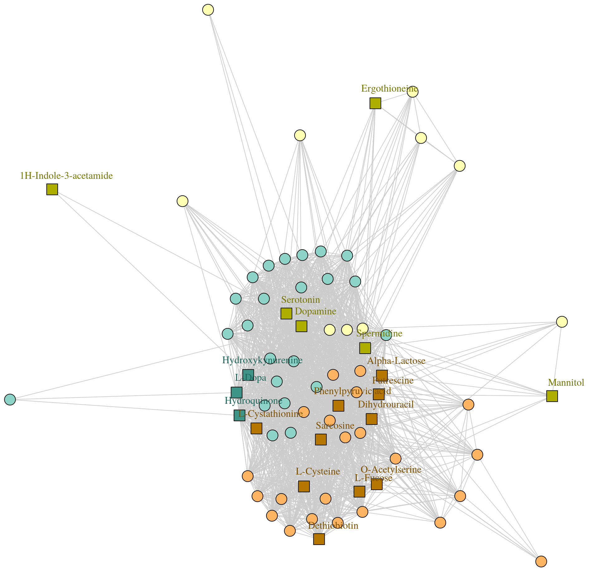

---
output:
  xaringan::moon_reader:
    css: [default, metropolis, metropolis-fonts]
    lib_dir: libs
    includes:
      after_body: insert-logo.html
    nature:
      highlightStyle: github
      countIncrementalSlides: false
      seal: false
      ratio: '16:9'
---
class: primary

<style type="text/css">

p.caption {
  font-size: 0.6em;
}

.large { font-size: 200% }

.medium-large { font-size: 130% }

.small{ font-size: 70% }

.tiny{ font-size: 50% }

code.r{
  font-size: 20px;
}

.center-left {
  position:          relative;
  top:               50%;
  transform:         translateY(50%);
}
.center-right {
  position:          relative;
  top:               50%;
  transform:         translateY(10%);
}

.remark-slide-content {
  background-color: #FFFFFF;
  border-top: 80px solid #2b0a5e;
  font-size: 28px;
  font-weight: 300;
  line-height: 1.5;
  padding: .5em 1em .5em 1em
}

.inverse {
  background-color: #2b0a5e;
  text-shadow: none;
}

.right-column {
	color: #000000;
	width: 30%;
	height: 92%;
	float: right;
}

.left-column {
  width: 68%;
  float: left;
}

.remark-slide-number {
	display: none;
}

.remark-slide-content:after {
    content: "";
    position: absolute;
    bottom: 0px;
	left: 20px;
    height: 60px;
    width: 400px;
	font-size: 12px;
    background-repeat: no-repeat;
    background-size: contain;
	background-image: url("img/The-Ohio-State-University-Wexner-Medical-Center.png")
}

.aligncenter {
  text-align: center;
}

</style> 

.pull-left[
<h2 style=font-size:35px>MetaboSPAN validation strategy</style>

]

.pull-right[
.center[
```{r,echo=FALSE,out.width="475px"}

```
]
]


---

# Outline
- Breast Cancer
- COVID
- Robustness to noise simulations
- Robustness to pathway properties simulations

---

# Validations in breast cancer: data
.tiny[
#### Ewy's Breast Cancer Data
**Description:** Characterized the metabolomic profile of human breast
tumors and uncovered intrinsic metabolite signatures in these tumors
using an untargeted discovery approach and validation of key
metabolites

**Samples:** Breast tissue and adjacent normal tissue

**Chromatography/Spectrometry:** LC-MS/MS

#### ST001111
**Description:** Screening of Breast Cancer tissue samples for
alteration in the lipidome using high resolution mass spectrometer,and
mapping of these changes to clinico-pathological data to search for
potential bio markers

**Sample types:** Lipidomic profiling of breast tumor tissue and adjacent normal tissue

**Chromatography/Spectrometry** RPLC/MS Pos and Neg

#### ST0000356
**Description:** Use GC/MS and LC/MS technique to profile breast
cancer samples and normal control samples

**Sample types:** Human breast cancer and normal controls serum
metabolomics profiling

**Chromatography/Spectrometry:** GC/MS and RPLC/MS, Positive mode only

**Clinical info** Healthy vs. disease, disease stage
]

---

# Breast cancer validation plan
.tiny[
1. Identify all pathways that are covered by metabolites in individual
   breast cancer datasets pre and post expansion. This will establish
   viable overlapping pathway results.
2. Select random sets of interest from dataset backgrounds. Perform
   MetaboSPAN analysis and demonstrate low overlap in results between
   data sets. This will establish that MetaboSPAN is not enriching for
   the same, promiscuous pathways in every analysis.
3. Perform MetaboSPAN on different datasets and show overlap between
   significant results is higher than when using other
   methods. Methods to be benchmarked:
   1. MetaboSPAN + W-Y
   2. MetaboSPAN + Holm
   3. MetaboSPAN + FDR
   4. Fisher's (all Metaboanalyst databases individually as well as RaMP) + W-Y
   5. Fisher's + Holm
   6. Fisher's + FDR
   7. K-S + W-Y
   8. K-S + Holm
   9. K-S + FDR
   10. Topological + W-Y
   11. Topological + Holm
   12. Topological + FDR
4. Demonstrate that shared pathways between datasets are coherent
   given what's know about breast cancer in the literature
]

---

# COVID Data
.tiny[
#### PMC7197563
**Description:** Assayed lipidome and metabolome in a time-series
analysis, and performed statistical analysis to identify biomarkers of
disease severity.

**Samples:** Blood samples taken from 9 fatal outcome COVID-19 patients, survivors recovered from 11 severe COVID-19
cases & 14 mild COVID-19 cases, and 10 healthy controls
- TImepoint 1 in mild and severe is collected during "disease peak"
- Timepoint 2 in mild and severe is last collection before 

**Chromatography/Spectrometry:** LC-MS/MS

#### PMC7254001
**Description:** Measured metabolomic and proteomic profiles of
COVID-19 vs healthy controls and severe vs non-severe COVID-19
patients, and built a machine learning model to predict disease
severity.

**Samples** 46 COVID-19 patients, 53 control patients

**Chromatography/Spectrometry:** LC-MS/MS

#### PMC7311890 
**Description:** Examined plasma and exosome of COVID-19 patients

**Samples:** 26 healthy controls, 18 mild cases, 19 moderate cases, 13 severe cases

**Chromatography/Spectrometry:** LC-MS
]
---

# COVID validation plan
.tiny[
1. Identify all pathways that are covered by metabolites in individual
   COVID datasets pre and post expansion. This will establish
   viable overlapping pathway results.
2. Select random sets of interest from dataset backgrounds. Perform
   MetaboSPAN analysis and demonstrate low overlap in results between
   data sets. This will establish that MetaboSPAN is not enriching for
   the same, promiscuous pathways in every analysis.
3. Perform MetaboSPAN on different datasets and show overlap between
   significant results is higher than when using other
   methods. Methods to be benchmarked:
   1. MetaboSPAN + W-Y
   2. MetaboSPAN + Holm
   3. MetaboSPAN + FDR
   4. Fisher's + W-Y
   5. Fisher's + Holm
   6. Fisher's + FDR
   7. K-S + W-Y
   8. K-S + Holm
   9. K-S + FDR
   10. Topological + W-Y
   11. Topological + Holm
   12. Topological + FDR
4. Demonstrate that shared pathways between datasets are coherent
   given what's know about COVID in the literature (this will be less detailed than the BC section)
]

---

# Simulation: Robustness to noise
.small[
1. Starting data is a real data set (background & list of interest)
2. Perform MetaboSPAN analysis, treating significant pathways as "true
   positives" for remaining steps
3. Iteratively randomly replace metabolites in list of interest with
   metabolites from background. Perform metaboSPAN analysis and record
   the false positive rate as noise increases.
	   1. Metabolites selected from background may not be totally
          random. They may be selected based on properties such as
          belonging to promicscous or non-promiscuous pathways, or
          larger or smaller pathways. These experiments would be
          segregated accordingly so we don't compare panels of random
          metabolites that shouldn't be compared.
4. Benchmark robustness to noise against methods and p value
   adjustments described in prior slides
5. This will establish that MetaboSPAN is less sensitive to random
   noise in the list of interest than other methods
]
---

# Simulation: Robustness to pathway properties
.small[
1. Starting data is a real metabolite panel (no list of interest)
2. Lists of interest are composed with true positives in mind
   1. Lists entirely composed of metabolites in large pathways
   2. Lists entirely composed of metabolites in small pathways
   3. Lists entirely composed of metabolites in promiscuous pathways
   4. Lists entirely composed of metabolites in non-promiscous pathways
   5. Small lists of interest (<10)
   6. Large lists of interest (>50)
3. Benchmark against other approaches described above
4. This will demonstrate that MetaboSPAN detects true positives at a
   similar or better rates as other methods in the various different
   plausible pathway analysis scenarios users are likely to encounter
]
