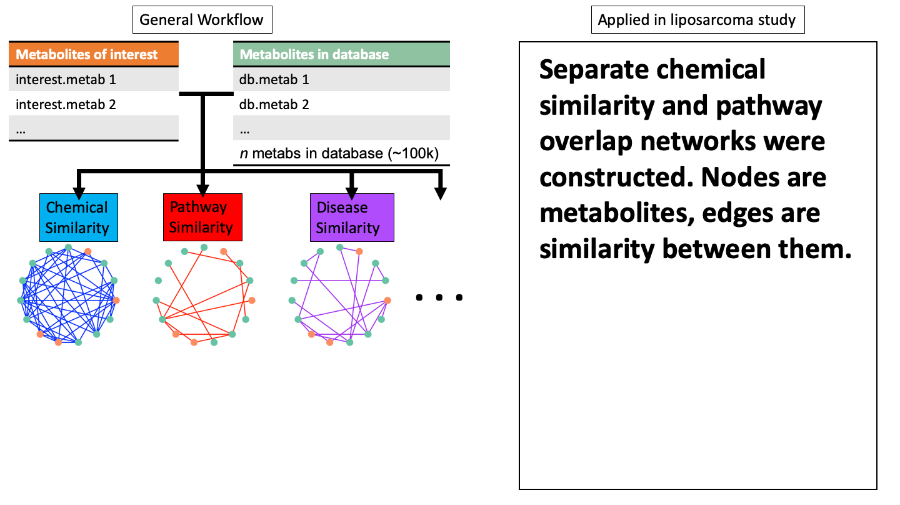

---
output:
  xaringan::moon_reader:
    css: [default, metropolis, metropolis-fonts]
    lib_dir: libs
    nature:
      highlightStyle: github
      countIncrementalSlides: false
      seal: false
      ratio: '16:9'
---

class: inverse, middle
background-image: url(title_background.svg)
background-size: cover

<font color = "white">
## Novel approaches for analysis and integration of metabolomic data
.pull-left[
### Andrew Patt
### National Center for Advancing Translational Science/Ohio State University
Biomedical Sciences Graduate Program

]

.pull-right[
.center[
```{r,echo=FALSE,out.width="300px"}

```
]
]


---

<style type="text/css">

p.caption {
  font-size: 0.6em;
}

.large { font-size: 200% }

.medium-large { font-size: 130% }

.small{ font-size: 80% }

.tiny{ font-size: 60% }

.center-left {
  position:          relative;
  top:               50%;
  transform:         translateY(50%);
}
.center-right {
  position:          relative;
  top:               50%;
  transform:         translateY(10%);
}

.remark-slide-content {
  background-color: #FFFFFF;
  border-top: 80px solid #8f1414;
  font-size: 28px;
  font-weight: 300;
  line-height: 1.5;
  padding: 1em 2em 1em 2em
}

.inverse {
  background-color: #8f1414;
  text-shadow: none;
}

.right-column {
	color: #000000;
	width: 30%;
	height: 92%;
	float: right;
}

.left-column {
  width: 68%;
  float: left;
}

</style>

# Background
--

- Pathway annotations are not available for most metabolites identified in an experiment
--

- There's variability in the number and types of metabolites that can be identified in similar experimental conditions
--

- Lipid annotations are sparse and difficult to consolidate
--

  - Pathway coverage is poor
--

  - Alternate schemes are not harmonized
--

- ORA statistics falsely assume that pathways are independent of each other

---

# Aim 1: Expanding RaMP

- Integrate lipid annotations drawn from following open-source resources:
--

  - LION/Web: >250,000 annotations for >50,000 lipids, including lipid class, subcellular location, biological function, and biochemical/physical properties.
--

  - SwissLipids: Location, reaction, structure and chemical class annotations for 777,657 lipids (real and theoretical)
--

  - Lipid Maps: Structure and chemical class annotations for 43,636 lipids
--
  
  - LipidPedia: Disease, MeSH term, function, reactions for 4,487 lipids.
--

- INCHIkeys for all metabolites in RaMP
--

- Implement enrichment analysis software for lipids/metabolites

---

# Aim 2

```{r,echo=FALSE,out.width="1000px"}
knitr::include_graphics("img/network_schematic1.png")
```

---

# Aim 2

```{r,echo=FALSE,out.width="1000px"}

```

---

# Aim 2

```{r,echo=FALSE,out.width="1000px"}
knitr::include_graphics("img/network_schematic3.png")
```

---

# Aim 2

```{r,echo=FALSE,out.width="1000px"}
knitr::include_graphics("img/network_schematic4.png")
```

---

# Aim 2

```{r,echo=FALSE,out.width="1000px"}
knitr::include_graphics("img/network_schematic5.png")
```

---

# Aim 2

```{r,echo=FALSE,out.width="1000px"}

```

---

# Aim 2

```{r,echo=FALSE,out.width="1000px"}
knitr::include_graphics("img/network_schematic7.png")
```

---

# Aim 2

```{r,echo=FALSE,out.width="1000px"}
knitr::include_graphics("img/network_schematic8.png")
```

---

# Aim 2

```{r,echo=FALSE,out.width="1000px"}

```

---

# Aim 2

```{r,echo=FALSE,out.width="1000px"}
knitr::include_graphics("img/network_schematic10.png")
```

---

# Aim 2

```{r,echo=FALSE,out.width="1000px"}
knitr::include_graphics("img/network_schematic11.png")
```

---
# Thesis Chapters

.small[
.pull-left[
**Part I: Metabolomics and Lipidomics: Applications in biomedical sciences (Introduction)**
      - Applications (why do people care? Also mention 
		liposarcoma and
        how metabolomics aided in this study)

**Part II: Metabolomics of liposarcoma**
   
   1) Liposarcoma review
   
   2) Liposarcoma treatment response and Ceramides
   
   3) Conclusions
]


.pull-right[
**Part III: Computational approaches for functional analysis and integration of metabolomic and lipidomic data**
.tiny[
   1) Introduction
   - Overview of standard metabolomic workflows (why it's not good enough)
	  
   - Missing annotations, identifications, and lack of standard annotations
	  
   - Databases
	  
   - Pathway analysis (methods & tools & challenges)
	  
   - Integration (methods & tools & challenges)
	  
2) RaMP chapter (addressing issues in multiomic data analysis) and
      improved lipid pathway annotations
	  
3) MetaboSPAN
   
4) Potential COVID work integrating drug target/metabolite data
   
5) Conclusions
]
**Part IV: Conclusions (Broadly state my contributions to the field of metabolomics)**

]
]
---
# Timeline

.tiny[
| Relative time | Actual time | Milestone |
|-------------------|-----------------|--------------|
| Year 0 | August 2016 | Started program  |
| Year 1.5 | December 2017 | RaMP publication (2nd author)  |
| Year 2.5 | October 2018 | Candidacy exam |
| Year 2.5 | January 2019 | RaMP textbook chapter (1st author)  |
| Year 3 | June 2019 | Proteogenomic integration review (Co-1st author)  |
| Year 3.5    | April 2020    | Multiomic integration review  (2nd author) |
| Year 3.5  | May 2020    | **Liposarcoma metabolomics (Co-1st author)**   |
| Year 4 | July 2020  | **MetaboSPAN (1st author)**  |
| Year 4.5  | December 2020 | Defend and submit thesis |
| Year 4.5   | Spring 2021  | **Renovated RaMP (1st author)**  |
| ???    | ???    | Identifying potential COVID therapies |
| ???    | ???    | LipidMatch Flow (6th author) |
]
