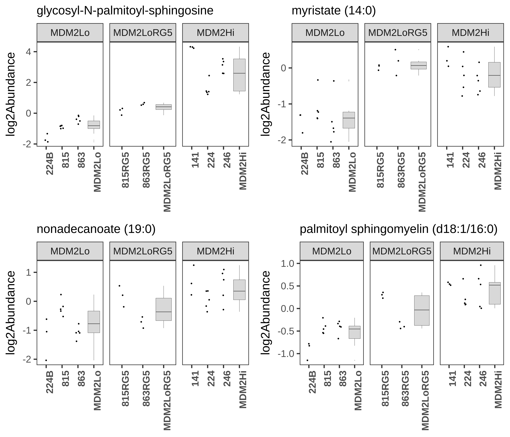
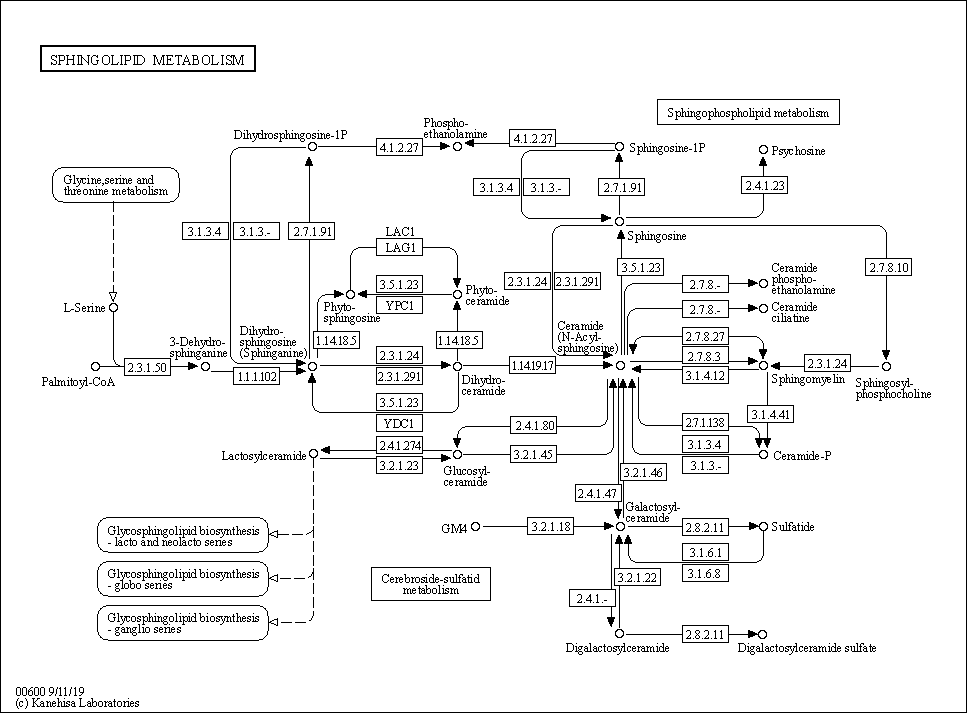

---
output:
  xaringan::moon_reader:
    css: [default, metropolis, metropolis-fonts]
    lib_dir: libs
    nature:
      highlightStyle: github
      countIncrementalSlides: false
      seal: false
      ratio: '16:9'
---

class: inverse, middle
background-image: url(title_background.svg)
background-size: cover

<font color = "white">
## Novel approaches for analysis and integration of metabolomic data
.pull-left[
### Andrew Patt
### Ohio State University
Department of Biomedical Informatics/Biomedical Sciences Graduate Program

]

.pull-right[
.center[
```{r,echo=FALSE,out.width="300px"}
knitr::include_graphics("img/Human_metabolome_project.png")
```
]
]


---

<style type="text/css">

p.caption {
  font-size: 0.6em;
}

.large { font-size: 200% }

.medium-large { font-size: 130% }

.small{ font-size: 80% }

.tiny{ font-size: 40% }

.center-left {
  position:          relative;
  top:               50%;
  transform:         translateY(50%);
}
.center-right {
  position:          relative;
  top:               50%;
  transform:         translateY(10%);
}

.remark-slide-content {
  background-color: #FFFFFF;
  border-top: 80px solid #8f1414;
  font-size: 28px;
  font-weight: 300;
  line-height: 1.5;
  padding: 1em 2em 1em 2em
}

.inverse {
  background-color: #8f1414;
  text-shadow: none;
}

.left-column {
	color: #000000;
	width: 40%;
	height: 92%;
	float: left;
}

.right-column {
  width: 58%;
  float: right;
  padding-top: 1em;
}

</style>

# Presentation Roadmap

--

### Metabolomics Introduction

--
</br>
</br>
### Project 1, Metabolomics of Liposarcoma

--
</br>
</br>
### Project 2, Improved Methodology for Interpreting Metabolomic Data

---

# Metabolomics for biomedical research

.pull-left[
- Study of small biomolecules using mass spectrometry or NMR

- Structurally and functionally diverse

- Impacted by diet, lifestyle, toxins, pharmaceutics, microbiome, etc.

- Downstream stage in flow of biological information
]

.pull-right[
```{r,echo=FALSE,out.width="600px"}
knitr::include_graphics("img/Metabolomics_schema.png")
```
]

---

# Metabolomics of Cancer

- Metabolites are the regulators and intermediates of many cellular processes relevant to cancer
--

- **Warburg Effect**: increased reliance on anaerobic respiration
--

- **Lipogenic Phenotype**: increased endogenous *de novo* production of lipids, decrease in exogenous uptake
--

- **p53 as a metabolism regulator**: p53 response elements exist in promoters of glycolytic enzymes. It can also inhibit expression of glucose transporters.
--

- **MYC as a metabolism regulator**: induces glycolysis and glutaminolysis. Induces a hypoxic phenotype in normal oxygen environments
--

- **Mutant IDH Gliomas:**: Mutant IDHs convert alpha Ketoglutarate to
  2-Hydroxyglutarate, which impacts the TCA cycle and induces
  epigenetic changes that promote tumor progression

---

class: inverse, bottom

# Project 1: Metabolomics of Liposarcoma

---

# Dedifferentiated Liposarcoma Background

.pull-left[
- 20% of all soft tissue sarcoma diagnoses
- Prognosis depends on copy number of the MDM2 oncogene
- Some drugs (Dactinomycin, Doxorubicin) are used to treat
  liposarcoma, but they have unpredictable efficacy and toxicity.
- Prognosis varies based on MDM2 amplification in tumor
]

.pull-right[
```{r,echo=FALSE,out.width="400px"}

```

.tiny[
Bill KLJ, Seligson ND, Hays JL, et al. Degree of Amplification Affects Clinical Outcomes in Dedifferentiated Liposarcoma. Oncologist. 2019;24(7):989-996.
]
]


---

# MDM2 inhibits DNA repair and apopotosis

.pull-left[
- Autoregulatory loop with p53
- Physically binds to p53 and catalyzes its ubiquitylation, keeping it at low levels in healthy cells
- p53 initiates DNA repair or apoptosis if DNA repair is impossible or if telomeres have shortened too much
- Frequently inhibited in mutant p53 cancers
]

.pull-right[
```{r,echo=FALSE,out.width="350px"}
knitr::include_graphics("img/MDM2_schematic.png")
```

.tiny[
http://mcr.aacrjournals.org/content/molcanres/1/14/1001/F1.large.jpg?width=800&height=600&carousel=1
]
]

---

# MDM2 high cells resist atorvastatin treatment

```{r,echo=FALSE,out.width="1000px"}
knitr::include_graphics("img/Atorvastatin_response.png")
```

---

# Objectives

--

### 1. General survey of differences between MDM2 high and low tumor cells to explain worse prognosis

--

### 2. Understand resistance of MDM2 high cells to atorvastatin treatment

--

### 3. Assess the hypothesis that MDM2 inhibition could induce atorvastatin sensitivity in MDM2 high cells 

---

# Methods

```{r,echo=FALSE,out.width="1000px"}

```

---

# Methods

```{r,echo=FALSE,out.width="1000px"}

```

---

# Lipid differences between MDM2 high and low cells

```{r,echo=FALSE,fig.height=7,fig.width=15}
library(plotly)
library(ggplot2)
library(ggrepel)
resMDM2HiLoLMME<-readRDS("img/metabolite_volcano_plot.Rds")
myPalette<-c("#e6194b","#8B008B","#808080","#f58231","gray80","#008080","#46f0f0","#3cb44b")

p<-ggplot(data=resMDM2HiLoLMME, aes(x=log2fc, y=-log10(LMMEadj), colour=class)) +
    geom_hline(yintercept = -log10(0.05),lty = 2) +
    geom_vline(xintercept = 0.75, lty = 2) +
    geom_vline(xintercept = -0.75, lty = 2) +
    geom_point(aes(size=size)) +
    theme_bw(base_size=24) +
    scale_color_manual(values = myPalette[c(1,2,4,5,3,6)]) +
    ggtitle("MDM2 High vs Low: Metabolomic Panel") +
    theme(plot.title = element_text(hjust = 0.5)) +
    theme(panel.grid.major = element_blank(), panel.grid.minor = element_blank()) +
    ylab("-log10 p-value") +
    xlab("log2(MDM2Hi)-log2(MDM2Lo)") +
    scale_alpha(range=c(0.2,0.7)) +
    scale_size(range=c(2,4)) +
    guides(size=FALSE,alpha=FALSE,label=FALSE)

p

```

---

# MDM2 high tumor cells show markers of inflammation

```{r,echo=FALSE,fig.height=7,fig.width=15}

p<-ggplot(data=resMDM2HiLoLMME, aes(x=log2fc, y=-log10(LMMEadj), colour=class)) +
    geom_hline(yintercept = -log10(0.05),lty = 2) +
    geom_vline(xintercept = 0.75, lty = 2) +
    geom_vline(xintercept = -0.75, lty = 2) +
    geom_point(aes(size=size)) +
    geom_label_repel(data = resMDM2HiLoLMME %>% filter(name == 
                                                       "Ac-Ser-Asp-Lys-Pro-OH" |
                                                       name == "stearate (18:0)" |
                                                       name == "myristate (14:0)" |
                                                       name == "nonadecanoate (19:0)"),
                     aes(label=name),
                     show.legend = FALSE,
                     force=10,
                     arrow = arrow(length = unit(0.03,"npc"),type = "closed", ends = "first"),
                     size=8) +
    theme_bw(base_size=24) +
    scale_color_manual(values = myPalette[c(1,2,4,5,3,6)]) +
    ggtitle("MDM2 High vs Low: Metabolomic Panel") +
    theme(plot.title = element_text(hjust = 0.5)) +
    theme(panel.grid.major = element_blank(), panel.grid.minor = element_blank()) +
    ylab("-log10 p-value") +
    xlab("log2(MDM2Hi)-log2(MDM2Lo)") +
    scale_alpha(range=c(0.2,0.7)) +
    scale_size(range=c(2,4)) +
    guides(size=FALSE,alpha=FALSE,label=FALSE)

p

```

---

# HexCers are upregulated by MDM2 in metab panel

```{r,echo=FALSE,fig.height=7,fig.width=15}

##ggplotly(p)
p<-ggplot(data=resMDM2HiLoLMME, aes(x=log2fc, y=-log10(LMMEadj), colour=class)) +
    geom_hline(yintercept = -log10(0.05),lty = 2) +
    geom_vline(xintercept = 0.75, lty = 2) +
    geom_vline(xintercept = -0.75, lty = 2) +
    geom_point(aes(size=size)) +
    geom_label_repel(data = resMDM2HiLoLMME %>% filter(name == "glycosyl-N-palmitoyl-sphingosine"),
                     aes(label=name),
                     show.legend = FALSE,
                     force=10,
                     arrow = arrow(length = unit(0.03,"npc"),type = "closed", ends = "first"),
                     size=8) +
    theme_bw(base_size=24) +
    scale_color_manual(values = myPalette[c(1,2,4,5,3,6)]) +
    ggtitle("MDM2 High vs Low: Metabolomic Panel") +
    theme(plot.title = element_text(hjust = 0.5)) +
    theme(panel.grid.major = element_blank(), panel.grid.minor = element_blank()) +
    ylab("-log10 p-value") +
    xlab("log2(MDM2Hi)-log2(MDM2Lo)") +
    scale_alpha(range=c(0.2,0.7)) +
    scale_size(range=c(2,4)) +
    guides(size=FALSE,alpha=FALSE,label=FALSE)
##ggplotly(p)
p

```

---

# HexCers are upregulated by MDM2 in lipidomic panel

```{r,echo=FALSE,fig.width=15,fig.height=7}
MDM2HivsLoLMME<-readRDS("img/Lipid_volcano_plot.Rds")

volcano_plotter <- function(df,title){
    T_test_results<-df
    
    ## Make insignificant points smaller and more transparent
    T_test_results$significant = abs(T_test_results$log2fc) > fc_thresh &
        -log10(T_test_results$mypadj) > -log10(p_thresh)
    T_test_results$size <- ifelse(T_test_results$significant,4,2)
    
    ## Color code by lipid class
    T_test_results$class<-lipidomic_key$LM.Main.Class[match(T_test_results$name,lipidomic_key$name)]
    palette_names<-as.vector(sort(unique(T_test_results$class)))
    T_test_results$class<-sapply(1:nrow(T_test_results),function(x){
        ifelse(T_test_results$significant[x],
                    return(as.vector(T_test_results$class)[x]),return("Not Significant"))
    })
      
	 legend_labels<-sort(unique(sapply(T_test_results$class, function(x){
             if(!is.na(x)){
		 return(paste0(x," (n=",length(which(T_test_results$class==x)),")"))
             }else{
		 return(x)
             }
	 })))
      
	 ##legend_labels<-legend_labels[-which(is.na(legend_labels))]
      
    palette<-c("gray80","red","blue","orange","forestgreen","gray80")
    
	 names(palette)<-c(unique(T_test_results$class),"Not Significant")

        g = ggplot(data=T_test_results, aes(x=log2fc, y=-log10(mypadj), colour=class)) +
            geom_point(##alpha=0.7,
                       aes(size=size)) +
            scale_color_manual(values = palette,
                                        #na.value="grey80",
                               labels=legend_labels,
                               name="LipidMaps Main Class") +
            theme_bw(base_size=24) +
                                        #scale_color_brewer(palette="Paired",na.value="grey80") +
            ggtitle(title) +
            theme(plot.title = element_text(hjust = 0.5)) +
            theme(panel.grid.major = element_blank(), panel.grid.minor = element_blank()) +
            ylab("-log10 p-value") +
            geom_hline(yintercept = -log10(p_thresh),lty = 2) +
            geom_vline(xintercept = fc_thresh, lty = 2) +
            geom_vline(xintercept = -fc_thresh, lty = 2) +
            scale_size(range=c(2,4)) +
            guides(size=FALSE)
    
    return(g)
}

volcano_plotter(MDM2HivsLoLMME, "MDM2 High vs Low: Lipidomic Panel") +
     geom_label_repel(data = MDM2HivsLoLMME %>% filter(name == "HexCer-NS(d18:1/16:0)"),
                     aes(label=name),
                     show.legend = FALSE,
                     force=10,
                     arrow = arrow(length = unit(0.03,"npc"),type = "closed", ends = "first"),
                     size=8)

```

---

# HexCers are upregulated by MDM2 in lipidomic panel

```{r,fig.width=15,fig.height=7, echo=FALSE}
volcano_plotter(MDM2HivsLoLMME, "MDM2 High vs Low: Lipidomic Panel") +
     geom_label_repel(data = MDM2HivsLoLMME %>% filter(grepl("HexCer",name)),
                     aes(label=name),
                     show.legend = FALSE,
                     force=10,
                     arrow = arrow(length = unit(0.03,"npc"),type = "closed", ends = "first"),
                     size=8)
```

---

# Ceramide glycosylation levels predict MDM2 status

```{r,echo=FALSE,fig.height=7,fig.width=15}
##knitr::include_graphics("img/Glycosylated_ceramides.png")

load("img/heatmap.Rda")

mycol = colorRampPalette(c("blue", "white","red"))(100)

heatmap.2(y, Colv=as.dendrogram(hc), col=mycol, scale="row", density.info="none",
          trace="none",dendrogram = "col", lhei=c(1.5,5,1),
          lwid=c(1.5, 3),
          ColSideColors = col_colors,
          tracecol = "black",
          labCol=as.vector(t(mycell)),
          cexRow = 1.5,
          cexCol = 1.5,
          margins=c(5,16))

```

---

# Pathways altered between MDM2 high and low cells

</br>
</br>
```{r,echo=FALSE,out.width="1000px"}

```


---

# MDM2 inhibition confers an MDM2 high phenotype

```{r,echo=FALSE,out.width="1000px"}

```

---

# Project 1 (tentative) Conclusions

### 1. MDM2 was implicated in resistance to apoptosis, shifts in energy metabolism, and driving a pro-inflammatory phenotype
### 2. Atorvastatin worked through changes in the sphingolipid pathway which were counteracted by MDM2 activity
### 3. MDM2 inhibitor transiently raises MDM2 expression and confers an MDM2 high phenotype

---

# Future work

### 1. Extend findings to human transcriptome data
### 2. Test a variety of MDM2 inhibitors
### 3. Experimentally validate findings

---

class: inverse, bottom

# Project 2: Network method for downstream analysis of metabolomic data

---

# Challenges in metabolite/lipid analysis

1. Lack of pathway annotations

---

# Challenges in metabolite/lipid analysis

1. Lack of pathway annotations

.center[
```{r,echo=FALSE,out.width="800px"}
knitr::include_graphics("img/pathway_coverage.png")
```
]

---

# Challenges in metabolite/lipid analysis

1. Lack of pathway annotations

	- Incorporating biological and chemical annotations offer better coverage

--

2. Metabolite panels don't cover the entire metabolome

	- Leads to reproducibility issues

--

3. Conventional pathway overrepresentation analysis does not account for redundancies of pathway annotations
	
	- Pathway annotations are not independent, which is an assumption of the Fisher's/Hypergeometric tests
---

# RaMP: Relational Database of Metabolic Pathways
.pull-left[
- Metabolic pathway database integrating pathways from other databases
- Pathways include enzymes that catalyze reactions on metabolites
- Includes reactions and ontology (biofluid/disease associations)
- Performs pathway enrichment analysis on a set of analytes 
]

.pull-right[
```{r,echo=FALSE,out.width="1000px"}

```
]

---

# Addressing Issue 1: Expanding RaMP

- 6 different types of information: Chemical structure, Chemical
  class, Context (subcellular or tissue location), Chemical/physical
  properties, Biological function, Disease association
--

- Drawn from following open-source resources:
--

  - LION/Web: >250,000 annotations for >50,000 lipids, including lipid class, subcellular location, biological function, and biochemical/physical properties.
--

  - SwissLipids: Location, reaction, structure and chemical class annotations for 777,657 lipids (real and theoretical)
--

  - Lipid Maps: Structure and chemical class annotations for 43,636 lipids
--
  
  - LipidPedia: Disease, MeSH term, function, reactions for 4,487 lipids.
--

- Implement enrichment analysis software for lipids/metabolites

---

# Addressing Issues 2 and 3: Novel Network Method

```{r,echo=FALSE,out.width="1000px"}

```

---

# Addressing Issues 2 and 3: Novel Network Method

```{r,echo=FALSE,out.width="1000px"}

```

---

# Addressing Issues 2 and 3: Novel Network Method

```{r,echo=FALSE,out.width="1000px"}

```

---

# Addressing Issues 2 and 3: Novel Network Method

```{r,echo=FALSE,out.width="1000px"}

```

---

# Addressing Issues 2 and 3: Novel Network Method

```{r,echo=FALSE,out.width="1000px"}

```

---

# Addressing Issues 2 and 3: Novel Network Method

```{r,echo=FALSE,out.width="1000px"}
knitr::include_graphics("img/network_schematic6.png")
```

---

# Addressing Issues 2 and 3: Novel Network Method

```{r,echo=FALSE,out.width="1000px"}

```

---

# Preliminary Experiment: Liposarcoma metabolomics

--
.small[
- **INPUT**: 10/18 metabolites different between MDM2 high and low
that mapped to KEGG pathways 
]
--
.small[
- Used as seeds in network of 1,449 KEGG metabolites that shared at
  least one pathway with seed set
]
--
.small[
- Pathway similarity network using Jaccard index of pathway participation
]
--
.small[
- Chemical similarity network using binarized Tanimoto similiarity of Pubchem fingerprint
]
--
.small[
- Merged networks by summing edge weights
]
--
.small[
- Random walk with restarts to quantify proximity
]
--
.small[
- Empirical significance distribution with 10,000 random seed sets to identify significantly proximal metabolites to seeds, filter to 97th percentile
]
--
.small[
- Louvain Clustering to find modules
]
--
.small[
- Fisher's test to find enriched pathways
]
--
.small[
- **OUTPUT**: Significantly enriched pathways
]

---

# Network Method Preliminary Result

```{r,echo=FALSE,out.width="1000px"}

```
---

# Project 2 Conclusions/Future Directions

--

- Novel method provided results more in line with observed biology in
system than conventional method, providing partial validation 

--

- Future work:
  - Best network topology analysis method
  - Best network fusion approach
  - How much information is appropriate to include?
  - Validate in more data sets as well as simulations

---

# Acknowledgements

.pull-left[
.small[
**Mathe Lab**
- Ewy Mathe
- Tara Eicher
- Kevin Ying
- Garrett Kinnebrew
- Kyle Spencer
- Kiran Boyinepally
- Cynthia Ramazani

**Collaborators/Advisors**
- Dr. James Chen
- Dr. Kevin Coombes
- Dr. Zachary Abrams
- Dr. Lang Li

]]

.pull-right[
.small[
**Collaborators/Advisors**
- Dr. Tim Garrett
- Dr. Jeremy Koelmel
- Dr. Andrew Patterson
- Dr. Philip Smith

**Funding from**
- The OSU Clinical and Translational Research Informatics Training
Program (4T15LM011270-05)
- Systems and Integrative Biology training program (T32GM068412) ]]
