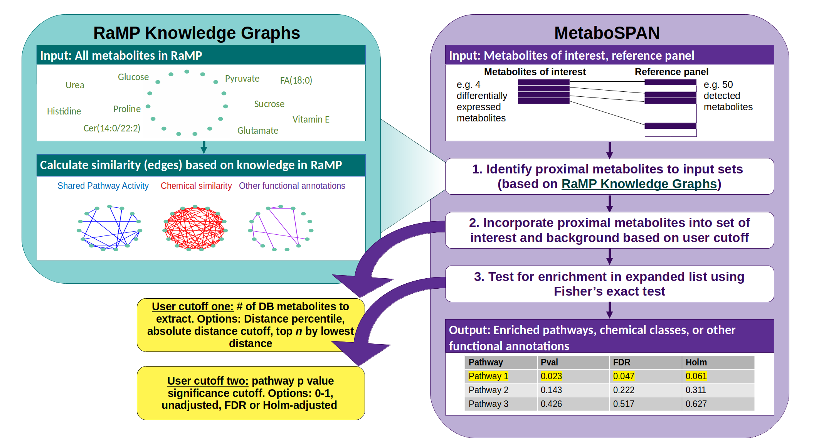

class: primary

<style type="text/css">

p.caption {
  font-size: 0.6em;
}

.large { font-size: 200% }

.medium-large { font-size: 130% }

.small{ font-size: 75% }

.cv{ font-size: 60% }

.tiny{ font-size: 40% }

.center-left {
  position:          relative;
  top:               50%;
  transform:         translateY(50%);
}
.center-right {
  position:          relative;
  top:               50%;
  transform:         translateY(10%);
}

.remark-slide-content {
  background-color: #FFFFFF;
  border-top: 80px solid #662e6b;
  font-size: 28px;
  font-weight: 300;
  line-height: 1.5;
  padding: .5em 3em .5em 3em
}

.inverse {
  background-color: #662e6b;
  text-shadow: none;
}

.right-column {
	color: #000000;
	width: 30%;
	height: 92%;
	float: right;
}

.left-column {
  color: #000000;
  width: 68%;
  float: left;
}

.remark-slide-number {
	display: none;
}

.remark-slide-content:after {
    content: "";
    position: absolute;
    bottom: 0px;
	left: 20px;
    height: 60px;
    width: 400px;
	font-size: 12px;
    background-repeat: no-repeat;
    background-size: contain;
	background-image: url("img/The-Ohio-State-University-Wexner-Medical-Center.png")
}

mark {
  background-color: teal;
  color: white;
}

.my-logo-null {
content: "";
    position: absolute;
    top: 15px;
    right:   8px;
    height: 200px;
    width: 250px;
    background-repeat: no-repeat;
    background-size: contain;
    background-image: url("img/Null_model_badge.png");
}

.my-logo-KP {
content: "";
    position: absolute;
    top: 15px;
    right:   8px;
    height: 200px;
    width: 300px;
    background-repeat: no-repeat;
    background-size: contain;
    background-image: url("img/Known_positive_badge.png");
}

.my-logo-SP {
content: "";
    position: absolute;
    top: 15px;
    right:   8px;
    height: 200px;
    width: 250px;
    background-repeat: no-repeat;
    background-size: contain;
    background-image: url("img/Sample_partition_badge.png");
}


</style> 

.pull-left[
<h2 style=font-size:35px> Integrative and Network-Based Approaches for Functional Interpretation of Metabolomic Data</style>
<h6 style=font-size:20px>
<br>
Andrew Patt, Doctoral Candidate
<br>
<br>
National Center for Advancing Translational Science/The Ohio State University
</style>
]

.pull-right[
```{r,echo=FALSE,out.width="500px"}
knitr::include_graphics("img/Thesis_schematic.png")
```
]

```{r, echo=FALSE, message=FALSE}

library(ggplot2)
library(ggrepel)
library(RColorBrewer)
library(tidyverse)
resMDM2HiLoLMME<-readRDS("img/metabolite_volcano_plot.Rds")
myPalette<-c("#e6194b","#8B008B","#808080","#f58231","gray80","#008080","#46f0f0","#3cb44b","#e6194b")
names(myPalette)<-c("Amino Acid","Cofactors and Vitamins","Nucleotide","Lipid","Not Significant","Peptide","Hexosylated Ceramide")

```

```{r xaringan-panelset, echo=FALSE,message=FALSE}
xaringanExtra::use_panelset()
```

---

# C.V.

.cv[
**B.Sc. Biochemistry, Biomathematics minor (SUNY Geneseo, 2015)**

#### Published

1. RaMP: A Comprehensive Relational Database of Metabolomics Pathways
  for Pathway Enrichment Analysis of Genes and Metabolites. 2018,
  Metabolites (*Second author*)
2. Integration of Metabolomics and Transcriptomics to Identify
  Gene-Metabolite Relationships Specific to Phenotype. 2019, Methods
  Mol Biol (*First author*)
3. Challenges in proteogenomics: a comparison of analysis methods with
  the case study of the DREAM proteogenomics sub-challenge. 2019, BMC
  Bioinformatics (*Co-first author*)
4. Metabolomics and Multi-Omics Integration: A Survey of Computational
  Methods and Resources. 2020, Metabolites (*Second author*)
5. MDM2-Dependent Rewiring of Metabolomic and Lipidomic Profiles in
  Dedifferentiated Liposarcoma Models. 2020, MDPI Cancers (*Co-first author*)

#### Preprint/ In review
1. An OpenData portal to share COVID-19 drug repurposing data in real
  time. 2020, bioRxiv (*Middle author*)
2. Lipidomics and Redox Lipidomics Indicate Early-Stage Alcohol-Induced
  Liver Damage. 2021, Hepatology (*In review, Middle author*)

#### In progress
1. MetaboSPAN: Network-Based Approach for Functional Interpretation
  of Metabolomic Data
2. RaMP 2.0: update to the RaMP pathway database
]


---

# C.V.

.cv[
**B.Sc. Biochemistry, Biomathematics minor (SUNY Geneseo, 2015)**

#### Published

1. <mark><b>RaMP: A Comprehensive Relational Database of Metabolomics Pathways
  for Pathway Enrichment Analysis of Genes and Metabolites. 2018,
  Metabolites (<i>Second author</i>)</b></mark>
2. <mark><b>Integration of Metabolomics and Transcriptomics to Identify
  Gene-Metabolite Relationships Specific to Phenotype. 2019, Methods
  Mol Biol (<i>First author</i>)</b></mark>
3. Challenges in proteogenomics: a comparison of analysis methods with
  the case study of the DREAM proteogenomics sub-challenge. 2019, BMC
  Bioinformatics (*Co-first author*)
4. <mark><b>Metabolomics and Multi-Omics Integration: A Survey of Computational
  Methods and Resources. 2020, Metabolites (<i>Second author</i>)</b></mark>
5. <mark><b>MDM2-Dependent Rewiring of Metabolomic and Lipidomic Profiles in
  Dedifferentiated Liposarcoma Models. 2020, MDPI Cancers (<i>Co-first author</i>)</b></mark>

#### Preprint/ In review
1. An OpenData portal to share COVID-19 drug repurposing data in real
  time. 2020, bioRxiv (*Middle author*)
2. Lipidomics and Redox Lipidomics Indicate Early-Stage Alcohol-Induced
  Liver Damage. 2021, Hepatology (*In review, Middle author*)

#### In progress
1. <mark><b>MetaboSPAN: Network-Based Approach for Functional Interpretation
  of Metabolomic Data</b></mark>
2. <mark><b>RaMP 2.0: update to the RaMP pathway database</b></mark>
]

---
# Metabolomic pathway analysis

```{r,echo=FALSE,out.width="1200px"}

```

---

# Biological pathway databases

.pull-left[
- Example: **Glycolysis** is a chain of 10 enzyme-catalyzed reactions
  where glucose is converted to pyruvate .tiny[(https://www.thoughtco.com/steps-of-glycolysis-373394)
  ]]
  
.pull-right[
.center[
```{r,echo=FALSE,out.width="300px"}
knitr::include_graphics("img/Glycolysis.jpeg")
```
]]

.pull-left[
- Stored in databases as lists of related analytes, or networks where nodes are metabolites and edges are reactions
]

.pull-right[
.tiny[
| Name            | # metabolites | Other features                                    |
|----------------|--------------|--------------------------------------------------|
| HMDB/SMPDB      | >114,000      | Reactions, chemical class, spectra, ontologies    |
| KEGG            | >18,000       | Reactions, Pathway hierarchy (BRITE)              |
| Reactome        | 1,856         | Interactive "Google Maps" pathway explorer        |
| Wikipathways    | 3,133         | Community-driven                                  |
| MetaCyc         | 16,313        | Highly curated                                    |
| PathBank        | 78,488        | Highly recent, contains many novel lipid pathways |
]
]

---

# Relational database of Metabolic Pathways (RaMP)
.pull-left[
- Metadatabase integrating
information from **KEGG**, **HMDB**, **WikiPathways** and **Reactome** 
- Currently contains 51,526 pathways and 536,245 associations to analytes
- Additional information includes chemical structures, chemical
classes, reactions, and ontologies
- Useable as web interface, R package and MySQL database
]

.pull-right[
```{r,echo=FALSE,out.width="600px"}
knitr::include_graphics("img/RaMP_contents.png")
```
]
---

# Using RaMP

.left-column[
.center[
```{r,echo=FALSE,out.width="700px"}

```

]
]

.right-column[
- Example data to help users format input
- Tabs for each step of pathway analysis
.cv[
	- Data input
- Map to pathways
- Pathway enrichment
- Significance filtration
- Overlap clustering
	]
- Pane showing underlying R functions
]

---

# Pathway overlap

.pull-left[
```{r,echo=FALSE,out.width="450px", fig.cap="Overlap in metabolites making up pathways in RaMP. Rows and columns are pathways, cells are Jaccard index of constituent metabolites"}
knitr::include_graphics("img/RaMP_pathway_overlap3.svg")
```
]

.pull-right[
- Pathways often share sub-processes, resulting in functional redundancy
- This causes collinearity in pathway analysis results, making interpretation difficult
- Heatmap shows high overlap in pathway constituent metabolites,
particularly within the same databases ]

---

# Pathway overlap clustering

.center[
```{r,echo=FALSE,out.width="1100px"}
knitr::include_graphics("img/Pathway_clustering.svg")
```
]

---

# Other issues with pathway analysis

.pull-left[

```{r,echo=FALSE,fig.width=11,fig.height=11, message=FALSE, warning=FALSE}
mapping_rates<-readRDS("img/mapping_rates.Rds")
mapping_rates %>%
    ggplot(aes(x=class_name,y=n,fill=annotated))+
    geom_text(aes(y = lab_ypos, x=class_name, label = paste0(round(per,1),"%"),
                  group=annotated,color = annotated),size=5) +
    geom_bar(position="dodge", stat="identity") +
    theme_classic(base_size=18)+
    labs(y="Metabolite Count",x="")+
    theme(axis.text.x=element_text(angle=45,hjust=1),
          plot.margin=unit(c(1,1,1.5,1.5),"cm"))+
    scale_y_continuous(trans='log10')+
    scale_fill_manual(values=c("aquamarine4","purple"))+
    scale_color_manual(values=c("aquamarine4","purple"))+
    ggtitle("Mapping rates for metabolites by class in RaMP")
```
]

.pull-right[
- Lack of pathway annotations for metabolites (see left)
  + .small[Testing for enrichment of other annotations with better coverage can increase the number of metabolites we can incorporate into analysis]
- Uncertainty in metabolite identification
  + .small[Need to develop metabolomics-specific methodology that accounts for this uncertainty]
]

---

# MetaboSPAN

.center[
```{r,echo=FALSE,out.width="1000px"}

```
]

---

# Validating MetaboSPAN

.center[
```{r,echo=FALSE,out.width="900px"}
knitr::include_graphics("img/Validation_schematic.png")
```
]

---

# Pathway analysis methods to compare against
</br>

.small[
| Class                        | Pros  | Cons | Representative      |
|------------------------------|---|---------|---------------------|
| Over-representation analysis | Simple to implement, easy to interpret  |Depends on choice of background, ignores pathway overlap         | Fisher's exact test |
| Functional class scoring     | Self-contained hypothesis (no background)  | Hypothesis interpretation difficult, more challenging to implement | MSEA         |
| Topological analysis         | Leverages graph theory and known pathway topology to improve analysis  | Graph-level annotations are not always available, challenging to implement        | NetGSA              |
| FELLA                        | Can enrich for reactions and pathways  | Only applicable to KEGG annotations   | FELLA               |
]

---


<div class="my-logo-null"></div> 

# Null model experiment
.pull-left[
.small[
| Background | Test           | .cv[Median sig. pathway count] |
|------------|----------------|--------------------------|
| Custom     | Fishers        | 1                        |
| Custom     | MetaboSPAN 10% | 2                        |
| Custom     | MetaboSPAN 15% | 3                        |
| Custom     | MetaboSPAN 20% | 4                        |
| KEGG       | Fishers        | 33                       |
| KEGG       | MetaboSPAN 10% | 33                       |
| KEGG     | MetaboSPAN 15% | 34                       |
| KEGG     | MetaboSPAN 20% | 35                         |
| N/a        | NetGSA         | 9                        |
| N/a        | MSEA           | 36                       |
| N/a        | FELLA          | 54                       |
]
]

.pull-right[
```{r,echo=FALSE,fig.width=12,fig.height=12}
## knitr::include_graphics("img/Null_model1.png")

results<-readRDS("img/Null_model_results.Rds")
results<-results[which(lapply(results,length)==2)]
KEGG_results_df<-lapply(results,function(x){return(x[[1]])})
KEGG_results_df<-do.call(rbind,KEGG_results_df)
KEGG_results_df<-KEGG_results_df %>%
    mutate(test=gsub("Pval","Fishers",test))%>%
    mutate(test=gsub("GOstats","Fishers_KEGGbg",test))%>%
    mutate(test=gsub("GO","KEGGbg",test))
nominal_df<-KEGG_results_df%>%
    filter(!grepl("holm",KEGG_results_df$test,ignore.case=TRUE))
nominal_df<-nominal_df%>%
    filter(!grepl("FDR",nominal_df$test,ignore.case=TRUE))
colnames(nominal_df)<-c("test","FPs")
nominal_df%>%
    filter(test!="MS15_Fish")%>%
    filter(test!="MS20_Fish")%>%
    filter(test!="MS15_KEGGbg")%>%
    filter(test!="MS20_KEGGbg")%>%
    ggplot(aes(x=FPs,fill=test,color=test))+
    geom_density(alpha=0.5) +
    theme_classic() +
    ## ggtitle("Significant pathways found in 500 randomized datasets") +
    theme(text = element_text(size=28)) +
    labs(x="Significant pathway count")

```
]

---

<div class="my-logo-KP"></div> 

# Recovery of known altered pathways

.left-column[
```{r,echo=FALSE,out.width="1100px"}

```
]

.right-column[
.small[
- Tested nine different scenarios for known positive pathways lists in
  terms of coverage and size, as well as raw pval and Holm adjustment

- In three scenarios post Holm adjustment, MetaboSPAN improved median recall rate (left)

- In three scenarios using raw pval, MetaboSPAN decreased median false positive rate

]]

---

<div class="my-logo-SP"></div> 

# Impact of sample size on performance

.left-column[
.small[
| Background | Test           | TPs | Median % recall | Median FPs |
|------------|----------------|---------------------------|---------------------------------------|-----------------------------------------|
| KEGG       | MetaboSPAN 20% | 5                         | 100%                                  | 3                                       |
| KEGG       | MetaboSPAN 10% | 10                        | 100%                                  | 2                                       |
| KEGG       | Fisher's       | 14                        | 93%                                  | 1                                       |
| KEGG       | MetaboSPAN 15% | 6                         | 77%                                   | 1                                       |
| Custom     | MetaboSPAN 20% | 5                         | 100%                                  | 0.5                                     |
| Custom     | MetaboSPAN 10% | 4                         | 100%                                  | 2                                       |
| Custom     | Fisher's       | 2                         | 100%                                  | 1                                       |
| Custom     | MetaboSPAN 15% | 6                         | 83%                                   | 1                                       |
| N/a        | MSEA           | 36                        | 97%                                    | 0                                       |
| N/a        | FELLA          | 14                        | 77%                                    | 1                                        |
| N/a        | NetGSA         | 24                        | 75%                                    | 2                                       |
]
]
.right-column[
</br>
.small[
- TPs are true positives (significant pathways found in unpartitioned data)
- FPs are false positives (significant pathways found in partitions not found in full data)
-  MetaboSPAN was able to improve recall in KEGG background use case
and lower false positives in custom case 
]
]

---

# Real data: Similar findings in separate cohorts

.left-column[
.small[
| Background | Test           | Dataset 1 | Dataset 2 | **Overlap** |
|------------|----------------|----------|----------|---------|
| KEGG       | MetaboSPAN 20% | 10       | 31       | **.6**  |
| KEGG       | MetaboSPAN 15% | 13       | 27       | **.54** |
| KEGG       | MetaboSPAN 10% | 10       | 28       | **.5**  |
| KEGG       | Fisher's       | 14       | 31       | **.5**  |
| Custom     | MetaboSPAN 20% | 5        | 7        | **.2**  |
| Custom     | MetaboSPAN 15% | 6        | 5        | **.2**  |
| Custom     | MetaboSPAN 10% | 4        | 5        | **0**   |
| Custom     | Fisher's       | 2        | 4        | **0**   |
| N/a        | MSEA           | 36       | 46       | **.69** |
| N/a        | NetGSA         | 24       | 30       | **.46** |
| N/a        | FELLA          | 14       | 19       | **.14**     |

]
]

.right-column[
.small[
- Two publicly available datasets generated from the same cohort on different platforms were obtained

- Only one metabolite was found in common between both datasets

- Significant pathways by each method were found in each set

- MetaboSPAN improved the concordance of Fisher's results in both
background cases ]
]

---

# Pathway anaysis conclusions

### 1. MetaboSPAN improved the performance of Fisher's in a variety of contexts

### 2. When considering an algorithm, check how many significant pathways it finds in random data

### 3. When using Fishers, be aware of the tradeoffs and assumptions that come with each background selection

### 4. Consider using an ensemble approach to identify the most trustworthy altered pathways

---

# Dedifferentiated Liposarcoma (DDLPS)

.pull-left[
```{r,echo=FALSE,out.width="350px"}

```

.tiny[
Bill KLJ, Seligson ND, Hays JL, et al. Degree of Amplification Affects Clinical Outcomes in Dedifferentiated Liposarcoma. Oncologist. 2019;24(7):989-996.
]
]

.pull-right[
- Current treatments for DDLPS (Dactinomycin, Doxorubicin) have unpredictable efficacy and high toxicity
- MDM2 is amplified in all DDLPS tumors
- MDM2 is an antagonist of the p53 DNA repair gene
- Prognosis depends on copy number of the MDM2 oncogene
]

---

# Targeting the MDM2-p53-cholesterol axis

.pull-left[
- Statins (cholesterol synthesis inhibitors) have been associated with
  reduced mortality in mutant p53 cancers
- p53 downregulates cholesterol synthesis pathway
- Collaborators showed MDM2 low cells are sensitive to statin while MDM2 high cells are not

]

.pull-right[

```{r,echo=FALSE,out.width="800px"}
knitr::include_graphics("img/Atorvastatin_response.svg")
```

]

---

# Metabolomic Methods

.center[
```{r,echo=FALSE,out.width="1100px"}

```
]

---

# Impact of statin on DDLPS cell lipidome

.panelset[
.panel[.panel-name[MDM2 lower cells]

.pull-left[
```{r,fig.width=11,fig.height=8, echo=FALSE}

TreVsUntreLMME_lo<-readRDS("img/Lipid_Lo_Tre_volcano_plot.Rds")
fc_thresh=0.75
p_thresh <- 0.05
lipidomic_key<-readRDS("img/lipidomic_key.Rds")
T_test_results<-TreVsUntreLMME_lo
    
## Make insignificant points smaller and more transparent
T_test_results$significant = abs(T_test_results$log2fc) > fc_thresh &
    -log10(T_test_results$mypadj) > -log10(p_thresh)
T_test_results$size <- ifelse(T_test_results$significant,4,2)

## Color code by lipid class
T_test_results$class<-lipidomic_key$LM.Main.Class[match(T_test_results$name,lipidomic_key$name)]
palette_names<-as.vector(sort(unique(T_test_results$class)))
T_test_results$class<-sapply(1:nrow(T_test_results),function(x){
    ifelse(T_test_results$significant[x],
           return(as.vector(T_test_results$class)[x]),return("Not Significant"))
})

T_test_results = T_test_results %>%
    mutate(class =
               apply(T_test_results, 1, function(x){
                   if(x["class"]!="Not Significant"){
                       if(grepl("HexCer",x["name"])){
                           "Hexosylated Ceramide"
                       }else if(grepl("Cer",x["name"])){
                           "Ceramide"
                       }else{
                           "Other"
                       }
                   }else{
                       "Other"
                   }
               }) %>%
           as.factor())

palette<-c("blue","red","grey80")
names(palette)<-c("Ceramide","Hexosylated Ceramide","Other")

g = ggplot(data=T_test_results, aes(x=log2fc, y=-log10(mypadj), colour=class)) +
    geom_point(##alpha=0.7,
        aes(size=size)) +
    scale_color_manual(values = palette,
                       ##na.value="grey80",
                       ##labels=legend_labels,
                       name="LipidMaps Main Class") +
    theme_bw(base_size=20) +
    ##scale_color_brewer(palette="Paired",na.value="grey80") +
    ggtitle("Treated vs Untreated, MDM2 Low") +
    theme(plot.title = element_text(hjust = 0.5)) +
    theme(panel.grid.major = element_blank(), panel.grid.minor = element_blank()) +
    ylab("-log10 p-value") +
    geom_hline(yintercept = -log10(p_thresh),lty = 2) +
    geom_vline(xintercept = fc_thresh, lty = 2) +
    geom_vline(xintercept = -fc_thresh, lty = 2) +
    scale_size(range=c(2,4)) +
    guides(size=FALSE,
           colour = guide_legend(override.aes = list(size=10))) ## +
    ## geom_label_repel(data = T_test_results %>% filter(grepl("Cer",name) &
    ##                                                   class!="Not Significant"),
    ##                  aes(label=name),
    ##                  show.legend = FALSE,
    ##                  force=10,
    ##                  xlim=c(NA,1),
    ##                  arrow = arrow(length = unit(0.03,"npc"),type = "closed"),
    ##                  size=6)
g

```
]

.pull-right[

- MDM2 low tumors have better prognosis
- MDM2 low cells responded to atorvastatin treatment
- 11 ceramides and 3 hexosylated ceramides were upregulated by atorvastatin treatment in MDM2 low cells

]
]

.panel[.panel-name[MDM2 higher cells]

.pull-left[
```{r,fig.width=11,fig.height=8, echo=FALSE}
MDM2HivsLoLMME<-readRDS("img/Lipid_volcano_plot.Rds")
fc_thresh=0.75
p_thresh <- 0.05
lipidomic_key<-readRDS("img/lipidomic_key.Rds")
volcano_plotter <- function(df,title){
    T_test_results<-df
    
    ## Make insignificant points smaller and more transparent
    T_test_results$significant = abs(T_test_results$log2fc) > fc_thresh &
        -log10(T_test_results$mypadj) > -log10(p_thresh)
    T_test_results$size <- ifelse(T_test_results$significant,4,2)
    
    ## Color code by lipid class
    T_test_results$class<-lipidomic_key$LM.Main.Class[match(T_test_results$name,lipidomic_key$name)]
    palette_names<-as.vector(sort(unique(T_test_results$class)))
    T_test_results$class<-sapply(1:nrow(T_test_results),function(x){
        ifelse(T_test_results$significant[x],
                    return(as.vector(T_test_results$class)[x]),return("Not Significant"))
    })
      
	 legend_labels<-sort(unique(sapply(T_test_results$class, function(x){
             if(!is.na(x)){
		 return(paste0(x," (n=",length(which(T_test_results$class==x)),")"))
             }else{
		 return(x)
             }
	 })))
      
	 ##legend_labels<-legend_labels[-which(is.na(legend_labels))]
      
	 palette<-c(rev(brewer.pal(8,"PRGn")),"blue","sienna","springgreen4","seagreen","#40E0D0","violet","grey80")
	 names(palette)<-c(palette_names,"Not Significant")
	 palette<-palette[unique(T_test_results$class)]
                                           #palette<-palette[-which(is.na(palette))]
      
        g = ggplot(data=T_test_results, aes(x=log2fc, y=-log10(mypadj), colour=class)) +
            geom_point(##alpha=0.7,
                       aes(size=size)) +
            scale_color_manual(values = palette,
                                        #na.value="grey80",
                               labels=legend_labels,
                               name="LipidMaps Main Class") +
            theme_bw(base_size=20) +
                                        #scale_color_brewer(palette="Paired",na.value="grey80") +
            ggtitle(title) +
            theme(plot.title = element_text(hjust = 0.5)) +
            theme(panel.grid.major = element_blank(), panel.grid.minor = element_blank()) +
            ylab("-log10 p-value") +
            geom_hline(yintercept = -log10(p_thresh),lty = 2) +
            geom_vline(xintercept = fc_thresh, lty = 2) +
            geom_vline(xintercept = -fc_thresh, lty = 2) +
            scale_size(range=c(2,4)) +
            guides(size=FALSE,
                   colour = guide_legend(override.aes = list(size=10)))
    
    T_test_results_sig<-T_test_results[T_test_results$significant,]
    text_size<-round(min(20,350/nrow(T_test_results_sig)),digits=0)
    
    return(g)
}

TreVsUntreLMME_hi<-readRDS("img/Lipid_Hi_Tre_volcano_plot.Rds")

volcano_plotter(TreVsUntreLMME_hi,"Treated vs Untreated, MDM2 High")
```
]

.pull-right[
- MDM2 high tumors have worse prognosis
- MDM2 high cell lines did not respond to atorvastatin treatment
- Analyzing the lipidome of MDM2 high cells pre and post atorvastatin
treatment revealed only 4 lipids perturbed by treatment ]

]

]

---

# Sphingolipid metabolism as a therapeutic target

.center[
```{r,echo=FALSE,out.width="1100px"}

```
]

---

# MDM2 status impact on ceramide levels

.panelset[
.panel[.panel-name[Metabolite panel]
.center[
```{r,echo=FALSE,fig.height=6,fig.width=10}

##ggplotly(p)

myPalette2<-c("gray80","red")
names(myPalette2)<-c("Not Significant","Hexosylated Ceramide")

p <- resMDM2HiLoLMME %>%
    mutate(class=ifelse(name == "glycosyl-N-palmitoyl-sphingosine"  |
                        name == "glycosyl-N-stearoyl-sphingosine"
                       ,
                        "Hexosylated Ceramide",
                        "Not Significant")) %>%
    ggplot(aes(x=log2fc, y=-log10(LMMEadj), colour=class)) +
    geom_hline(yintercept = -log10(0.05),lty = 2) +
    geom_vline(xintercept = 0.75, lty = 2) +
    geom_vline(xintercept = -0.75, lty = 2) +
    geom_point(aes(size=size)) +
    geom_label_repel(data =
                         resMDM2HiLoLMME %>%
                         mutate(class=ifelse(name == "glycosyl-N-palmitoyl-sphingosine"  |
                                             name == "glycosyl-N-stearoyl-sphingosine",
                                             "Hexosylated Ceramide",
                                             "Not Significant")) %>%
                         mutate(name=sapply(name, function(x) if(x == "glycosyl-N-palmitoyl-sphingosine"){
                                         "HexCer-NS(d18:1/16:0)"
                                     }else if(x == "glycosyl-N-stearoyl-sphingosine"){
                                         "HexCer-NS(d18:1/18:0)"
                                     }else{
                                         x})) %>%
                         ## mutate(name=ifelse(name == "glycosyl-N-stearoyl-sphingosine",
                         ##                    "HexCer-NS(d18:1/18:0)",
                         ##                    name)) %>%
                         filter(class=="Hexosylated Ceramide")
                    ,
                     aes(label=name),
                     show.legend = FALSE,
                     force=10,
                     xlim=c(NA,0),
                     ylim=c(NA,2.25),
                     arrow = arrow(length = unit(0.03,"npc"),type = "closed"),
                     size=10) +
    theme_bw(base_size=24) +
    scale_color_manual(values = myPalette2) +
    ## ggtitle("Metabolomic Panel") +
    theme(plot.title = element_text(hjust = 0.5)) +
    theme(panel.grid.major = element_blank(), panel.grid.minor = element_blank()) +
    ylab("-log10 p-value") +
    xlab("log2(MDM2Hi)-log2(MDM2Lo)") +
    scale_alpha(range=c(0.2,0.7)) +
    scale_size(range=c(4,6)) +
    guides(size=FALSE,alpha=FALSE,label=FALSE,
           ##colour = guide_legend(override.aes = list(size=10))) +
           colour = FALSE) +
    xlim(-4,5) +
    ylim(0,3)
##ggplotly(p)
p

```

]
]


.panel[.panel-name[Lipid panel]
.pull-left[
```{r,echo=FALSE,fig.width=10,fig.height=8,message=FALSE,warning=FALSE}

library(gplots)

library(RColorBrewer)

T_test_results<-MDM2HivsLoLMME
    
## Make insignificant points smaller and more transparent
T_test_results$significant = abs(T_test_results$log2fc) > fc_thresh &
    -log10(T_test_results$mypadj) > -log10(p_thresh)
T_test_results$size <- ifelse(T_test_results$significant,4,2)

## Color code by lipid class
T_test_results$class<-lipidomic_key$LM.Main.Class[match(T_test_results$name,lipidomic_key$name)]
palette_names<-as.vector(sort(unique(T_test_results$class)))
T_test_results$class<-sapply(1:nrow(T_test_results),function(x){
    ifelse(T_test_results$significant[x],
                    return(as.vector(T_test_results$class)[x]),return("Not Significant"))
})

legend_labels<-sort(unique(sapply(T_test_results$class, function(x){
    if(!is.na(x)){
        return(paste0(x," (n=",length(which(T_test_results$class==x)),")"))
    }else{
        return(x)
    }
})))

##legend_labels<-legend_labels[-which(is.na(legend_labels))]

palette<-c("gray80","red")

names(palette)<-c("Not Significant","Hexosylated Ceramide")

g =
    T_test_results %>%
    mutate(class = ifelse(grepl("HexCer",name),
                          "Hexosylated Ceramide",
                          "Not Significant")) %>%
    ggplot(aes(x=log2fc, y=-log10(mypadj), colour=class)) +
    geom_point(##alpha=0.7,
        aes(size=size)) +
    scale_color_manual(values = palette,
                                        #na.value="grey80",
                       ##labels=legend_labels,
                       name="class") +
    theme_bw(base_size=24) +
                                        #scale_color_brewer(palette="Paired",na.value="grey80") +
    ## ggtitle("Lipidomic Panel") +
    theme(plot.title = element_text(hjust = 0.5)) +
    theme(panel.grid.major = element_blank(), panel.grid.minor = element_blank()) +
    ylab("-log10 p-value") +
    xlab("log2(MDM2Hi)-log2(MDM2Lo)") +
    geom_hline(yintercept = -log10(p_thresh),lty = 2) +
    geom_vline(xintercept = fc_thresh, lty = 2) +
    geom_vline(xintercept = -fc_thresh, lty = 2) +
    scale_size(range=c(4,6)) +
    guides(size=FALSE,
           ## colour = guide_legend(override.aes = list(size=10))) +
           colour = FALSE) +
    geom_label_repel(data = T_test_results %>%
                         mutate(class = ifelse(grepl("HexCer",name),
                                               "Hexosylated Ceramide",
                                               "Not Significant")) %>% filter(grepl("HexCer",name)),
                     aes(label=name),
                     nudge_y=0.5,
                     show.legend = FALSE,
                     force=10,
                     xlim=c(NA,1),
                     arrow = arrow(length = unit(0.03,"npc"),type = "closed"),
                     size=8) +
    xlim(-4,5) +
    ylim(0,3)
g


```
]

.pull-right[
</br>
```{r,echo=FALSE,fig.height=8,fig.width=12}
##knitr::include_graphics("img/Glycosylated_ceramides.png")

load("img/heatmap.Rda")

mycol = colorRampPalette(c("blue", "white","red"))(100)

heatmap.2(y, Colv=as.dendrogram(hc), col=mycol, scale="row", density.info="none",
          trace="none",dendrogram = "col",
          ##lhei=c(1.5,5,1),
          ##lwid=c(1.5, 3),
          ColSideColors = col_colors,
          tracecol = "black",
          labCol=as.vector(t(mycell)),
          margins=c(10,20.0),
          cexRow = 2,
          cexCol = 2
          )

```

]
]
]

---

# Pathway analysis results in DDLPS

.center[
```{r,echo=FALSE,out.width="800px"}
knitr::include_graphics("img/fig1C.png")
```
]

---

# In Conclusion

### 1. We characterized the metabolome/lipidome of a DDLPS model and identified sphingolipid metabolism as a potential therapeutic target

### 2. We developed RaMP, a comprehensive metabolomics functional annotations resource that harmonizes information from many large sources, and provides a convenient user interface, R package and MySQL database for ease of use

### 3. We developed and validated MetaboSPAN, a novel network-based pathway analysis algorithm that can compensate for uncertainty in identification and incomplete metabolome coverage

---

# Acknowledgements

.pull-left[
.small[
**Mathé Lab**
- Dr. Ewy Mathé, OSU/NCATS
- Tara Eicher, OSU/NCATS
- Kevin Ying, OSU
- Kyle Spencer, OSU/NCATS
- Dr. Garrett Kinnebrew, OSU


**Collaborators/Advisors**
- Dr. James Chen, OSU
- Dr. Kevin Coombes, OSU
- Dr. Zachary Abrams, OSU
- Dr. Lang Li, OSU
- Dr. Rachel Kopec, OSU

]]

.pull-right[
.small[
**Collaborators/Advisors**
- Dr. Tim Garrett, Florida State University
- Dr. Jeremy Koelmel Florida State University
- John Braisted, NCATS
- Jorge Neyra, NCATS
- NCATS informatics core

**Funding from**
- The OSU Clinical and Translational Research Informatics Training
Program (4T15LM011270-05)
- Systems and Integrative Biology training program (T32GM068412) ]]

---

# Questions?

.pull-left[
<iframe src='https://gfycat.com/ifr/LongLateAcouchi' frameborder='0' scrolling='no' allowfullscreen width='480' height='390'></iframe><p><a href="https://gfycat.com/discover/question-gifs">from Question GIFs</a> <a href="https://gfycat.com/longlateacouchi-question-mark-confused-what-huh">via Gfycat</a></p>
]

.pull-right[
- Slides link: https://andyptt21.github.io/Thesis_presentation_6_29_21

- RaMP link: https://rampdb.ncats.io/
]

---

# Known Positive Table

```{r,echo=FALSE,out.width="1000px"}

```
