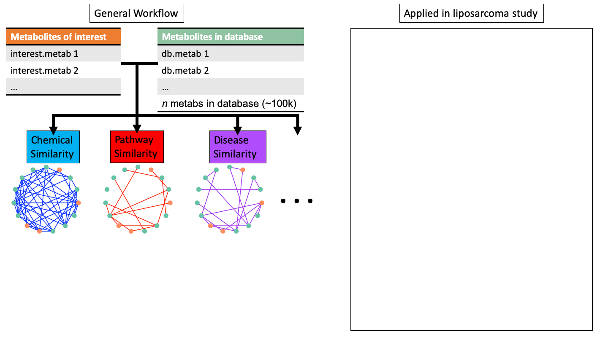
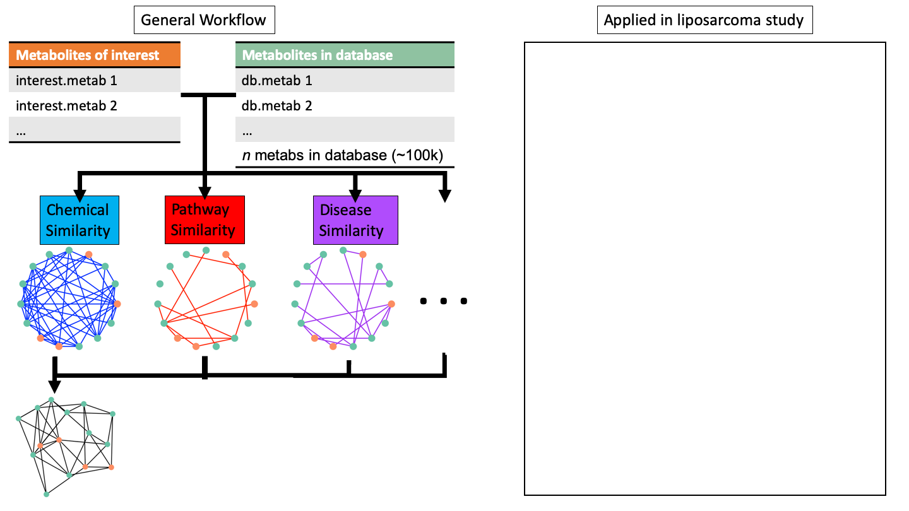

---
output:
  xaringan::moon_reader:
    css: [default, metropolis, metropolis-fonts]
    lib_dir: libs
    nature:
      highlightStyle: github
      countIncrementalSlides: false
      seal: false
      ratio: '16:9'
---

class: inverse, middle
background-image: url(title_background.svg)
background-size: cover

<font color = "white">
## Analyzing gene expression data in terms of gene sets: methodological issues
.pull-left[
### Jelle J. Goeman and Peter Buhlmann
]

.pull-right[
.center[
```{r,echo=FALSE,out.width="300px"}
knitr::include_graphics("img/Ohio_State_University_seal.svg.png")
```
]
]


---

<style type="text/css">

p.caption {
  font-size: 0.6em;
}

.large { font-size: 200% }

.medium-large { font-size: 130% }

.small{ font-size: 80% }

.tiny{ font-size: 55% }

.center-left {
  position:          relative;
  top:               50%;
  transform:         translateY(50%);
}
.center-right {
  position:          relative;
  top:               50%;
  transform:         translateY(10%);
}

.remark-slide-content {
  background-color: #FFFFFF;
  border-top: 80px solid #8f1414;
  font-size: 28px;
  font-weight: 300;
  line-height: 1.5;
  padding: 1em 2em 1em 2em
}

.inverse {
  background-color: #8f1414;
  text-shadow: none;
}

.right-column {
	color: #000000;
	width: 30%;
	height: 92%;
	float: right;
}

.left-column {
  width: 68%;
  float: left;
}

</style>

# Background

- Assumptions are always being made when performing pathway analysis of omic data
--

- When we do enrichment testing, we're actually testing for significance of a set of terms, not a set of analytes (directly)
--

- This paper discusses erroneous statistics used for enrichment testing; ignoring shortcomings in annotation databases and issues with statistical cutoffs
--

- Main focuses of the paper:
--

  1. What is the null hypothesis that should be tested against?
--
  
  2. How does one calculate and interpret a resulting p-value?
---

# Contingency table tests

- Contingency table tests are *competitive* and *gene sampling* methods
--

----------------------------------
| |DE genes|Non DE genes|
|-|-|-|
|**Genes in set**| DE genes in gene set of interest   | Non DE genes in gene set of interest  |
|**Genes not in set**| DE genes not in gene set  | Non DE genes not in gene set of interest  |
----------------------------------
--

- Assessing the likelihood that a random set of genes would have as
  high of a DE:NonDE gene ratio as the set selected, using the ratio of the whole set measured
--

- Equivalent to finding the null distribution of a test statistic by randomly reassigning genes to the labels for being in the gene set and for being differentially expressed
---

# Competitive vs Self-contained tests
--


- Competitive test compares differential expression of the gene set
being tested to a standard defined by the genes measured that were not
in the set
--

- Null hypothesis is that the **genes in G are at most as
often differentially expressed as the genes measured not in set G**
--

- Self contained tests compares gene set being test to fixed standard that does not rely on measurements outside the set
--

- Null hypothesis is that **no genes in G are differentially expressed (more stringent)**
--

.small[
- Rather than using the ratio of DE/NonDE genes in the measured set, in this example they generate a binomial distribution modeling an independent relationship between DE and the gene set (expect that the number of DE genes is directly proportional to $\alpha$)

]
--

- The self contained test is unaffected by the number of DE genes in your data; it is the generalization of single gene tests
--

- Self contained test can be expanded to test the hypothesis that any genes in your set are truly DE

---

# Gene vs Subject-sampling methods
- Subject sampling tests are easier to conceptualize for DE analysis
--

- Think of DE analysis as testing for overrepresentation of class
  labels in one group of genes based on fold change, whereas
  enrichment analysis w/ gene sampling is testing for enrichment of
  pathway labels in group of genes based on DE label
--

- Subject sampling uses distribution of data to model how likely it
  would be for a term to be overrepresented in random data
--

- The example in table two tests the likelihood that no genes of a
  certain label were DE; using a subject-sampling approach to test a
  gene-sampling hypothesis
  
--

- Since it is testing the hypothesis that no genes in the set are DE, it also ends up being self contained

---

# P value interpretation

- P value interpretation relies solely on the sampling method employed, and thus sampling determines the extrapolations you can make
--

- Subject-sampling tests the hypothesis that you would identify the same pattern of genes in a new set of samples
--

- Gene-sampling tests the opposite; telling the probability of identifying the same ratio of DE genes in a given pathway to those outside of it in a random sampling of genes
--

- Gene-sampling artificially inflates sample size and generates misleading p values that don't align with the experimental hypothesis
---

# The IID assumption

- Conventional methodologies assume that genes are independently and identically distributed
--

- This is obviously wrong for a number of reasons
--

- Related genes often have correlated expression
--

- This means that we have more genes DE than we would expect in a hypergeometric distribution
--

- Phenomenon demonstrated in simulation experiment

---
# Experimental setup

- Wanted to demonstrate the anti-conservativeness of the hypergeometric test as a function of the dependence of related gene expression
--

- Generated random data of 10k genes for 20 subjects
--

- Genes are divided into 100 gene sets (uniquely)
--

- Subjects were 10 "healthy" and 10 "disease"
--

- Genes sharing a set were made to correlate across a range of 11 rho values (5000 replicates apiece)
--

- Genes not sharing a set always had correlation of 0
--

- Measure proportion of observed significant gene sets vs nominal alpha value in random data

---

# Results

- Hypergeometric test rapidly becomes anticonservative at low correlation levels
--

- The phenomenon is more pronounced at lower p value cutoffs
--

- This is in unadjusted p vals, so the lower cutoffs are around the range we operate in presumably
--

## Recommendations
--

- Use a self-contained, subject-sampling approach
--

- The prominent example of self contained tests is the FSEA family,
modified (use a raw p-val list instead of a ranked list for KS test against uniform distribution) 

---

# Dedifferentiated Liposarcoma

--

- Dedifferentiated liposarcoma is a common sarcoma with high morbidity
--

- Copy number of MDM2 gene determines chemosensitivity
--

- **Final major findings:**
--

- MDM2 status predicts glycosylation level of ceramides
.center[
```{r,echo=FALSE,out.width="500px"}
knitr::include_graphics("img/Glycosylated_ceramides.png")
```
]
--

- Glycosylated ceramides are tied to chemoresistance
---

# Dedifferentiated Liposarcoma

- Dedifferentiated liposarcoma is a common sarcoma with high morbidity
- Copy number of MDM2 gene determines chemosensitivity
- **Final major findings:**
- MDM2 status is tied to differences in sphingolipid metabolism, pro-inflammation pathways/platelet activation, fatty acid metabolism , and bile acid metabolism
.center[
```{r,echo=FALSE,out.width="600px"}

```
]
---

# Dedifferentiated Liposarcoma

- Dedifferentiated liposarcoma is a common sarcoma with high morbidity
- Copy number of MDM2 gene determines chemosensitivity
- **Final major findings:**
- MDM2 inhibition lead to differences in DNA repair and amino acid metabolism
.center[
```{r,echo=FALSE,out.width="700px"}

```
]
---

# Dedifferentiated Liposarcoma

- Dedifferentiated liposarcoma is a common sarcoma with high morbidity
- Copy number of MDM2 gene determines chemosensitivity
- **Final major findings:**
- Atorvastatin impacted sphingolipid pathways which could explain resistance of MDM2 higher cells
.center[
```{r,echo=FALSE,out.width="600px"}

```
]
---
# MetaboSPAN

```{r,echo=FALSE,out.width="1000px"}
knitr::include_graphics("img/network_schematic1.png")
```

---

# MetaboSPAN

```{r,echo=FALSE,out.width="1000px"}
knitr::include_graphics("img/network_schematic2.png")
```

---

# MetaboSPAN

```{r,echo=FALSE,out.width="1000px"}
knitr::include_graphics("img/network_schematic3.png")
```

---

# MetaboSPAN

```{r,echo=FALSE,out.width="1000px"}
knitr::include_graphics("img/network_schematic4.png")
```

---

# MetaboSPAN

```{r,echo=FALSE,out.width="1000px"}

```

---

# MetaboSPAN

```{r,echo=FALSE,out.width="1000px"}
knitr::include_graphics("img/network_schematic6.png")
```

---

# MetaboSPAN

```{r,echo=FALSE,out.width="1000px"}

```

---

# MetaboSPAN

```{r,echo=FALSE,out.width="1000px"}
knitr::include_graphics("img/network_schematic8.png")
```

---

# MetaboSPAN

```{r,echo=FALSE,out.width="1000px"}
knitr::include_graphics("img/network_schematic9.png")
```

---

# MetaboSPAN

```{r,echo=FALSE,out.width="1000px"}
knitr::include_graphics("img/network_schematic10.png")
```

---

# MetaboSPAN

```{r,echo=FALSE,out.width="1000px"}
knitr::include_graphics("img/network_schematic11.png")
```

---

# MetaboSPAN

```{r,echo=FALSE,out.width="1000px"}
knitr::include_graphics("img/Network_figure_2.png")
```

---

# MetaboSPAN moving forward

--

## What to test:
.small[
1. How much information to include
2. How to encode that information
3. How to combine network models
4. How to evaluate network topology
5. How to evaluate annotation enrichment
]

--

## How to test:

.small[
- Requires both biological and statistical validation (computational efficiency is a concern as well)
- **Statistical**
  - Simulation studies showing improved detection of pathways in same list of analytes
  - Consistent results across similar experimental setups
- **Biological**
  - Consistent results across similar experimental setups
  - Test generated hypotheses in *in vitro* liposarcoma experimentation
]
---

# COVID-19

- End goal: Use 'omic data to identify a "pathway signature" of many
  lung diseases, including covid, to suggest similar diseases that
  have known therapies
- This has been done on an individual protein level, but not on the higher (pathway) level
- Clustering pathway similarities of diseases should be relatively easy, but how we detect perturbed pathways will be crucial
- So far, transcriptomic and proteomic data are abundant, but
  metabolomic data are scarce and lipidomic data are nonexistant
--

.center[  
  ```{r,echo=FALSE,out.width="300px"}

```
]
