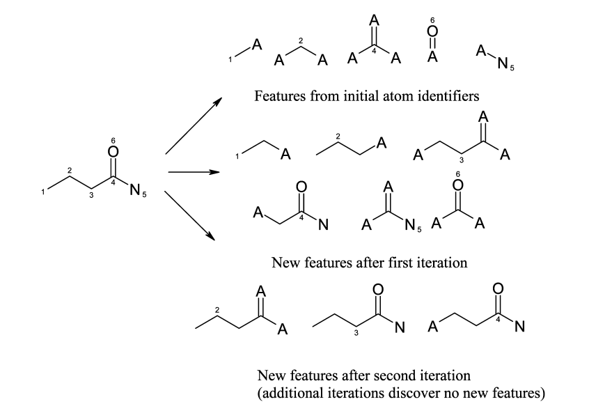
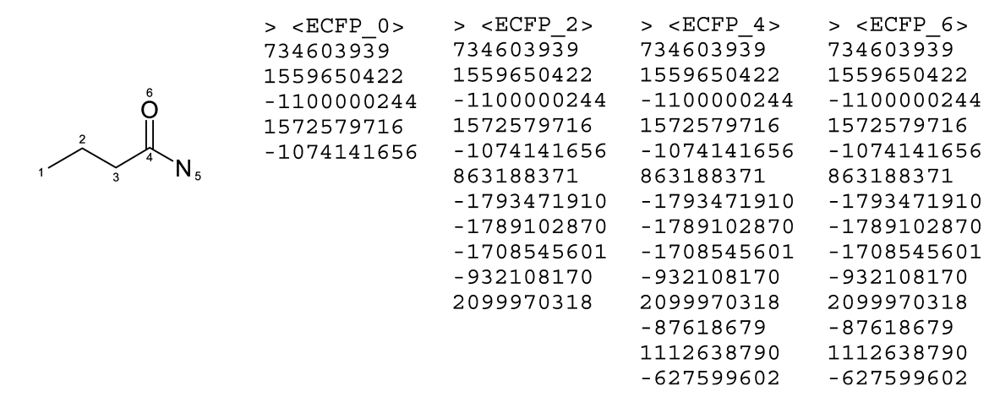
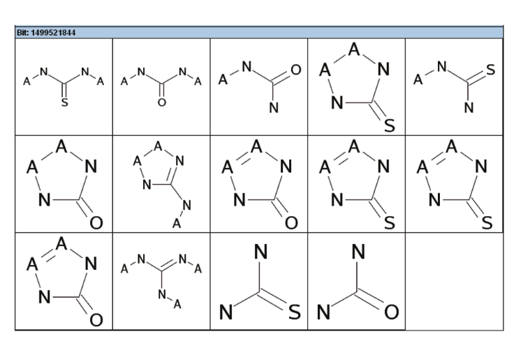
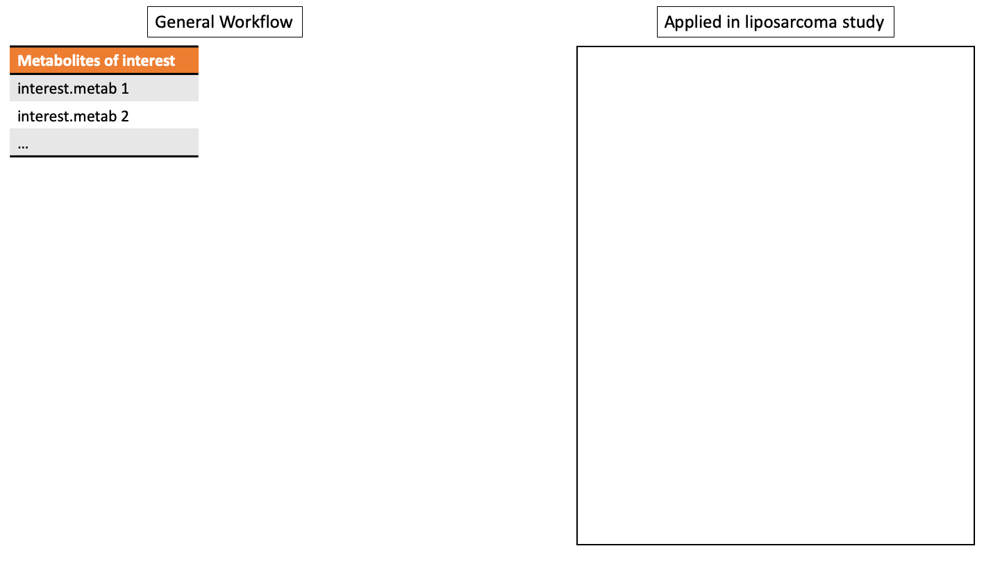

---
output:
  xaringan::moon_reader:
    css: [default, metropolis, metropolis-fonts]
    lib_dir: libs
    nature:
      highlightStyle: github
      countIncrementalSlides: false
      seal: false
      ratio: '16:9'
---

class: inverse, middle
background-image: url(title_background.svg)
background-size: cover

<font color = "white">
# Extended-Connectivity Fingerprints for Functional Clustering of Metabolites
.pull-left[
## Andrew Patt

### National Center for Advancing Translational Science/Ohio State University Biomedical Sciences Graduate Program

]

.pull-right[
.center[
```{r,echo=FALSE,out.width="300px"}
knitr::include_graphics("img/ECF.png")
```
]
]


---

<style type="text/css">

p.caption {
  font-size: 0.6em;
}

.large { font-size: 200% }

.medium-large { font-size: 130% }

.small{ font-size: 80% }

.tiny{ font-size: 40% }

.center-left {
  position:          relative;
  top:               50%;
  transform:         translateY(50%);
}
.center-right {
  position:          relative;
  top:               50%;
  transform:         translateY(10%);
}

.remark-slide-content {
  background-color: #FFFFFF;
  border-top: 80px solid #013220;
  font-size: 28px;
  font-weight: 300;
  line-height: 1.5;
  padding: 1em 2em 1em 2em
}

.inverse {
  background-color: #013220;
  text-shadow: none;
}

.right-column {
	color: #000000;
	width: 30%;
	height: 92%;
	float: right;
}

.left-column {
  width: 68%;
  float: left;
}

</style>

# Context: SCOPE

.pull-left[
.small[
- Workflow presented by Erin Baker group at ASMS
- Focused on improving interpretation of lipidomics data 
- Lipids are commonly grouped into generic structures in pathway databases
- Want to incorporate chemical structure and biological context into their interpretation models
- Structural connectivity:
  - Agglomerative clustering of similarity by structural features (custom algorithm that weights head group differences highly)
  - Based on SMILES strings in Lipid MAPS
]
]

.pull-right[
```{r,echo=FALSE,out.width="900px"}
knitr::include_graphics("img/lipid_interpretation.png")
```
]

---

# Introduction

- Chemical fingerprints are machine readable structural representations of molecules
- The most primitive are just binary bit strings indicating the
  presence or absence of 
  - Chemical substructures 
  - Molecular descriptors
  - Pharmacophores
- Captures information such as element count, type of ring system,
atom pairing, atom environment, etc.
- There are many different fingerprinting systems in use

---

# Extended-Connectivity Fingerprints Method

- [Check out this webpage for a succinct summary](https://depth-first.com/articles/2019/01/11/extended-connectivity-fingerprints/)
--

- Each atom is given an integer identifier to start
--
	- Standard method:
		1. Number of "heavy" neighbors
        2. Valence - # of hydrogens
        3. Atomic number
        4. Atomic mass
        5. Atomic charge
        6. Number of attached hydrogens
        7. Is the atom in a ring?
--
- Each atom builds an array of identifiers based on its neighbors
--

- A hash function reduces this array to a single identifier
--

- The algorithm iterates for a set number of times
--

- Duplicate fragments are removed, and the identifier for each
  atom across iterations is retained in the final result

---

# Brief aside: Hash tables & functions

- Hash tables are a data structure that stores data in a key-data pattern
- The hash function is used to 
  - Compute keys and insert new data
  - Aid in recovering stored data


.center[
```{r,echo=FALSE,out.width="900px"}
knitr::include_graphics("img/hash_function.jpg")
```
]

---

# Example: Butyramide
.center[
```{r,echo=FALSE,out.width="400px"}

```
]

.center[
```{r,echo=FALSE,out.width="600px"}

```
]
---

# Functional-Class Fingerprints

.pull-left[
- Additional level of abstraction that groups functionally related groups
- Each atom is identified by a six-bit code, where a given bit is “on”
if the atom plays the associated role
- Since atoms not longer have unique identifiers, this creates a
one-to-many mapping between features and chemical substructures 
]

.pull-right[
```{r,echo=FALSE,out.width="600px"}

```
]

---

# Concluding thoughts
.small[
- They mention fingerprints based on fragment libraries
  (e.g. LeadScope) might be superior for tying biological function to
  structure
- Path-based keys were designed for substructure and similarity
  search, meaning they might not be ideal for functional analysis
- PubChem fingerprints seem to just be a binary string encoding the presence or absence of 880 different chemical features
- They mention that higher resolution (more iterations) is desirable
  when modeling structure from function
- Use cases (ECFP):
  - Estimating the structural diversity of a library
  - Virtual drug candidate screening
  - **Structure-Activity Relationship Modeling**
  - Similarity searching
  - Biological classification
]

---
class: inverse, center, middle
# Current research

---

# Thesis Aims Background
--

- Pathway annotations are not available for most metabolites identified in an experiment
--

- There's variability in the number and types of metabolites that can be identified in similar experimental conditions
--

- Lipid annotations are sparse and difficult to consolidate
--

  - Pathway coverage is poor
--

  - Alternate schemes are not harmonized
--

- ORA statistics falsely assume that pathways are independent of each other

---

# Aim 1 

### Expand and improve usability of lipid annotations within RaMP from multiple sources
--

.small[
**Subaim 1a:  Consolidate lipid annotations in RaMP from lipid databases**
]
--

.small[
- LION/Web, SwissLipids, Lipid Maps, LipidPedia, InChIKey
]
--

.small[
**Subaim 1b: Improve usability of known lipid annotations by implementing conventional ORA software
for expanded lipidomic knowledge base.**
]
--

.small[
- Structure, Chemical class, Disease, MeSH term, Biological Function,
Reaction(?), Subcellular location, Biochemical/physical properties 
]
--

.small[
**Subaim1c: Develop methodology for the visualization of coverage of pathways in user-supplied data.**
]
--

.small[
- Generate a network visual for demonstrating high level functional clusters in user analytes
]

---
# Aim 2 

### Develop a novel network-based pathway and annotation enrichment method that integrates multiple sources of metabolite/lipid annotations
--

.small[
**Subaim 2a:  Build a consensus similarity network model from multiple annotation types using similarity network fusion algorithms**
]
--

.small[
**Subaim 2b: Develop methodology for detecting enriched pathways and annotations in the consensus similarity network**
]

--

.small[
**Subaim2c: Develop MetaboSPAN: R package/Shiny app for Metabolite Structure, Pathway, and Anno-
tation Network enrichment analysis**
]


---
# MetaboSPAN

```{r,echo=FALSE,out.width="1000px"}

```

---

# MetaboSPAN

```{r,echo=FALSE,out.width="1000px"}
knitr::include_graphics("img/network_schematic2.png")
```

---

# MetaboSPAN

```{r,echo=FALSE,out.width="1000px"}
knitr::include_graphics("img/network_schematic3.png")
```

---

# MetaboSPAN

```{r,echo=FALSE,out.width="1000px"}
knitr::include_graphics("img/network_schematic4.png")
```

---

# MetaboSPAN

```{r,echo=FALSE,out.width="1000px"}
knitr::include_graphics("img/network_schematic5.png")
```

---

# MetaboSPAN

```{r,echo=FALSE,out.width="1000px"}
knitr::include_graphics("img/network_schematic6.png")
```

---

# MetaboSPAN

```{r,echo=FALSE,out.width="1000px"}
knitr::include_graphics("img/network_schematic7.png")
```

---

# MetaboSPAN

```{r,echo=FALSE,out.width="1000px"}
knitr::include_graphics("img/network_schematic8.png")
```

---

# MetaboSPAN

```{r,echo=FALSE,out.width="1000px"}
knitr::include_graphics("img/network_schematic9.png")
```

---

# MetaboSPAN

```{r,echo=FALSE,out.width="1000px"}
knitr::include_graphics("img/network_schematic10.png")
```

---

# MetaboSPAN

```{r,echo=FALSE,out.width="1000px"}
knitr::include_graphics("img/network_schematic11.png")
```

---

# HexCers are upregulated by MDM2 in DDLPS
.pull-left[
```{r,echo=FALSE,fig.height=10,fig.width=10,message=FALSE}
library(tidyverse)
##ggplotly(p)

MDM2HivsLoLMME<-readRDS("img/Lipid_volcano_plot.Rds")
fc_thresh=0.75
p_thresh <- 0.05
lipidomic_key<-readRDS("img/lipidomic_key.Rds")

library(ggplot2)
library(ggrepel)
resMDM2HiLoLMME<-readRDS("img/metabolite_volcano_plot.Rds")
myPalette<-c("#e6194b","#8B008B","#808080","#f58231","gray80","#008080","#46f0f0","#3cb44b","#e6194b")
names(myPalette)<-c("Amino Acid","Cofactors and Vitamins","Nucleotide","Lipid","Not Significant","Peptide","Hexosylated Ceramide")


myPalette2<-c("gray80","red")
names(myPalette2)<-c("Not Significant","Hexosylated Ceramide")

p <- resMDM2HiLoLMME %>%
    mutate(class=ifelse(name == "glycosyl-N-palmitoyl-sphingosine"  |
                        name == "glycosyl-N-stearoyl-sphingosine"
                       ,
                        "Hexosylated Ceramide",
                        "Not Significant")) %>%
    ggplot(aes(x=log2fc, y=-log10(LMMEadj), colour=class)) +
    geom_hline(yintercept = -log10(0.05),lty = 2) +
    geom_vline(xintercept = 0.75, lty = 2) +
    geom_vline(xintercept = -0.75, lty = 2) +
    geom_point(aes(size=size)) +
    geom_label_repel(data =
                         resMDM2HiLoLMME %>%
                         mutate(class=ifelse(name == "glycosyl-N-palmitoyl-sphingosine"  |
                                             name == "glycosyl-N-stearoyl-sphingosine",
                                             "Hexosylated Ceramide",
                                             "Not Significant")) %>%
                         mutate(name=sapply(name, function(x) if(x == "glycosyl-N-palmitoyl-sphingosine"){
                                         "HexCer-NS(d18:1/16:0)"
                                     }else if(x == "glycosyl-N-stearoyl-sphingosine"){
                                         "HexCer-NS(d18:1/18:0)"
                                     }else{
                                         x})) %>%
                         ## mutate(name=ifelse(name == "glycosyl-N-stearoyl-sphingosine",
                         ##                    "HexCer-NS(d18:1/18:0)",
                         ##                    name)) %>%
                         filter(class=="Hexosylated Ceramide")
                    ,
                     aes(label=name),
                     show.legend = FALSE,
                     force=10,
                     xlim=c(NA,0),
                     ylim=c(NA,2.25),
                     arrow = arrow(length = unit(0.03,"npc"),type = "closed"),
                     size=10) +
    theme_bw(base_size=24) +
    scale_color_manual(values = myPalette2) +
    ggtitle("Metabolomic Panel") +
    theme(plot.title = element_text(hjust = 0.5)) +
    theme(panel.grid.major = element_blank(), panel.grid.minor = element_blank()) +
    ylab("-log10 p-value") +
    xlab("log2(MDM2Hi)-log2(MDM2Lo)") +
    scale_alpha(range=c(0.2,0.7)) +
    scale_size(range=c(4,6)) +
    guides(size=FALSE,alpha=FALSE,label=FALSE,
           ##colour = guide_legend(override.aes = list(size=10))) +
           colour = FALSE) +
    xlim(-4,5) +
    ylim(0,3)
##ggplotly(p)
p

```
]

.pull-right[
```{r,echo=FALSE,fig.width=10,fig.height=10}
MDM2HivsLoLMME<-readRDS("img/Lipid_volcano_plot.Rds")
fc_thresh=0.75
p_thresh <- 0.05

library(gplots)

library(RColorBrewer)

T_test_results<-MDM2HivsLoLMME
    
## Make insignificant points smaller and more transparent
T_test_results$significant = abs(T_test_results$log2fc) > fc_thresh &
    -log10(T_test_results$mypadj) > -log10(p_thresh)
T_test_results$size <- ifelse(T_test_results$significant,4,2)

## Color code by lipid class
T_test_results$class<-lipidomic_key$LM.Main.Class[match(T_test_results$name,lipidomic_key$name)]
palette_names<-as.vector(sort(unique(T_test_results$class)))
T_test_results$class<-sapply(1:nrow(T_test_results),function(x){
    ifelse(T_test_results$significant[x],
                    return(as.vector(T_test_results$class)[x]),return("Not Significant"))
})

legend_labels<-sort(unique(sapply(T_test_results$class, function(x){
    if(!is.na(x)){
        return(paste0(x," (n=",length(which(T_test_results$class==x)),")"))
    }else{
        return(x)
    }
})))

##legend_labels<-legend_labels[-which(is.na(legend_labels))]

palette<-c("gray80","red")

names(palette)<-c("Not Significant","Hexosylated Ceramide")

g =
    T_test_results %>%
    mutate(class = ifelse(grepl("HexCer",name),
                          "Hexosylated Ceramide",
                          "Not Significant")) %>%
    ggplot(aes(x=log2fc, y=-log10(mypadj), colour=class)) +
    geom_point(##alpha=0.7,
        aes(size=size)) +
    scale_color_manual(values = palette,
                                        #na.value="grey80",
                       ##labels=legend_labels,
                       ##name="class"
                       ) +
    theme_bw(base_size=24) +
                                        #scale_color_brewer(palette="Paired",na.value="grey80") +
    ggtitle("Lipidomic Panel") +
    theme(plot.title = element_text(hjust = 0.5)) +
    theme(panel.grid.major = element_blank(), panel.grid.minor = element_blank()) +
    ylab("-log10 p-value") +
    xlab("log2(MDM2Hi)-log2(MDM2Lo)") +
    geom_hline(yintercept = -log10(p_thresh),lty = 2) +
    geom_vline(xintercept = fc_thresh, lty = 2) +
    geom_vline(xintercept = -fc_thresh, lty = 2) +
    scale_size(range=c(4,6)) +
    guides(size=FALSE,
           ## colour = guide_legend(override.aes = list(size=10))) +
           colour = FALSE) +
    geom_label_repel(data = T_test_results %>%
                         mutate(class = ifelse(grepl("HexCer",name),
                                               "Hexosylated Ceramide",
                                               "Not Significant")) %>% filter(grepl("HexCer",name)),
                     aes(label=name),
                     nudge_y=0.5,
                     show.legend = FALSE,
                     force=10,
                     xlim=c(NA,1),
                     arrow = arrow(length = unit(0.03,"npc"),type = "closed"),
                     size=8) +
    xlim(-4,5) +
    ylim(0,3)
g


```
]

---
# MDM2 high vs low comparison

```{r,echo=FALSE,out.width="1000px"}
knitr::include_graphics("img/Network_figure_2.png")
```

---

# Reviewer questions to address

.small[
**Logistical Issues**
1. Is the incorporation of additional annotations beneficial?
2. How do we encode metabolite similarity into edges?
3. How to combine network models (SNF algorithms, sum edge weights, multi-layer network)
4. How to evaluate network topology (Random walks, heat diffusion)
5. How to evaluate annotation enrichment (Fisher's vs. FSEA test)
(These can all be tested quantitatively via simulation experiments)
]

--

.small[
**Methodological Issues**
1. Does the method have higher sensitivity than existing methods in certain contexts?
2. **Does the method have high enough specificity?**
3. What are the potential use cases of the method? 
]

---

# Potential publication figures

.small[
**Sensitivity**
  - Liposarcoma 
	- New method captured biological insight which
    was validated with *in vitro* experimentation that conventional
    method did not
  - Breast Cancer
	- I've identified two independent breast tumor/ANT metabolomic
datasets on metabolomics workbench and want to demonstrate similar
altered pathways between the two 
 - Simulation
  - Finds true positives at higher noise levels than conventional methods]

--

.small[
**Specificity**
  - Does not detect altered pathways in randomized data
  - Does not return larger pathways or pathways that are
overrepresented in network model more than conventional methods ]

---

# "Simulation" Studies

- The main strategy will be to use real metabolomic/lipidomic data
  sets with perturbed pathways that are well known and characterized
  (e.g. glycolysis/FA synthesis/beta oxidation in breast cancer)
- "Noise" can be introduced by scrambling sample labels or using some
  gaussian noise function
- Considerations:
  - There has to be enough "true positives" to detect variations between method results
  - There has to be some "true negatives" which might be difficult to define here
  - The true positives would have to span a variety of pathway sizes/metabolite classes
