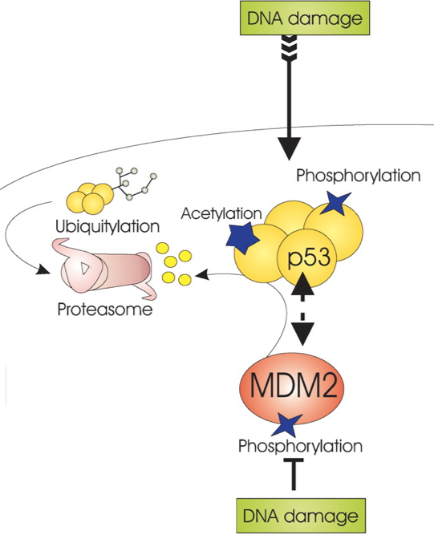
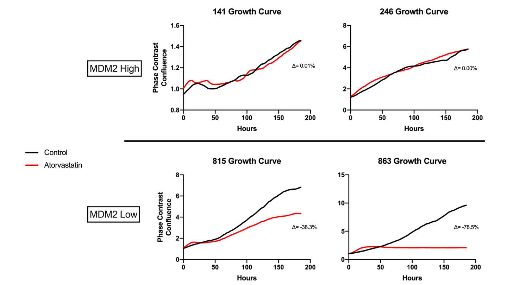
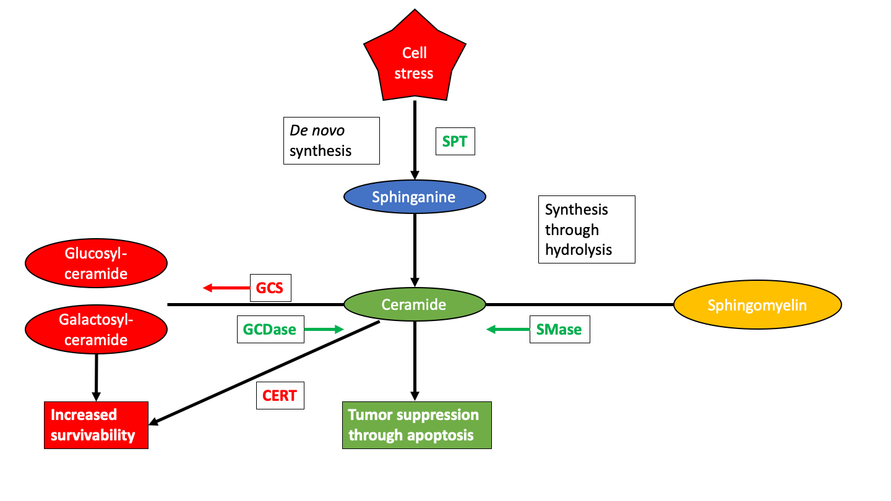

---
output:
  xaringan::moon_reader:
    css: [default, metropolis, metropolis-fonts]
    lib_dir: libs
    nature:
      highlightStyle: github
      countIncrementalSlides: false
      seal: false
      ratio: '16:9'
---

class: inverse, middle
background-image: url(title_background.svg)
background-size: cover

<font color = "white">
## Novel approaches for analysis and integration of metabolomic data
.pull-left[
### Andrew Patt
### National Center for Advancing Translational Science/Ohio State University
Biomedical Sciences Graduate Program

]

.pull-right[
.center[
```{r,echo=FALSE,out.width="300px"}
knitr::include_graphics("img/Human_metabolome_project.png")
```
]
]


---

<style type="text/css">

p.caption {
  font-size: 0.6em;
}

.large { font-size: 200% }

.medium-large { font-size: 130% }

.small{ font-size: 80% }

.tiny{ font-size: 40% }

.center-left {
  position:          relative;
  top:               50%;
  transform:         translateY(50%);
}
.center-right {
  position:          relative;
  top:               50%;
  transform:         translateY(10%);
}

.remark-slide-content {
  background-color: #FFFFFF;
  border-top: 80px solid #8f1414;
  font-size: 28px;
  font-weight: 300;
  line-height: 1.5;
  padding: 1em 2em 1em 2em
}

.inverse {
  background-color: #8f1414;
  text-shadow: none;
}

.right-column {
	color: #000000;
	width: 30%;
	height: 92%;
	float: right;
}

.left-column {
  width: 68%;
  float: left;
}

</style>

# Metabolomics for biomedical research
```{r, echo=FALSE}

library(ggplot2)
library(ggrepel)
resMDM2HiLoLMME<-readRDS("img/metabolite_volcano_plot.Rds")
myPalette<-c("#e6194b","#8B008B","#808080","#f58231","gray80","#008080","#46f0f0","#3cb44b","#e6194b")
names(myPalette)<-c("Amino Acid","Cofactors and Vitamins","Nucleotide","Lipid","Not Significant","Peptide","Hexosylated Ceramide")

```

.pull-left[
- Study of small biomolecules using mass spectrometry or NMR

- Structurally and functionally diverse

- Impacted by diet, lifestyle, toxins, pharmaceutics, microbiome, etc.

- Downstream stage in flow of biological information
]

.pull-right[
```{r,echo=FALSE,out.width="600px"}
knitr::include_graphics("img/Metabolomics_schema.png")
```
]

---

# Metabolomics of Cancer

- Metabolites are the regulators and intermediates of many cellular processes relevant to cancer
--

- **Warburg Effect**

--

- **Lipogenic Phenotype**

--

- **p53 as a metabolism regulator**

--

- **MYC as a metabolism regulator**

--

- **Mutant IDH Gliomas**
  
<!-- - **Warburg Effect**: increased reliance on anaerobic respiration -->

<!-- - **Lipogenic Phenotype**: increased endogenous *de novo* production of lipids, decrease in exogenous uptake -->

<!-- - **p53 as a metabolism regulator**: p53 response elements exist in promoters of glycolytic enzymes. It can also inhibit expression of glucose transporters. -->

<!-- - **MYC as a metabolism regulator**: induces glycolysis and glutaminolysis. Induces a hypoxic phenotype in normal oxygen environments -->

<!-- - **Mutant IDH Gliomas:**: Mutant IDHs convert alpha Ketoglutarate to -->
<!--   2-Hydroxyglutarate, which impacts the TCA cycle and induces -->
<!--   epigenetic changes that promote tumor progression -->

---

# Dedifferentiated Liposarcoma 

.pull-left[
- 20% of all soft tissue sarcoma diagnoses
- Some drugs (Dactinomycin, Doxorubicin) are used to treat
  liposarcoma, but they have unpredictable efficacy and toxicity.
- Prognosis depends on copy number of the MDM2 oncogene
]

.pull-right[
```{r,echo=FALSE,out.width="400px"}
knitr::include_graphics("img/DDLPS_prognosis.png")
```

.tiny[
Bill KLJ, Seligson ND, Hays JL, et al. Degree of Amplification Affects Clinical Outcomes in Dedifferentiated Liposarcoma. Oncologist. 2019;24(7):989-996.
]
]


---

# MDM2 inhibits DNA repair and apopotosis

.pull-left[
- Autoregulatory loop with p53

- Physically binds to p53 and catalyzes its ubiquitylation

- p53 initiates DNA repair or apoptosis if DNA repair is impossible or if telomeres have shortened too much

- Frequently inhibited in mutant p53 cancers
]

.pull-right[
```{r,echo=FALSE,out.width="350px"}

```

.tiny[
http://mcr.aacrjournals.org/content/molcanres/1/14/1001/F1.large.jpg?width=800&height=600&carousel=1
]
]

---

# Targeting the p53-cholesterol synthesis axis

.right-column[
.small[
- Statins (mevalonate pathway inhibitors) have been associated with
  reduced mortality in multiple cancers

- p53 downregulates transcriptional regulator of mevalonate pathway

- p53-null cell lines have been shown to withstand sterol deprived
  conditions better than WT

]
]

.left-column[

```{r,echo=FALSE,out.width="800px"}

```

]

---

# Objectives

--

### 1. Understand resistance of MDM2 high cells to atorvastatin treatment

--

### 2. Identify altered metabolites/lipids between MDM2 high and low to identify potential biomarkers/therapeutic targets 

--

### 3. Find higher level biological differences (e.g. pathways) between MDM2 high and low tumors that explain poorer prognosis of MDM2 high patients

---

# Methods

```{r,echo=FALSE,out.width="1000px"}
knitr::include_graphics("img/metabolite_methods.png")
```

---

# Methods

```{r,echo=FALSE,out.width="1000px"}
knitr::include_graphics("img/lipid_methods.png")
```

---

# Atorvastatin did not impact MDM2 high lipidome
.pull-left[
```{r,fig.width=10,fig.height=10, echo=FALSE}
volcano_plotter <- function(df,title){
    T_test_results<-df
    
    ## Make insignificant points smaller and more transparent
    T_test_results$significant = abs(T_test_results$log2fc) > fc_thresh &
        -log10(T_test_results$mypadj) > -log10(p_thresh)
    T_test_results$size <- ifelse(T_test_results$significant,4,2)
    
    ## Color code by lipid class
    T_test_results$class<-lipidomic_key$LM.Main.Class[match(T_test_results$name,lipidomic_key$name)]
    palette_names<-as.vector(sort(unique(T_test_results$class)))
    T_test_results$class<-sapply(1:nrow(T_test_results),function(x){
        ifelse(T_test_results$significant[x],
                    return(as.vector(T_test_results$class)[x]),return("Not Significant"))
    })
      
	 legend_labels<-sort(unique(sapply(T_test_results$class, function(x){
             if(!is.na(x)){
		 return(paste0(x," (n=",length(which(T_test_results$class==x)),")"))
             }else{
		 return(x)
             }
	 })))
      
	 ##legend_labels<-legend_labels[-which(is.na(legend_labels))]
      
	 palette<-c(brewer.pal(9,"Set1"),"sienna","springgreen4","seagreen","#40E0D0","violet","grey80")
	 names(palette)<-c(palette_names,"Not Significant")
	 palette<-palette[unique(T_test_results$class)]
                                           #palette<-palette[-which(is.na(palette))]
      
        g = ggplot(data=T_test_results, aes(x=log2fc, y=-log10(mypadj), colour=class)) +
            geom_point(##alpha=0.7,
                       aes(size=size)) +
            scale_color_manual(values = palette,
                                        #na.value="grey80",
                               labels=legend_labels,
                               name="LipidMaps Main Class") +
            theme_bw(base_size=20) +
                                        #scale_color_brewer(palette="Paired",na.value="grey80") +
            ggtitle(title) +
            theme(plot.title = element_text(hjust = 0.5)) +
            theme(panel.grid.major = element_blank(), panel.grid.minor = element_blank()) +
            ylab("-log10 p-value") +
            geom_hline(yintercept = -log10(p_thresh),lty = 2) +
            geom_vline(xintercept = fc_thresh, lty = 2) +
            geom_vline(xintercept = -fc_thresh, lty = 2) +
            scale_size(range=c(2,4)) +
            guides(size=FALSE,
                   colour = guide_legend(override.aes = list(size=10)))
    
    T_test_results_sig<-T_test_results[T_test_results$significant,]
    text_size<-round(min(20,350/nrow(T_test_results_sig)),digits=0)
    
    return(g)
}

TreVsUntreLMME_hi<-readRDS("img/Lipid_Hi_Tre_volcano_plot.Rds")

volcano_plotter(TreVsUntreLMME_hi,"Treated vs Untreated, MDM2 High")
```
]

.pull-right[
- MDM2 high tumors have worse prognosis

- MDM2 high cell lines did not respond to atorvastatin treatment

- Analyzing the lipidome of MDM2 high cells pre and post atorvastatin
treatment revealed only 4 lipids perturbed by treatment ]

---

# Atorvastatin greatly impacted MDM2 low lipidome 

.left-column[
```{r,fig.width=10,fig.height=7, echo=FALSE}

p_thresh=0.05
fc_thresh=0.75
TreVsUntreLMME_lo<-readRDS("img/Lipid_Lo_Tre_volcano_plot.Rds")

volcano_plotter(TreVsUntreLMME_lo,"Treated vs Untreated, MDM2 Low")
```
]

.right-column[
- MDM2 low tumors have better prognosis

- The growth of MDM2 low cell lines was slowed by atorvastatin treatment

- Over a quarter of the panel was significantly altered by atorvastatin treatment ]

---

# Atorvastatin changed sphingolipids in MDM2 low cells

.left-column[
```{r,fig.width=10,fig.height=7, echo=FALSE}

T_test_results<-TreVsUntreLMME_lo
    
## Make insignificant points smaller and more transparent
T_test_results$significant = abs(T_test_results$log2fc) > fc_thresh &
    -log10(T_test_results$mypadj) > -log10(p_thresh)
T_test_results$size <- ifelse(T_test_results$significant,4,2)

## Color code by lipid class
T_test_results$class<-lipidomic_key$LM.Main.Class[match(T_test_results$name,lipidomic_key$name)]
palette_names<-as.vector(sort(unique(T_test_results$class)))
T_test_results$class<-sapply(1:nrow(T_test_results),function(x){
    ifelse(T_test_results$significant[x],
           return(as.vector(T_test_results$class)[x]),return("Not Significant"))
})

T_test_results = T_test_results %>%
    mutate(class =
               apply(T_test_results, 1, function(x){
                   if(x["class"]!="Not Significant"){
                       if(grepl("HexCer",x["name"])){
                           "Hexosylated Ceramide"
                       }else if(grepl("Cer",x["name"])){
                           "Ceramide"
                       }else{
                           "Not Significant"
                       }
                   }else{
                       "Not Significant"
                   }
               }) %>%
           as.factor())

palette<-c("red","blue","grey80")
names(palette)<-c("Ceramide","Hexosylated Ceramide","Not Significant")

g = ggplot(data=T_test_results, aes(x=log2fc, y=-log10(mypadj), colour=class)) +
    geom_point(##alpha=0.7,
        aes(size=size)) +
    scale_color_manual(values = palette,
                       ##na.value="grey80",
                       ##labels=legend_labels,
                       name="LipidMaps Main Class") +
    theme_bw(base_size=20) +
    ##scale_color_brewer(palette="Paired",na.value="grey80") +
    ggtitle("Treated vs Untreated, MDM2 Low") +
    theme(plot.title = element_text(hjust = 0.5)) +
    theme(panel.grid.major = element_blank(), panel.grid.minor = element_blank()) +
    ylab("-log10 p-value") +
    geom_hline(yintercept = -log10(p_thresh),lty = 2) +
    geom_vline(xintercept = fc_thresh, lty = 2) +
    geom_vline(xintercept = -fc_thresh, lty = 2) +
    scale_size(range=c(2,4)) +
    guides(size=FALSE,
           colour = guide_legend(override.aes = list(size=10))) ## +
    ## geom_label_repel(data = T_test_results %>% filter(grepl("Cer",name) &
    ##                                                   class!="Not Significant"),
    ##                  aes(label=name),
    ##                  show.legend = FALSE,
    ##                  force=10,
    ##                  xlim=c(NA,1),
    ##                  arrow = arrow(length = unit(0.03,"npc"),type = "closed"),
    ##                  size=6)
g

```
]

.right-column[

- 11 ceramides and 3 hexosylated ceramides were upregulated by atorvastatin treatment in MDM2 low cells

- This could indicate activation of an apoptotic response

]

---

# Sphingolipid metabolism as a therapeutic target

```{r,echo=FALSE,out.width="1100px"}

```

---

# Preliminary Conclusion

## Atorvastatin may activate the sphingolipid pathway in MDM2 low cells, initiating apoptosis

--

## Hypothesis: There are baseline differences in sphingolipid levels in MDM2 high and low tumors, compromising treatment response in MDM2 high cells

---

# Lipid differences between MDM2 high and low cells

```{r,echo=FALSE,fig.height=7,fig.width=15}

p<-ggplot(data=resMDM2HiLoLMME, aes(x=log2fc, y=-log10(LMMEadj), colour=class)) +
    geom_hline(yintercept = -log10(0.05),lty = 2) +
    geom_vline(xintercept = 0.75, lty = 2) +
    geom_vline(xintercept = -0.75, lty = 2) +
    geom_point(aes(size=size)) +
    theme_bw(base_size=24) +
    scale_color_manual(values = myPalette[c(1,2,4,5,3,6)]) +
    ggtitle("MDM2 High vs Low: Metabolomic Panel") +
    theme(plot.title = element_text(hjust = 0.5)) +
    theme(panel.grid.major = element_blank(), panel.grid.minor = element_blank()) +
    ylab("-log10 p-value") +
    xlab("log2(MDM2Hi)-log2(MDM2Lo)") +
    scale_alpha(range=c(0.2,0.7)) +
    scale_size(range=c(2,4)) +
    guides(size=FALSE,alpha=FALSE,label=FALSE,
           colour = guide_legend(override.aes = list(size=10)))

p

```

---

# MDM2 high tumor cells show markers of inflammation

.pull-left[
```{r,echo=FALSE,fig.height=10,fig.width=10}

p<- resMDM2HiLoLMME %>%
    ##mutate(class=sapply(class, function(x) ifelse(x %in% c("Lipid","Peptide"),return(x),return("Not Significant")))) %>%
    mutate(class = ifelse(name == "Ac-Ser-Asp-Lys-Pro-OH" |
                         name == "stearate (18:0)" |
                         name == "myristate (14:0)" |
                         name == "nonadecanoate (19:0)",
                         class,
                         "Not Significant")) %>%
    ggplot(aes(x=log2fc, y=-log10(LMMEadj), colour=class)) +
    geom_hline(yintercept = -log10(0.05),lty = 2) +
    geom_vline(xintercept = 0.75, lty = 2) +
    geom_vline(xintercept = -0.75, lty = 2) +
    geom_point(aes(size=size)) +
    geom_label_repel(data = resMDM2HiLoLMME %>% filter(name == "Ac-Ser-Asp-Lys-Pro-OH" |
                                                       name == "stearate (18:0)" |
                                                       name == "myristate (14:0)" |
                                                       name == "nonadecanoate (19:0)"),
                     aes(label=name),
                     show.legend = FALSE,
                     force=100,
                     nudge_x = .25,
                     nudge_y=-.5,
                     ##xlim=c(NA,0),
                     ##ylim=c(NA,1.25),
                     arrow = arrow(length = unit(0.2,"inches"),type="closed"),
                     size=9) +
    theme_bw(base_size=24) +
    scale_color_manual(values = myPalette[c(1,2,4,5,3,6)]) +
    ggtitle("MDM2 High vs Low: Metabolomic Panel") +
    theme(plot.title = element_text(hjust = 0.5)) +
    theme(panel.grid.major = element_blank(), panel.grid.minor = element_blank()) +
    ylab("-log10 p-value") +
    xlab("log2(MDM2Hi)-log2(MDM2Lo)") +
    scale_alpha(range=c(0.2,0.7)) +
    scale_size(range=c(4,6)) +
    guides(size=FALSE,alpha=FALSE,label=FALSE,
           colour = guide_legend(override.aes = list(size=10)))

p

```
]

.pull-right[
- Increase in saturated fatty acid levels could indicate activation of lipogenesis
- Saturated fatty acids activate inflammation through TLR4/nf $\kappa$ B dependent signaling
- Ac-Ser-Asp-Lys-Pro-OH prevents differentation of bone marrow stem cells into macrophages and inhibits their activation and sectretion of TNF- $\alpha$
]

---

# HexCers are upregulated by MDM2 in both panels
.pull-left[
```{r,echo=FALSE,fig.height=10,fig.width=10}

##ggplotly(p)

myPalette2<-c("gray80","red")
names(myPalette2)<-c("Not Significant","Hexosylated Ceramide")

p <- resMDM2HiLoLMME %>%
    mutate(class=ifelse(name == "glycosyl-N-palmitoyl-sphingosine"  |
                        name == "glycosyl-N-stearoyl-sphingosine"
                       ,
                        "Hexosylated Ceramide",
                        "Not Significant")) %>%
    ggplot(aes(x=log2fc, y=-log10(LMMEadj), colour=class)) +
    geom_hline(yintercept = -log10(0.05),lty = 2) +
    geom_vline(xintercept = 0.75, lty = 2) +
    geom_vline(xintercept = -0.75, lty = 2) +
    geom_point(aes(size=size)) +
    geom_label_repel(data =
                         resMDM2HiLoLMME %>%
                         mutate(class=ifelse(name == "glycosyl-N-palmitoyl-sphingosine"  |
                                             name == "glycosyl-N-stearoyl-sphingosine",
                                             "Hexosylated Ceramide",
                                             "Not Significant")) %>%
                         mutate(name=sapply(name, function(x) if(x == "glycosyl-N-palmitoyl-sphingosine"){
                                         "HexCer-NS(d18:1/16:0)"
                                     }else if(x == "glycosyl-N-stearoyl-sphingosine"){
                                         "HexCer-NS(d18:1/18:0)"
                                     }else{
                                         x})) %>%
                         ## mutate(name=ifelse(name == "glycosyl-N-stearoyl-sphingosine",
                         ##                    "HexCer-NS(d18:1/18:0)",
                         ##                    name)) %>%
                         filter(class=="Hexosylated Ceramide")
                    ,
                     aes(label=name),
                     show.legend = FALSE,
                     force=10,
                     xlim=c(NA,0),
                     ylim=c(NA,2.25),
                     arrow = arrow(length = unit(0.03,"npc"),type = "closed"),
                     size=10) +
    theme_bw(base_size=24) +
    scale_color_manual(values = myPalette2) +
    ggtitle("Metabolomic Panel") +
    theme(plot.title = element_text(hjust = 0.5)) +
    theme(panel.grid.major = element_blank(), panel.grid.minor = element_blank()) +
    ylab("-log10 p-value") +
    xlab("log2(MDM2Hi)-log2(MDM2Lo)") +
    scale_alpha(range=c(0.2,0.7)) +
    scale_size(range=c(4,6)) +
    guides(size=FALSE,alpha=FALSE,label=FALSE,
           ##colour = guide_legend(override.aes = list(size=10))) +
           colour = FALSE) +
    xlim(-4,5) +
    ylim(0,3)
##ggplotly(p)
p

```
]

.pull-right[
```{r,echo=FALSE,fig.width=10,fig.height=10}
MDM2HivsLoLMME<-readRDS("img/Lipid_volcano_plot.Rds")
fc_thresh=0.75
p_thresh <- 0.05
lipidomic_key<-readRDS("img/lipidomic_key.Rds")

library(gplots)

library(RColorBrewer)

T_test_results<-MDM2HivsLoLMME
    
## Make insignificant points smaller and more transparent
T_test_results$significant = abs(T_test_results$log2fc) > fc_thresh &
    -log10(T_test_results$mypadj) > -log10(p_thresh)
T_test_results$size <- ifelse(T_test_results$significant,4,2)

## Color code by lipid class
T_test_results$class<-lipidomic_key$LM.Main.Class[match(T_test_results$name,lipidomic_key$name)]
palette_names<-as.vector(sort(unique(T_test_results$class)))
T_test_results$class<-sapply(1:nrow(T_test_results),function(x){
    ifelse(T_test_results$significant[x],
                    return(as.vector(T_test_results$class)[x]),return("Not Significant"))
})

legend_labels<-sort(unique(sapply(T_test_results$class, function(x){
    if(!is.na(x)){
        return(paste0(x," (n=",length(which(T_test_results$class==x)),")"))
    }else{
        return(x)
    }
})))

##legend_labels<-legend_labels[-which(is.na(legend_labels))]

palette<-c("gray80","red","gray80")

names(palette)<-c("Not Significant","Hexosylated Ceramide")

g =
    T_test_results %>%
    mutate(class = ifelse(grepl("HexCer",name),
                          "Hexosylated Ceramide",
                          "Not Significant")) %>%
    ggplot(aes(x=log2fc, y=-log10(mypadj), colour=class)) +
    geom_point(##alpha=0.7,
        aes(size=size)) +
    scale_color_manual(values = palette,
                                        #na.value="grey80",
                       ##labels=legend_labels,
                       name="class") +
    theme_bw(base_size=24) +
                                        #scale_color_brewer(palette="Paired",na.value="grey80") +
    ggtitle("Lipidomic Panel") +
    theme(plot.title = element_text(hjust = 0.5)) +
    theme(panel.grid.major = element_blank(), panel.grid.minor = element_blank()) +
    ylab("-log10 p-value") +
    xlab("log2(MDM2Hi)-log2(MDM2Lo)") +
    geom_hline(yintercept = -log10(p_thresh),lty = 2) +
    geom_vline(xintercept = fc_thresh, lty = 2) +
    geom_vline(xintercept = -fc_thresh, lty = 2) +
    scale_size(range=c(4,6)) +
    guides(size=FALSE,
           ## colour = guide_legend(override.aes = list(size=10))) +
           colour = FALSE) +
    geom_label_repel(data = T_test_results %>%
                         mutate(class = ifelse(grepl("HexCer",name),
                                               "Hexosylated Ceramide",
                                               "Not Significant")) %>% filter(grepl("HexCer",name)),
                     aes(label=name),
                     nudge_y=0.5,
                     show.legend = FALSE,
                     force=10,
                     xlim=c(NA,1),
                     arrow = arrow(length = unit(0.03,"npc"),type = "closed"),
                     size=8) +
    xlim(-4,5) +
    ylim(0,3)
g


```
]

---


# Ceramide glycosylation levels predict MDM2 status
.left-column[
```{r,echo=FALSE,fig.height=4.2,fig.width=10}
##knitr::include_graphics("img/Glycosylated_ceramides.png")

load("img/heatmap.Rda")

mycol = colorRampPalette(c("blue", "white","red"))(100)

heatmap.2(y, Colv=as.dendrogram(hc), col=mycol, scale="row", density.info="none",
          trace="none",dendrogram = "col",
          ##lhei=c(1.5,5,1),
          ##lwid=c(1.5, 3),
          ColSideColors = col_colors,
          tracecol = "black",
          labCol=as.vector(t(mycell)),
          margins=c(5,14.2),
          cexRow = 1.5,
          cexCol = 1.5
          )

```
.center[
```{r,echo=FALSE,fig.height=2.5,fig.width=6}
volcano_plotter(MDM2HivsLoLMME,"MDM2 Hi vs Lo, Lipids") + guides(color=FALSE) + theme_classic(base_size=12)
```
]
]

.right-column[
.small[
- Cell lines cluster by their expression of glycosylated ceramides in
  an unsupervised manner in the lipidomic dataset

- MDM2 high is the red bar and MDM2 low is the blue bar ]
]
---
# Preliminary Conclusion

## Metabolites different between untreated MDM2 high and MDM2 low cell lines played roles in inflammation, increased survivability, and resistance to apoptosis

--

## Does pathway analysis corroborate/extend these observations?

---
# Challenges in metabolite/lipid pathway analysis

1. Lack of pathway annotations

---

# Challenges in metabolite/lipid analysis

1. Lack of pathway annotations

.center[
```{r,echo=FALSE,out.width="800px"}
knitr::include_graphics("img/pathway_coverage.png")
```
]

---

# Challenges in metabolite/lipid pathway analysis

1. Lack of pathway annotations

	- Incorporating biological and chemical annotations offer better coverage

--

2. Metabolite panels don't cover the entire metabolome

	- Leads to reproducibility issues

--

3. Conventional pathway overrepresentation analysis does not account for redundancies of pathway annotations
	
	- Pathway annotations are not independent, which is an assumption of the Fisher's/Hypergeometric tests
---

# Addressing Issue 1: Expanding RaMP

- RaMP is our group's multiomic pathway database integrating
information from KEGG, HMDB, WikiPathways and Reactome 

--

- Integrate lipid annotations drawn from following open-source resources:
--

  - LION/Web: >250,000 annotations for >50,000 lipids, including lipid class, subcellular location, biological function, and biochemical/physical properties.
--

  - SwissLipids: Location, reaction, structure and chemical class annotations for 777,657 lipids (real and theoretical)
--

  - Lipid Maps: Structure and chemical class annotations for 43,636 lipids
--
  
  - LipidPedia: Disease, MeSH term, function, reactions for 4,487 lipids.
--

- Implement enrichment analysis software for lipids/metabolites

---

# Addressing Issues 2 and 3: Novel Network Method

```{r,echo=FALSE,out.width="1000px"}
knitr::include_graphics("img/network_schematic1.png")
```

---

# Addressing Issues 2 and 3: Novel Network Method

```{r,echo=FALSE,out.width="1000px"}
knitr::include_graphics("img/network_schematic2.png")
```

---

# Addressing Issues 2 and 3: Novel Network Method

```{r,echo=FALSE,out.width="1000px"}
knitr::include_graphics("img/network_schematic3.png")
```

---

# Addressing Issues 2 and 3: Novel Network Method

```{r,echo=FALSE,out.width="1000px"}
knitr::include_graphics("img/network_schematic4.png")
```

---

# Addressing Issues 2 and 3: Novel Network Method

```{r,echo=FALSE,out.width="1000px"}
knitr::include_graphics("img/network_schematic5.png")
```

---

# Addressing Issues 2 and 3: Novel Network Method

```{r,echo=FALSE,out.width="1000px"}
knitr::include_graphics("img/network_schematic6.png")
```

---

# Addressing Issues 2 and 3: Novel Network Method

```{r,echo=FALSE,out.width="1000px"}
knitr::include_graphics("img/network_schematic7.png")
```

---

# Addressing Issues 2 and 3: Novel Network Method

```{r,echo=FALSE,out.width="1000px"}
knitr::include_graphics("img/network_schematic8.png")
```

---

# Addressing Issues 2 and 3: Novel Network Method

```{r,echo=FALSE,out.width="1000px"}
knitr::include_graphics("img/network_schematic9.png")
```

---

# Addressing Issues 2 and 3: Novel Network Method

```{r,echo=FALSE,out.width="1000px"}
knitr::include_graphics("img/network_schematic10.png")
```

---

# Addressing Issues 2 and 3: Novel Network Method

```{r,echo=FALSE,out.width="1000px"}
knitr::include_graphics("img/network_schematic11.png")
```

---

# Network Method Preliminary Result

```{r,echo=FALSE,out.width="1000px"}
knitr::include_graphics("img/Network_figure_2.png")
```

---

# Conclusions

--

### 1. MDM2 was associated with resistance to apoptosis, shifts in energy metabolism, and driving a pro-inflammatory phenotype

--

### 2. Atorvastatin worked through changes in the sphingolipid pathway which were counteracted by MDM2 activity

--

### 3. Our novel pathway analysis method provided results more in line with observed biology in system than conventional method, providing partial validation 

---

# Future Directions
### 1. Extend findings to human transcriptome data
### 2. Experimentally validate findings
### 3. Network method improvements:
  - Best network topology analysis method
  - Best network fusion approach
  - How much information is appropriate to include?
  - Validate in more data sets as well as simulations

---

# Acknowledgements

.pull-left[
.small[
**Mathe Lab**
- Ewy Mathe
- Tara Eicher
- Kevin Ying
- Garrett Kinnebrew
- Kyle Spencer
- Kiran Boyinepally
- Cynthia Ramazani

**Collaborators/Advisors**
- Dr. James Chen
- Dr. Kevin Coombes
- Dr. Zachary Abrams
- Dr. Lang Li

]]

.pull-right[
.small[
**Collaborators/Advisors**
- Dr. Rachel Kopec
- Dr. Tim Garrett
- Dr. Jeremy Koelmel
- Dr. Andrew Patterson
- Dr. Philip Smith

**Funding from**
- The OSU Clinical and Translational Research Informatics Training
Program (4T15LM011270-05)
- Systems and Integrative Biology training program (T32GM068412) ]]

---

# Questions?

.pull-left[
<iframe src='https://gfycat.com/ifr/LongLateAcouchi' frameborder='0' scrolling='no' allowfullscreen width='480' height='390'></iframe><p><a href="https://gfycat.com/discover/question-gifs">from Question GIFs</a> <a href="https://gfycat.com/longlateacouchi-question-mark-confused-what-huh">via Gfycat</a></p>
]

.pull-right[
- Slides link: https://andyptt21.github.io

- RaMP link: https://ramp-db.bmi.osumc.edu/
]
